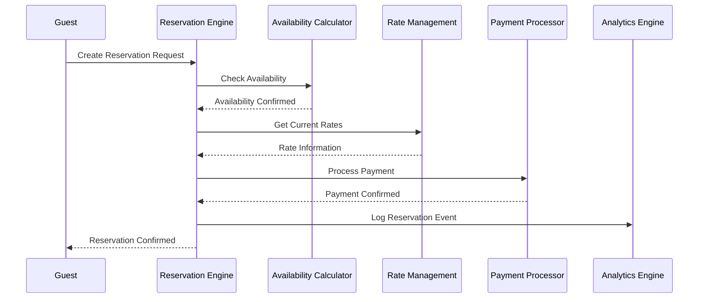

# Reservation Engine API

The Reservation Engine is the core booking service that orchestrates the complete reservation lifecycle, from availability checking to confirmation and management.

## 🎯 Overview

| Property | Value |
|----------|-------|
| **Service Name** | reservation-engine |
| **Port** | 8081 |
| **Health Check** | `/actuator/health` |
| **API Base URL** | `http://localhost:8081/api/v1/reservations` |
| **OpenAPI Spec** | `/v3/api-docs` |
| **Swagger UI** | `/swagger-ui.html` |

## 🚧 Development Status

This service is currently in development. API documentation will be available when Java source code is completed.

### Core Features
- **Reservation Management** - Complete booking lifecycle orchestration
- **Availability Integration** - Real-time room availability checking
- **Rate Application** - Dynamic pricing integration
- **Payment Coordination** - Secure payment processing coordination
- **Multi-tenant Support** - Property-specific reservation handling

### Expected API Endpoints
- `POST /api/v1/reservations` - Create new reservation
- `GET /api/v1/reservations/{id}` - Get reservation details
- `PUT /api/v1/reservations/{id}` - Update reservation
- `DELETE /api/v1/reservations/{id}` - Cancel reservation  
- `GET /api/v1/reservations/search` - Search reservations
- `POST /api/v1/reservations/{id}/confirm` - Confirm reservation
- `POST /api/v1/reservations/{id}/checkin` - Guest check-in
- `POST /api/v1/reservations/{id}/checkout` - Guest check-out

## 🔄 Reservation Workflow

### Booking Process


### Reservation States
- **PENDING** - Initial reservation request
- **HOLD** - Temporary room hold (15 minutes)
- **CONFIRMED** - Payment processed, booking confirmed
- **CHECKED_IN** - Guest has arrived
- **CHECKED_OUT** - Guest has departed
- **CANCELLED** - Reservation cancelled
- **NO_SHOW** - Guest failed to arrive

## 🔌 Integration Points

### Event Consumption
- `availability.updated` - Respond to inventory changes
- `rate.adjusted` - Apply new pricing
- `payment.completed` - Confirm reservation after payment
- `payment.failed` - Handle payment failures

### Event Publishing
- `reservation.created` - New booking notification
- `reservation.confirmed` - Booking confirmation
- `reservation.cancelled` - Cancellation notification
- `reservation.modified` - Booking changes
- `guest.checked_in` - Check-in event
- `guest.checked_out` - Check-out event

## 🔧 Configuration

```yaml
# Reservation Engine Configuration (Planned)
reservations:
  booking:
    hold-duration: 15m  # Temporary hold time
    confirmation-timeout: 30m
    auto-cancel-unpaid: true
    
  policies:
    cancellation-window: 24h
    modification-window: 2h
    overbooking-allowed: true
    max-advance-booking: 365d
    
  validation:
    require-payment: true
    require-guest-info: true
    validate-dates: true
    check-blacklist: true
```

## 🏨 Reservation Management

### Booking Operations
- **Create Reservation** - New booking with availability check
- **Modify Reservation** - Change dates, rooms, or guest details
- **Cancel Reservation** - Handle cancellations and refunds
- **Split Reservation** - Divide booking across multiple rooms
- **Extend Stay** - Modify checkout date with availability check

### Guest Management
- **Guest Profiles** - Store guest preferences and history
- **Loyalty Integration** - Apply member rates and benefits
- **Group Bookings** - Handle multi-room reservations
- **Corporate Rates** - Apply negotiated rates
- **Special Requests** - Manage room preferences and amenities

## 📊 Performance Targets

| Metric | Target | Description |
|--------|--------|-------------|
| **Booking Completion** | <5s | End-to-end booking time |
| **Availability Check** | <500ms | Real-time availability query |
| **Success Rate** | 99.5% | Booking success rate |
| **Data Consistency** | 100% | No double bookings |

## 🛡️ Business Rules

### Booking Validation
- **Date Validation** - Check-in before check-out, future dates
- **Availability Check** - Real-time room inventory verification
- **Rate Validation** - Confirm current pricing at booking time
- **Guest Limits** - Maximum occupancy enforcement
- **Stay Restrictions** - Minimum/maximum stay requirements

### Cancellation Policies
- **Free Cancellation** - Within policy window
- **Partial Refund** - Late cancellations
- **No Refund** - No-show or very late cancellation
- **Corporate Flexibility** - Enhanced cancellation for corporate rates

## 🔍 Monitoring & Observability

### Key Metrics (Planned)
```
# Reservation metrics
reservations_created_total
reservations_confirmed_total  
reservations_cancelled_total
reservation_duration_seconds
booking_conversion_rate

# Business metrics
revenue_per_booking
average_daily_rate
occupancy_rate
cancellation_rate_percentage
no_show_rate_percentage
```

### Health Checks
```bash
# Service health
curl http://localhost:8081/actuator/health

# Database connectivity
curl http://localhost:8081/actuator/health/db

# External service integration
curl http://localhost:8081/actuator/health/dependencies
```

## 🔄 Event-Driven Architecture

### Kafka Integration
The Reservation Engine participates in the event-driven architecture:

```yaml
# Kafka Topics (Planned)
topics:
  consume:
    - availability-updates
    - rate-adjustments  
    - payment-events
    
  produce:
    - reservation-events
    - guest-events
    - inventory-holds
```

### Event Schemas
```json
{
  "reservation.created": {
    "reservationId": "string",
    "propertyId": "string", 
    "guestId": "string",
    "checkInDate": "date",
    "checkOutDate": "date",
    "roomType": "string",
    "totalAmount": "decimal",
    "status": "string"
  }
}
```

## 🛠️ Development

### Local Development Setup
```bash
# Start the service (when implemented)
./dev.sh start reservation-engine

# Run with development profile
cd apps/backend/java-services/business-services/reservation-engine
mvn spring-boot:run -Dspring-boot.run.profiles=dev
```

### Testing
```bash
# Unit tests
mvn test

# Integration tests with dependencies
mvn verify -P integration-tests

# End-to-end booking flow tests
mvn verify -P e2e-tests
```

## 🧪 API Testing Examples

### Create Reservation (Planned)
```bash
curl -X POST http://localhost:8081/api/v1/reservations \
  -H "Content-Type: application/json" \
  -d '{
    "propertyId": "prop-123",
    "guestId": "guest-456", 
    "checkInDate": "2024-03-15",
    "checkOutDate": "2024-03-17",
    "roomType": "STANDARD",
    "adults": 2,
    "children": 0
  }'
```

### Search Reservations (Planned)
```bash
curl "http://localhost:8081/api/v1/reservations/search?propertyId=prop-123&status=CONFIRMED&checkInDate=2024-03-15"
```

## 🏗️ Architecture Integration

### Service Dependencies
- **Availability Calculator** - Real-time inventory checking
- **Rate Management** - Current pricing information
- **Payment Processor** - Secure payment handling
- **Analytics Engine** - Booking analytics and reporting

### Data Flow
1. Guest initiates booking request
2. Check availability with Availability Calculator
3. Get current rates from Rate Management  
4. Process payment via Payment Processor
5. Create confirmed reservation
6. Send events to Analytics Engine
7. Return confirmation to guest

## 📚 Related Documentation

- [Business Services Overview](../index.md)
- [Availability Calculator](../availability-calculator/) - Room inventory integration
- [Rate Management](../rate-management/) - Pricing integration
- [Payment Processor](../payment-processor/) - Payment coordination
- [Analytics Engine](../analytics-engine/) - Booking analytics

---

## 📞 Support & Development

This service is actively being developed. For questions or contributions:

1. Check the [Business Services Overview](../index.md)
2. Review the [Development Guide](../../../guides/DEV_QUICK_REFERENCE.md)
3. Follow the [Architecture Documentation](../../../architecture/)

**Status**: 🚧 **In Development** - API documentation will be generated automatically when Java source code is added.