# Product Requirements Document (PRD)
## Modern Reservation Management System

### Document Information
- **Project Name:** Modern Reservation Management System
- **Version:** 2.0
- **Date:** September 24, 2025
- **Author:** Development Team
- **Stakeholders:** Product Owner, Engineering Team, Operations Team, Hotel Management

---

## 1. Executive Summary

### 1.1 Project Overview
The Modern Reservation Management System is a comprehensive, cloud-native hospitality management platform designed to streamline all aspects of hotel operations. Built on a microservices architecture using Node.js LTS, Angular LTS with Material Design, PostgreSQL, Redis, and Apache Kafka, this system provides end-to-end management capabilities from reservations to housekeeping, integrated with modern payment systems and channel managers.

### 1.2 Vision Statement
To create a unified, scalable, and user-friendly reservation management system that empowers hospitality businesses to efficiently manage their operations, optimize revenue, and enhance guest experiences through real-time data processing and intelligent automation.

### 1.3 Technology Stack
- **Frontend:** Angular LTS (v17+) with Angular Material
- **Backend:** Node.js LTS (v20+) with Express.js/NestJS
- **Database:** PostgreSQL 15+ (Primary), Redis 7+ (Cache)
- **Message Broker:** Apache Kafka (Real-time notifications)
- **Observability:** OpenTelemetry for distributed tracing and logging
- **Containerization:** Docker & Kubernetes
- **UI/UX:** Dark/Light theme support, Responsive design

---

## 2. Business Objectives

### 2.1 Primary Goals
1. **Operational Efficiency:** Reduce manual processes by 75% through automation
2. **Revenue Optimization:** Increase revenue by 20% through dynamic pricing and channel management
3. **Guest Satisfaction:** Improve guest experience with seamless booking and real-time updates
4. **Data-Driven Decisions:** Provide comprehensive analytics and reporting for informed decision-making
5. **Scalability:** Support properties from 10 to 1000+ rooms with multi-property chains

### 2.2 Success Metrics
- **Booking Conversion Rate:** > 25% improvement
- **Average Processing Time:** < 3 seconds for reservations
- **System Uptime:** 99.95% availability
- **User Adoption:** 90% staff adoption within 30 days
- **Revenue Per Available Room (RevPAR):** 15% increase
- **Guest Satisfaction Score:** > 4.5/5

---

## 3. Target Users & Personas

### 3.1 Guest User
- **Goals:** Quick and easy booking, transparent pricing, instant confirmation
- **Pain Points:** Complex booking processes, hidden fees, lack of real-time availability
- **Access:** Web portal, mobile responsive interface

### 3.2 Front Desk Staff
- **Goals:** Efficient check-in/out, quick access to guest information, handle walk-ins
- **Pain Points:** Multiple systems, slow processing, manual paperwork
- **Access:** Desktop application with barcode/card reader support

### 3.3 Reservation Manager
- **Goals:** Optimize occupancy, manage rates, handle group bookings
- **Pain Points:** Manual rate adjustments, channel synchronization issues
- **Access:** Full dashboard with analytics

### 3.4 Housekeeping Staff
- **Goals:** Real-time room status updates, efficient task management
- **Pain Points:** Paper-based tracking, communication delays
- **Access:** Mobile/tablet interface

### 3.5 Hotel Administrator
- **Goals:** System configuration, user management, compliance reporting
- **Pain Points:** Limited visibility, manual report generation
- **Access:** Admin portal with full system access

### 3.6 Finance Team
- **Goals:** Accurate billing, payment reconciliation, financial reporting
- **Pain Points:** Manual invoice generation, payment tracking
- **Access:** Finance module with export capabilities

---

## 4. Functional Requirements

### 4.1 Core Modules Overview

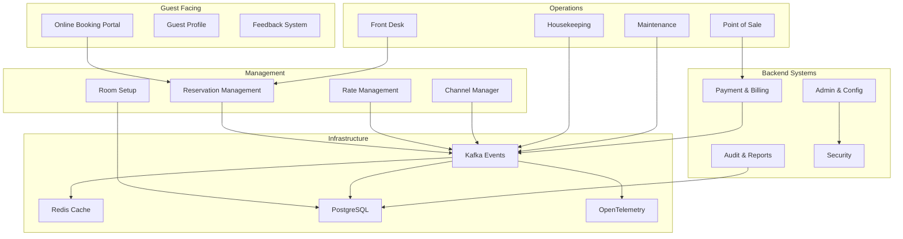

### 4.2 Module Specifications

#### 4.2.1 Reservation & Booking Module
**Purpose:** Core reservation engine handling all booking operations

**Key Features:**
- Real-time availability checking
- Multi-room and group bookings
- Booking modifications and cancellations
- Waitlist management
- Booking confirmation with QR codes
- Guest history and preferences tracking
- Corporate and travel agent bookings
- Package deals and promotions

**User Stories:**
- As a guest, I want to search for available rooms by date and preferences
- As a front desk agent, I want to create walk-in reservations quickly
- As a manager, I want to view and modify any reservation

#### 4.2.2 Availability Management
**Purpose:** Real-time inventory and availability tracking

**Key Features:**
- Real-time room inventory
- Availability calendar view
- Block/release room functionality
- Overbooking management
- Room allocation optimization
- Maintenance blocking
- Long-stay management

**Integration Points:**
- Syncs with Channel Manager for OTA updates
- Publishes availability events to Kafka
- Caches frequently accessed data in Redis

#### 4.2.3 Rates Management
**Purpose:** Dynamic pricing and rate plan management

**Key Features:**
- Base rate configuration
- Dynamic pricing rules
- Seasonal rate adjustments
- Weekend/weekday differentials
- Length-of-stay pricing
- Last-minute deals
- Corporate rate contracts
- Package pricing

**Rate Calculation Flow:**
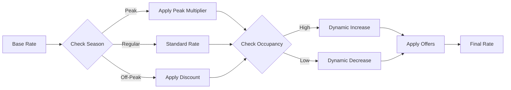

#### 4.2.4 Room Setup & Amenities Configuration
**Purpose:** Define and manage room types, features, and amenities

**Key Features:**
- Room type definitions
- Amenity management
- Room feature configuration
- Floor plan management
- Virtual room tours
- Photo galleries
- Room capacity settings
- Connecting room configurations

#### 4.2.5 Offers & Promotions
**Purpose:** Create and manage special offers and packages

**Key Features:**
- Promotional code generation
- Package creation (room + amenities)
- Early bird discounts
- Loyalty program integration
- Referral rewards
- Group discounts
- Corporate deals
- Seasonal packages

#### 4.2.6 Seasonal Rates
**Purpose:** Manage rate variations based on seasons and events

**Key Features:**
- Season definition and calendar
- Event-based pricing
- Holiday rate management
- Automatic rate transitions
- Historical season analysis
- Forecast-based adjustments

#### 4.2.7 Add-ons Management
**Purpose:** Upsell additional services and amenities

**Key Features:**
- Service catalog (spa, tours, transfers)
- Meal plan options
- Equipment rentals
- Premium amenity packages
- Dynamic add-on suggestions
- Bundle offerings
- Third-party service integration

#### 4.2.8 Customer Feedback Module
**Purpose:** Collect and analyze guest feedback

**Key Features:**
- Post-stay survey automation
- Real-time feedback alerts
- Review aggregation
- Sentiment analysis
- Response management
- Reputation monitoring
- Feedback analytics dashboard
- Integration with review platforms

#### 4.2.9 Night Audit & Date Roll
**Purpose:** Daily closing procedures and system date management

**Key Features:**
- Automatic night audit process
- Revenue reconciliation
- No-show processing
- Automatic charge posting
- Report generation
- System date advancement
- Data archival
- Audit trail generation

**Night Audit Process:**
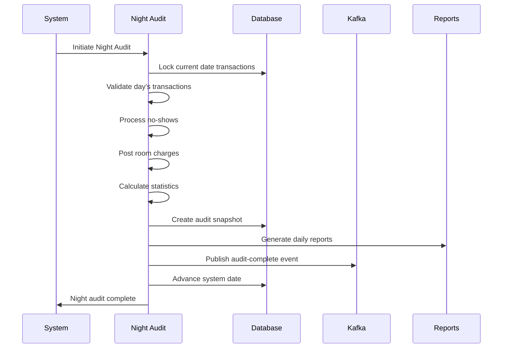

#### 4.2.10 Audit & Compliance
**Purpose:** Maintain comprehensive audit trails and ensure compliance

**Key Features:**
- Complete transaction logging
- User action tracking
- Data change history
- Compliance reporting
- Access control audit
- PCI DSS compliance tools
- GDPR compliance features
- Regulatory report generation

#### 4.2.11 Reports Module
**Purpose:** Comprehensive reporting and analytics

**Key Reports:**
- Occupancy reports
- Revenue reports (daily/monthly/yearly)
- Guest demographics
- Channel performance
- Housekeeping status
- Financial statements
- Forecast reports
- Custom report builder

**Report Categories:**
- Operational Reports
- Financial Reports
- Guest Analytics
- Performance Metrics
- Compliance Reports
- Executive Dashboards

#### 4.2.12 Back Office & Admin
**Purpose:** System administration and configuration

**Key Features:**
- User management and RBAC
- System configuration
- Property setup
- Tax configuration
- Integration management
- Backup and restore
- System health monitoring
- License management

#### 4.2.13 Point of Sale (POS)
**Purpose:** Manage all property sales and services

**Key Features:**
- Restaurant billing
- Spa services
- Gift shop
- Room service
- Minibar tracking
- Split billing
- Multi-currency support
- Integrated payment processing

#### 4.2.14 Housekeeping & Maintenance
**Purpose:** Manage room cleaning and property maintenance

**Key Features:**
- Room status management
- Cleaning task assignment
- Inspection checklists
- Maintenance request tracking
- Inventory management
- Staff scheduling
- Lost and found
- Preventive maintenance scheduling

**Housekeeping Workflow:**
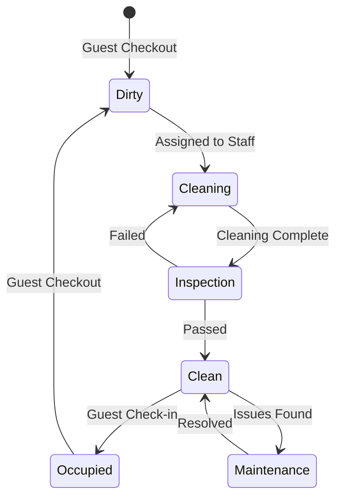

#### 4.2.15 Payment & Billing
**Purpose:** Handle all payment processing and billing operations

**Key Features:**
- Multiple payment methods
- Payment gateway integration
- Invoice generation
- Folio management
- Deposit handling
- Refund processing
- Payment reconciliation
- Multi-currency conversion
- Payment tokenization
- Recurring billing

#### 4.2.16 Channel Manager (OTA/GDS Integration)
**Purpose:** Synchronize with Online Travel Agencies and Global Distribution Systems

**Key Features:**
- Multi-channel connectivity
- Real-time inventory sync
- Rate parity management
- Booking retrieval
- Channel performance analytics
- Automated mapping
- Error handling and retry
- Channel-specific rules

**Supported Channels:**
- Booking.com
- Expedia
- Airbnb
- Hotels.com
- Agoda
- GDS (Amadeus, Sabre)
- Direct website
- Meta search engines

#### 4.2.17 Front Desk / Reception Module
**Purpose:** Streamline front desk operations

**Key Features:**
- Quick check-in/check-out
- Walk-in management
- Guest registration
- Key card management
- Guest messaging
- Concierge services
- Wake-up calls
- Package handling
- VIP guest management
- Group arrivals

#### 4.2.18 Security & Compliance
**Purpose:** Ensure system security and regulatory compliance

**Key Features:**
- Role-based access control
- Data encryption
- PCI DSS compliance
- GDPR tools
- Audit logging
- Security monitoring
- Intrusion detection
- Data privacy controls
- Compliance reporting
- Security training tracking

---

## 5. Non-Functional Requirements

### 5.1 Performance Requirements
- **Response Time:** < 2 seconds for 95% of transactions
- **Concurrent Users:** Support 500+ simultaneous users
- **Transaction Throughput:** 100+ bookings per minute
- **Search Performance:** < 500ms for availability searches
- **Report Generation:** < 10 seconds for standard reports
- **Real-time Sync:** < 1 second for critical updates

### 5.2 Scalability Requirements
- **Horizontal Scaling:** Microservices architecture for independent scaling
- **Database Sharding:** Support for data partitioning
- **Multi-tenancy:** Support for hotel chains
- **Load Balancing:** Automatic traffic distribution
- **Geographic Distribution:** Multi-region deployment capability

### 5.3 Reliability & Availability
- **Uptime SLA:** 99.95% availability
- **Recovery Time Objective (RTO):** < 1 hour
- **Recovery Point Objective (RPO):** < 15 minutes
- **Failover:** Automatic failover with < 30 seconds downtime
- **Data Durability:** 99.999999999% (11 9's)

### 5.4 Security Requirements
- **Authentication:** Multi-factor authentication support
- **Authorization:** Fine-grained RBAC
- **Encryption:** TLS 1.3 for transit, AES-256 for storage
- **Compliance:** PCI DSS Level 1, GDPR compliant
- **Security Audits:** Quarterly penetration testing
- **Session Management:** Secure session handling with timeout

### 5.5 Usability Requirements
- **Theme Support:** Dark and light theme switching
- **Responsive Design:** Mobile, tablet, and desktop support
- **Accessibility:** WCAG 2.1 Level AA compliance
- **Internationalization:** Support for 10+ languages
- **User Training:** < 2 hours for basic operations
- **Help System:** Contextual help and documentation

### 5.6 Observability Requirements
- **Logging:** Structured logging with OpenTelemetry
- **Tracing:** Distributed tracing across services
- **Metrics:** Real-time performance metrics
- **Alerting:** Proactive alert system
- **Dashboards:** Real-time monitoring dashboards
- **Log Retention:** 90 days hot storage, 2 years cold storage

---

## 6. System Architecture

### 6.1 High-Level Architecture

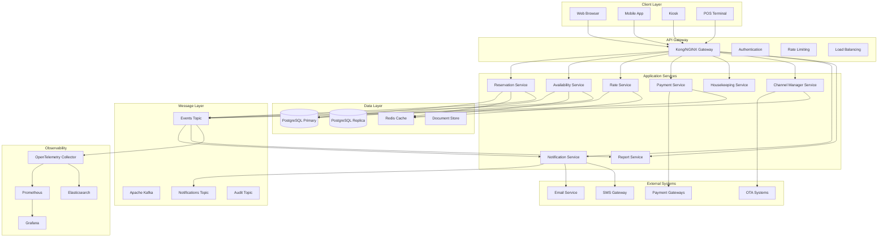

### 6.2 Microservices Communication

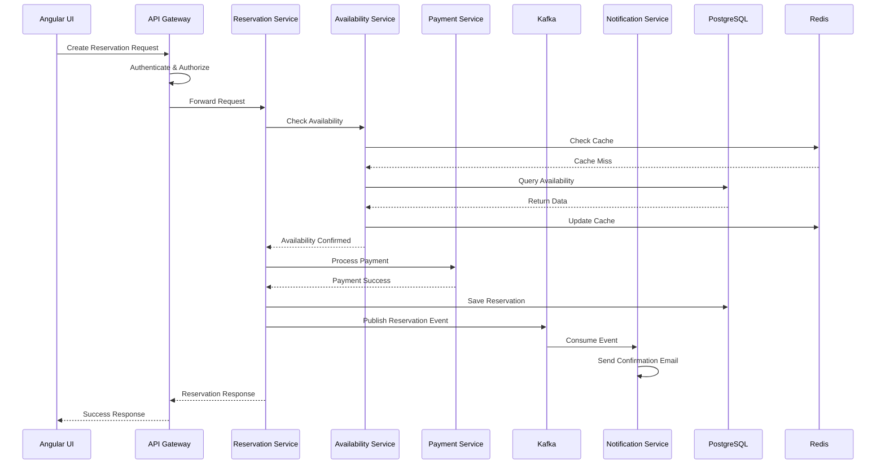

### 6.3 Data Flow Architecture

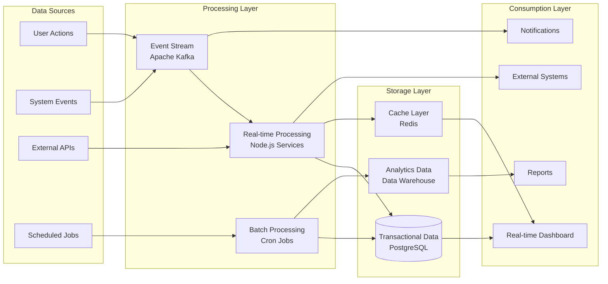

### 6.4 Deployment Architecture

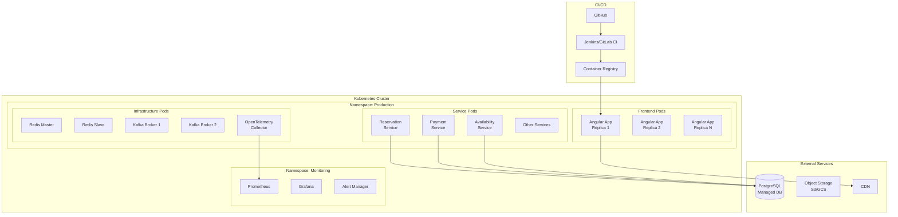

---

## 7. Theme Support Implementation

### 7.1 Theme Architecture
- **Theme Service:** Centralized theme management
- **Theme Storage:** User preference in database
- **Theme Variables:** CSS custom properties
- **Dynamic Loading:** Runtime theme switching
- **Accessibility:** High contrast mode support

### 7.2 Theme Components
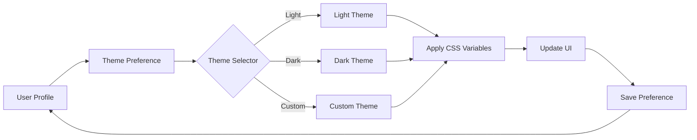

---

## 8. Kafka Implementation for Real-time Notifications

### 8.1 Kafka Topic Structure
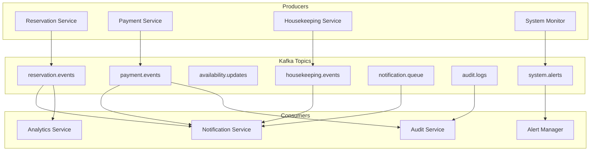

### 8.2 Notification Flow
1. **Event Generation:** Service publishes event to Kafka
2. **Event Processing:** Notification service consumes event
3. **Template Selection:** Choose notification template based on event type
4. **Channel Selection:** Determine delivery channel (email/SMS/push/in-app)
5. **Delivery:** Send notification through selected channel
6. **Tracking:** Log delivery status and user engagement

---

## 9. OpenTelemetry Integration

### 9.1 Observability Stack
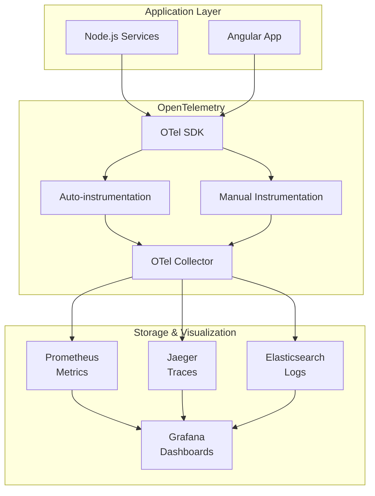

### 9.2 Logging Strategy
- **Structured Logging:** JSON format with correlation IDs
- **Log Levels:** ERROR, WARN, INFO, DEBUG, TRACE
- **Context Propagation:** Trace IDs across services
- **Sensitive Data:** Masking and encryption
- **Retention Policy:** 30 days hot, 1 year cold storage
- **Log Aggregation:** Centralized logging with search capabilities

---

## 10. Docker & Kubernetes Deployment

### 10.1 Container Strategy
- **Base Images:** Node.js Alpine for services, NGINX for Angular
- **Multi-stage Builds:** Optimize image size
- **Security Scanning:** Vulnerability assessment in CI/CD
- **Registry:** Private container registry
- **Versioning:** Semantic versioning for images

### 10.2 Kubernetes Resources
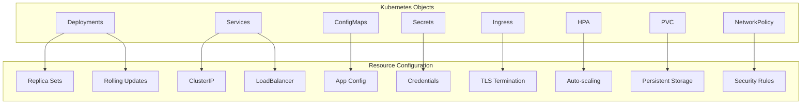

### 10.3 Deployment Pipeline
1. **Code Commit:** Push to Git repository
2. **Build Trigger:** CI/CD pipeline activation
3. **Test Execution:** Unit, integration, and security tests
4. **Image Build:** Docker image creation
5. **Image Push:** Upload to container registry
6. **Deployment:** Kubernetes rolling update
7. **Health Check:** Readiness and liveness probes
8. **Smoke Test:** Automated validation
9. **Monitoring:** Metrics and log verification

---

## 11. Development Timeline

### Phase 1: Foundation (Weeks 1-6)
- [x] Project setup and architecture design
- [ ] Development environment configuration
- [ ] CI/CD pipeline setup
- [ ] Basic authentication and authorization
- [ ] Database schema design
- [ ] Kafka cluster setup
- [ ] OpenTelemetry integration
- [ ] Angular project scaffolding with Material UI
- [ ] Theme support implementation

### Phase 2: Core Modules (Weeks 7-14)
- [ ] Reservation & Booking module
- [ ] Availability management
- [ ] Rate management system
- [ ] Room configuration
- [ ] Front desk module
- [ ] Basic payment integration
- [ ] Real-time notifications via Kafka

### Phase 3: Advanced Features (Weeks 15-22)
- [ ] Channel Manager integration
- [ ] Housekeeping & Maintenance
- [ ] Point of Sale system
- [ ] Customer feedback module
- [ ] Offers and promotions
- [ ] Add-ons management
- [ ] Advanced reporting

### Phase 4: Operations & Analytics (Weeks 23-28)
- [ ] Night audit implementation
- [ ] Comprehensive audit system
- [ ] Advanced analytics dashboard
- [ ] Back office administration
- [ ] Security hardening
- [ ] Performance optimization

### Phase 5: Testing & Deployment (Weeks 29-32)
- [ ] End-to-end testing
- [ ] Load testing
- [ ] Security audit
- [ ] User acceptance testing
- [ ] Production deployment
- [ ] Documentation completion
- [ ] Staff training

---

## 12. Risk Management

### 12.1 Technical Risks

| Risk | Impact | Probability | Mitigation Strategy |
|------|--------|-------------|-------------------|
| Kafka cluster failure | High | Low | Multi-broker setup, replication factor 3 |
| Database performance issues | High | Medium | Read replicas, query optimization, caching |
| OTA integration complexity | Medium | High | Phased integration, fallback mechanisms |
| Real-time sync delays | Medium | Medium | Redis caching, event-driven updates |
| Security vulnerabilities | High | Medium | Regular audits, OWASP compliance |
| Scalability bottlenecks | High | Low | Microservices architecture, auto-scaling |

### 12.2 Business Risks

| Risk | Impact | Probability | Mitigation Strategy |
|------|--------|-------------|-------------------|
| User adoption resistance | High | Medium | Comprehensive training, intuitive UI |
| Data migration issues | High | Low | Thorough testing, phased migration |
| Regulatory compliance | High | Low | Regular compliance audits |
| Integration partner changes | Medium | Medium | Abstraction layers, multiple vendors |
| Scope creep | Medium | High | Clear requirements, change control |

---

## 13. Success Criteria

### 13.1 Technical Success Metrics
- **System Performance:** Meeting all NFR targets
- **Code Coverage:** > 80% test coverage
- **Security Score:** A+ rating in security audits
- **Deployment Frequency:** Daily deployments capability
- **Mean Time to Recovery:** < 30 minutes

### 13.2 Business Success Metrics
- **ROI:** Positive return within 18 months
- **Operational Efficiency:** 60% reduction in manual tasks
- **Revenue Impact:** 20% increase in RevPAR
- **Customer Satisfaction:** NPS score > 70
- **Market Position:** Top 3 in feature completeness

---

## 14. Dependencies & Assumptions

### 14.1 Dependencies
- **External Systems:** Payment gateways availability
- **Third-party Services:** OTA API stability
- **Infrastructure:** Cloud provider SLAs
- **Licensing:** Software license procurement
- **Resources:** Team availability and expertise

### 14.2 Assumptions
- Stable internet connectivity at properties
- Staff technical competency for basic operations
- Existing data in migratable format
- Regulatory requirements remain stable
- Budget approval for all phases

---

## 15. Appendix

### 15.1 Glossary
- **OTA:** Online Travel Agency
- **GDS:** Global Distribution System
- **RevPAR:** Revenue Per Available Room
- **ADR:** Average Daily Rate
- **PMS:** Property Management System
- **POS:** Point of Sale
- **PCI DSS:** Payment Card Industry Data Security Standard
- **GDPR:** General Data Protection Regulation
- **RBAC:** Role-Based Access Control
- **SLA:** Service Level Agreement
- **NFR:** Non-Functional Requirement

### 15.2 Reference Documents
- OpenTelemetry Documentation
- Kafka Architecture Guide
- Angular Material Design Guidelines
- PostgreSQL Performance Tuning
- Kubernetes Best Practices
- PCI DSS Compliance Requirements
- GDPR Implementation Guide

### 15.3 Technology Stack Versions
- Node.js: v20.x LTS
- Angular: v17.x LTS
- PostgreSQL: 15.x
- Redis: 7.x
- Apache Kafka: 3.x
- Docker: 24.x
- Kubernetes: 1.28.x
- OpenTelemetry: Latest stable

---

**Document Approval:**

| Role | Name | Signature | Date |
|------|------|-----------|------|
| Product Owner | | | |
| Technical Lead | | | |
| Business Stakeholder | | | |
| Project Manager | | | |

---

**Revision History:**

| Version | Date | Author | Changes |
|---------|------|---------|---------|
| 1.0 | Sept 24, 2025 | Initial | Initial draft |
| 2.0 | Sept 24, 2025 | Team | Comprehensive update with all modules |

---

**Next Steps:**
1. Review and approval from all stakeholders
2. Technical architecture deep dive
3. API specification documentation
4. Database schema finalization
5. Development environment setup
6. Sprint planning for Phase 1
