# Product Requirements Document (PRD)
## Modern Reservation Management System

### Document Information
- **Project Name:** Modern Reservation Management System
- **Version:** 2.0
- **Date:** September 24, 2025
- **Author:** Development Team
- **Stakeholders:** Product Owner, Engineering Team, Operations Team, Hotel Management

---

## 1. Executive Summary

### 1.1 Project Overview
The Modern Reservation Management System is a comprehensive, cloud-native hospitality management platform designed to streamline all aspects of hotel operations. Built on a microservices architecture using Node.js LTS, Angular LTS with Material Design, PostgreSQL, Redis, and Apache Kafka, this system provides end-to-end management capabilities from reservations to housekeeping, integrated with modern payment systems and channel managers.

### 1.2 Vision Statement
To create a unified, scalable, and user-friendly reservation management system that empowers hospitality businesses to efficiently manage their operations, optimize revenue, and enhance guest experiences through real-time data processing and intelligent automation.

### 1.3 Technology Stack
- **Frontend:** Angular LTS (v17+) with Angular Material
- **Backend:** Node.js LTS (v20+) with Express.js/NestJS
- **Database:** PostgreSQL 15+ (Primary), Redis 7+ (Cache)
- **Schema Validation:** Zod for TypeScript-first schema validation
- **Message Broker:** Apache Kafka (Real-time notifications)
- **Observability:** OpenTelemetry for distributed tracing and logging
- **Containerization:** Docker & Kubernetes
- **UI/UX:** Dark/Light theme support, Responsive design

---

## 2. Business Objectives

### 2.1 Primary Goals
1. **Operational Efficiency:** Reduce manual processes by 75% through automation
2. **Revenue Optimization:** Increase revenue by 20% through dynamic pricing and channel management
3. **Guest Satisfaction:** Improve guest experience with seamless booking and real-time updates
4. **Data-Driven Decisions:** Provide comprehensive analytics and reporting for informed decision-making
5. **Scalability:** Support properties from 10 to 1000+ rooms with multi-property chains

### 2.2 Success Metrics
- **Booking Conversion Rate:** > 25% improvement
- **Average Processing Time:** < 3 seconds for reservations
- **System Uptime:** 99.95% availability
- **User Adoption:** 90% staff adoption within 30 days
- **Revenue Per Available Room (RevPAR):** 15% increase
- **Guest Satisfaction Score:** > 4.5/5

---

## 3. Target Users & Personas

### 3.1 Guest User
- **Goals:** Quick and easy booking, transparent pricing, instant confirmation
- **Pain Points:** Complex booking processes, hidden fees, lack of real-time availability
- **Access:** Web portal, mobile responsive interface

### 3.2 Front Desk Staff
- **Goals:** Efficient check-in/out, quick access to guest information, handle walk-ins
- **Pain Points:** Multiple systems, slow processing, manual paperwork
- **Access:** Desktop application with barcode/card reader support

### 3.3 Reservation Manager
- **Goals:** Optimize occupancy, manage rates, handle group bookings
- **Pain Points:** Manual rate adjustments, channel synchronization issues
- **Access:** Full dashboard with analytics

### 3.4 Housekeeping Staff
- **Goals:** Real-time room status updates, efficient task management
- **Pain Points:** Paper-based tracking, communication delays
- **Access:** Mobile/tablet interface

### 3.5 Hotel Administrator
- **Goals:** System configuration, user management, compliance reporting
- **Pain Points:** Limited visibility, manual report generation
- **Access:** Admin portal with full system access

### 3.6 Finance Team
- **Goals:** Accurate billing, payment reconciliation, financial reporting
- **Pain Points:** Manual invoice generation, payment tracking
- **Access:** Finance module with export capabilities

---

## 4. Functional Requirements

### 4.1 Core Modules Overview

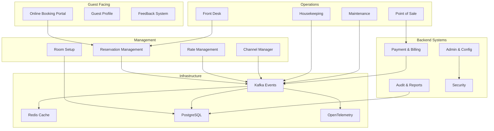

### 4.2 Module Specifications

#### 4.2.1 Reservation & Booking Module
**Purpose:** Core reservation engine handling all booking operations

**Key Features:**
- Real-time availability checking
- Multi-room and group bookings
- Booking modifications and cancellations
- Waitlist management
- Booking confirmation with QR codes
- Guest history and preferences tracking
- Corporate and travel agent bookings
- Package deals and promotions
- **Soft Delete System:** Fail-safe reservation deletion with audit trail

**Soft Delete Capabilities:**
- **Reservation Cancellation:** Mark reservations as soft deleted instead of permanent removal
- **Recovery Window:** 30-day recovery period for accidentally cancelled reservations
- **Audit Trail:** Complete logging of who deleted reservations and why
- **Automatic Cleanup:** Hard delete after 7-year retention period for compliance
- **Bulk Operations:** Soft delete multiple reservations with admin approval

**User Stories:**
- As a guest, I want to search for available rooms by date and preferences
- As a front desk agent, I want to create walk-in reservations quickly
- As a manager, I want to view and modify any reservation
- **As a manager, I want to safely cancel reservations knowing they can be recovered if needed**
- **As an auditor, I want to see complete history of all reservation deletions**

#### 4.2.2 Availability Management
**Purpose:** Real-time inventory and availability tracking

**Key Features:**
- Real-time room inventory
- Availability calendar view
- Block/release room functionality
- Overbooking management
- Room allocation optimization
- Maintenance blocking
- Long-stay management
- **Soft Delete System:** Room blocking records with recovery capabilities

**Soft Delete Capabilities:**
- **Availability Blocks:** Soft delete room blocks with admin recovery options
- **Historical Tracking:** Maintain history of availability changes for audit
- **Bulk Block Management:** Safely remove multiple availability blocks
- **Maintenance Records:** Soft delete maintenance blocks after completion
- **Recovery Tools:** Restore accidentally deleted availability configurations

**Integration Points:**
- Syncs with Channel Manager for OTA updates
- Publishes availability events to Kafka
- Caches frequently accessed data in Redis
- **Audit Events:** Kafka events for all soft delete operations

#### 4.2.3 Rates Management
**Purpose:** Dynamic pricing and rate plan management

**Key Features:**
- Base rate configuration
- Dynamic pricing rules
- Seasonal rate adjustments
- Weekend/weekday differentials
- Length-of-stay pricing
- Last-minute deals
- Corporate rate contracts
- Package pricing
- **Soft Delete System:** Safe rate plan archival with historical preservation

**Soft Delete Capabilities:**
- **Rate Plan Archival:** Soft delete outdated rate plans while preserving historical data
- **Seasonal Rate Cleanup:** Archive expired seasonal rates with recovery option
- **Contract Management:** Soft delete expired corporate contracts with audit trail
- **Promotion Management:** Archive completed promotions while maintaining historical revenue data
- **Bulk Rate Operations:** Safely archive multiple rate plans with manager approval

**Rate Calculation Flow:**
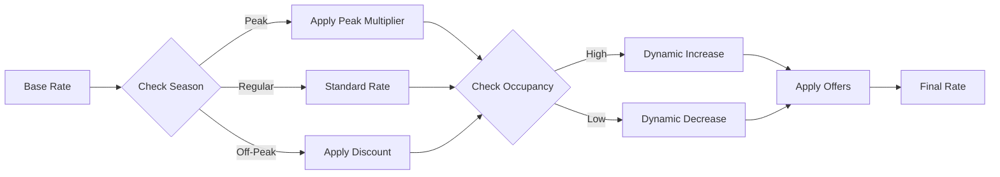

#### 4.2.4 Room Setup & Amenities Configuration
**Purpose:** Define and manage room types, features, and amenities

**Key Features:**
- Room type definitions
- Amenity management
- Room feature configuration
- Floor plan management
- Virtual room tours
- Photo galleries
- Room capacity settings
- Connecting room configurations

#### 4.2.5 Offers & Promotions
**Purpose:** Create and manage special offers and packages

**Key Features:**
- Promotional code generation
- Package creation (room + amenities)
- Early bird discounts
- Loyalty program integration
- Referral rewards
- Group discounts
- Corporate deals
- Seasonal packages

#### 4.2.6 Seasonal Rates
**Purpose:** Manage rate variations based on seasons and events

**Key Features:**
- Season definition and calendar
- Event-based pricing
- Holiday rate management
- Automatic rate transitions
- Historical season analysis
- Forecast-based adjustments

#### 4.2.7 Add-ons Management
**Purpose:** Upsell additional services and amenities

**Key Features:**
- Service catalog (spa, tours, transfers)
- Meal plan options
- Equipment rentals
- Premium amenity packages
- Dynamic add-on suggestions
- Bundle offerings
- Third-party service integration

#### 4.2.8 Customer Feedback Module
**Purpose:** Collect and analyze guest feedback

**Key Features:**
- Post-stay survey automation
- Real-time feedback alerts
- Review aggregation
- Sentiment analysis
- Response management
- Reputation monitoring
- Feedback analytics dashboard
- Integration with review platforms

#### 4.2.9 Night Audit & Date Roll
**Purpose:** Daily closing procedures and system date management

**Key Features:**
- Automatic night audit process
- Revenue reconciliation
- No-show processing
- Automatic charge posting
- Report generation
- System date advancement
- Data archival
- Audit trail generation

**Night Audit Process:**
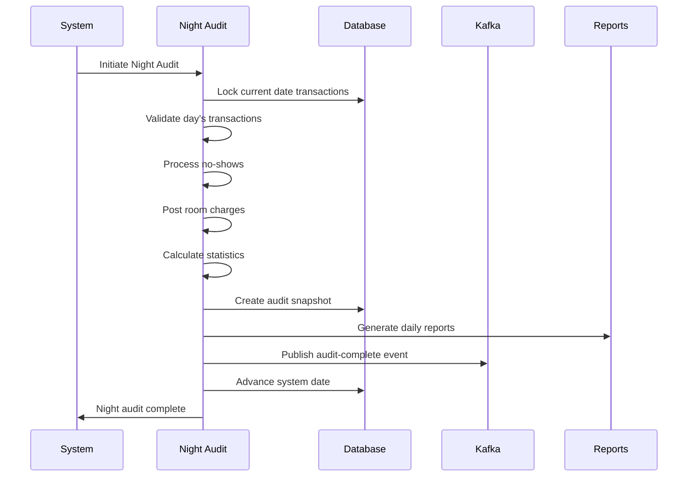

#### 4.2.10 Audit & Compliance
**Purpose:** Maintain comprehensive audit trails and ensure compliance

**Key Features:**
- Complete transaction logging
- User action tracking
- Data change history
- Compliance reporting
- Access control audit
- PCI DSS compliance tools
- GDPR compliance features
- Regulatory report generation

#### 4.2.11 Reports Module
**Purpose:** Comprehensive reporting and analytics

**Key Reports:**
- Occupancy reports
- Revenue reports (daily/monthly/yearly)
- Guest demographics
- Channel performance
- Housekeeping status
- Financial statements
- Forecast reports
- Custom report builder

**Report Categories:**
- Operational Reports
- Financial Reports
- Guest Analytics
- Performance Metrics
- Compliance Reports
- Executive Dashboards

#### 4.2.12 Back Office & Admin
**Purpose:** System administration and configuration

**Key Features:**
- User management and RBAC
- System configuration
- Property setup
- Tax configuration
- Integration management
- Backup and restore
- System health monitoring
- License management

#### 4.2.13 Point of Sale (POS)
**Purpose:** Manage all property sales and services

**Key Features:**
- Restaurant billing
- Spa services
- Gift shop
- Room service
- Minibar tracking
- Split billing
- Multi-currency support
- Integrated payment processing

#### 4.2.14 Housekeeping & Maintenance
**Purpose:** Manage room cleaning and property maintenance

**Key Features:**
- Room status management
- Cleaning task assignment
- Inspection checklists
- Maintenance request tracking
- Inventory management
- Staff scheduling
- Lost and found
- Preventive maintenance scheduling

**Housekeeping Workflow:**
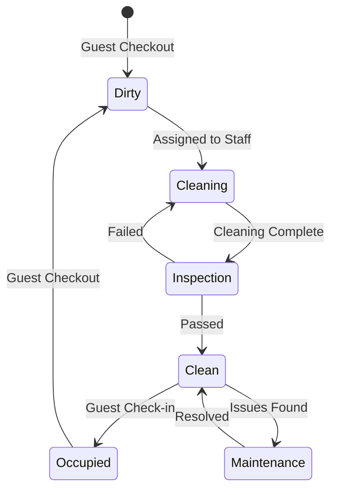

#### 4.2.15 Payment & Billing
**Purpose:** Handle all payment processing and billing operations

**Key Features:**
- Multiple payment methods
- Payment gateway integration
- Invoice generation
- Folio management
- Deposit handling
- Refund processing
- Payment reconciliation
- Multi-currency conversion
- Payment tokenization
- Recurring billing

#### 4.2.16 Channel Manager (OTA/GDS Integration)
**Purpose:** Synchronize with Online Travel Agencies and Global Distribution Systems

**Key Features:**
- Multi-channel connectivity
- Real-time inventory sync
- Rate parity management
- Booking retrieval
- Channel performance analytics
- Automated mapping
- Error handling and retry
- Channel-specific rules

**Supported Channels:**
- Booking.com
- Expedia
- Airbnb
- Hotels.com
- Agoda
- GDS (Amadeus, Sabre)
- Direct website
- Meta search engines

#### 4.2.17 Front Desk / Reception Module
**Purpose:** Streamline front desk operations

**Key Features:**
- Quick check-in/check-out
- Walk-in management
- Guest registration
- Key card management
- Guest messaging
- Concierge services
- Wake-up calls
- Package handling
- VIP guest management
- Group arrivals

#### 4.2.18 Security & Compliance
**Purpose:** Ensure system security and regulatory compliance

**Key Features:**
- Role-based access control
- Data encryption
- PCI DSS compliance
- GDPR tools
- Audit logging
- Security monitoring
- Intrusion detection
- Data privacy controls
- Compliance reporting
- Security training tracking

### 4.3 Soft Delete API Specifications

#### 4.3.1 Core Soft Delete Endpoints

**Universal Soft Delete Endpoints (Available for All Entities):**

```typescript
// Soft Delete Single Record
DELETE /api/v1/{entity}/{id}
Request Headers:
  Authorization: Bearer {jwt_token}
  Content-Type: application/json
Request Body:
{
  "reason": "string",           // Required: Deletion reason
  "businessJustification": "string" // Optional: Business context
}
Response: 200 OK
{
  "success": true,
  "recordId": "uuid",
  "deletedAt": "2025-09-24T10:30:00Z",
  "deletedBy": "user_uuid",
  "auditTrailId": "audit_uuid",
  "recoveryWindow": "30 days"
}

// Soft Delete Bulk Records
DELETE /api/v1/{entity}/bulk
Request Body:
{
  "recordIds": ["uuid1", "uuid2", "uuid3"],
  "reason": "string",
  "businessJustification": "string",
  "adminApproval": "admin_user_uuid"  // Required for bulk operations
}
Response: 200 OK
{
  "success": true,
  "deletedCount": 3,
  "failed": [],
  "auditTrailIds": ["audit_uuid1", "audit_uuid2", "audit_uuid3"]
}

// Restore Single Record
POST /api/v1/{entity}/{id}/restore
Request Body:
{
  "reason": "string",
  "businessJustification": "string"
}
Response: 200 OK
{
  "success": true,
  "recordId": "uuid",
  "restoredAt": "2025-09-24T11:00:00Z",
  "restoredBy": "user_uuid",
  "auditTrailId": "audit_uuid"
}

// Get Deleted Records (Admin Only)
GET /api/v1/{entity}/deleted?page=1&limit=50&since=2025-09-01
Response: 200 OK
{
  "records": [...deleted records with metadata...],
  "pagination": { "page": 1, "limit": 50, "total": 150 },
  "metadata": {
    "deletionSummary": {
      "totalDeleted": 150,
      "pendingCleanup": 45,
      "recoverable": 105
    }
  }
}
```

#### 4.3.2 Entity-Specific Soft Delete APIs

**Reservation Soft Delete (Enhanced):**
```typescript
// Cancel Reservation with Soft Delete
DELETE /api/v1/reservations/{reservationId}
Request Body:
{
  "reason": "guest_cancellation|no_show|overbooking|system_error",
  "refundAmount": 150.00,         // Optional: Refund amount
  "notifyGuest": true,            // Send cancellation notification
  "blockDates": false,            // Block dates for future bookings
  "businessJustification": "Guest requested cancellation due to emergency"
}

// Restore Cancelled Reservation
POST /api/v1/reservations/{reservationId}/restore
Request Body:
{
  "reason": "accidental_cancellation|guest_request|system_error",
  "processPayment": true,         // Re-process payment if needed
  "updateAvailability": true,     // Update room availability
  "notifyGuest": true
}
```

**Rate Management Soft Delete:**
```typescript
// Archive Rate Plan
DELETE /api/v1/rates/{rateId}
Request Body:
{
  "reason": "expired|replaced|seasonal_end|restructure",
  "replacementRateId": "uuid",    // Optional: Link to replacement rate
  "effectiveDate": "2025-10-01",  // When archival takes effect
  "preserveBookings": true        // Keep existing bookings with archived rate
}

// Bulk Archive Seasonal Rates
DELETE /api/v1/rates/seasonal/bulk
Request Body:
{
  "season": "summer_2024",
  "reason": "seasonal_cleanup",
  "adminApproval": "admin_uuid"
}
```

#### 4.3.3 Cleanup & Maintenance APIs

**Administrative Cleanup Endpoints:**
```typescript
// Get Cleanup Status
GET /api/v1/admin/cleanup/status
Response: 200 OK
{
  "nextScheduledCleanup": "2025-09-25T02:00:00Z",
  "entitiesAwaitingCleanup": {
    "reservations": 1250,
    "payments": 890,
    "guestProfiles": 234,
    "ratePlans": 45
  },
  "estimatedCleanupDuration": "45 minutes",
  "storageReclaimed": "2.3GB"
}

// Manual Trigger Cleanup (Emergency)
POST /api/v1/admin/cleanup/trigger
Request Body:
{
  "entityTypes": ["reservations", "payments"],
  "confirmationCode": "EMERGENCY_CLEANUP_2025",
  "adminApproval": "super_admin_uuid",
  "reason": "storage_emergency|compliance_requirement|manual_maintenance"
}

// Generate Cleanup Report
GET /api/v1/admin/cleanup/report?startDate=2025-09-01&endDate=2025-09-24
Response: 200 OK
{
  "periodSummary": {
    "totalRecordsDeleted": 15420,
    "storageReclaimed": "12.8GB",
    "entitiesProcessed": {
      "reservations": 8900,
      "payments": 4320,
      "guestProfiles": 1800,
      "ratePlans": 400
    }
  },
  "complianceStatus": "COMPLIANT",
  "nextActions": ["schedule_backup_verification"]
}
```

#### 4.3.4 Audit & Compliance APIs

**Comprehensive Audit Trail:**
```typescript
// Get Deletion Audit Trail
GET /api/v1/audit/deletions/{entityType}?userId={uuid}&dateRange=last30days
Response: 200 OK
{
  "auditRecords": [
    {
      "auditId": "uuid",
      "entityType": "reservation",
      "entityId": "uuid",
      "action": "soft_delete",
      "performedBy": "user_uuid",
      "performedAt": "2025-09-24T10:30:00Z",
      "reason": "guest_cancellation",
      "businessJustification": "Emergency cancellation",
      "additionalContext": {
        "guestNotified": true,
        "refundProcessed": true,
        "approvalRequired": false
      }
    }
  ],
  "pagination": {...},
  "summary": {
    "totalDeletions": 45,
    "byReason": {
      "guest_cancellation": 30,
      "no_show": 10,
      "system_error": 5
    }
  }
}

// Generate Compliance Report
POST /api/v1/compliance/soft-delete-report
Request Body:
{
  "reportType": "gdpr|pci_dss|sox|full",
  "dateRange": {
    "startDate": "2025-08-01",
    "endDate": "2025-09-24"
  },
  "includeDetails": true
}
Response: 200 OK
{
  "reportId": "uuid",
  "generatedAt": "2025-09-24T12:00:00Z",
  "complianceScore": 99.8,
  "findings": [
    {
      "level": "INFO",
      "description": "All retention policies properly implemented",
      "recommendation": "Continue current practices"
    }
  ],
  "downloadUrl": "/api/v1/reports/{reportId}/download"
}
```

#### 4.3.5 Performance & Security Specifications

**Performance Requirements:**
- **Soft Delete Response Time:** < 10ms for single record, < 500ms for bulk operations
- **Restore Response Time:** < 50ms for single record restoration
- **Audit Query Performance:** < 200ms for standard audit queries
- **Cleanup Performance:** Process 10,000+ records per minute during maintenance windows

**Security & Authorization:**
- **Role-Based Access:** Only authorized roles can perform soft deletes
- **Admin Approval:** Bulk operations require manager+ approval
- **Audit Logging:** All soft delete operations logged to immutable audit store
- **Recovery Window:** Automatic expiry of recovery capabilities after defined periods
- **Encryption:** All soft-deleted data encrypted at rest and in transit

---

## 5. Non-Functional Requirements

### 5.1 Performance Requirements
**Ultra-High Performance Targets (10,000 Reservations per Minute Scale):**
- **Response Time:** < 50ms for 95% of API calls, < 100ms for 99% of transactions
- **Concurrent Users:** Support 100,000+ simultaneous users across all properties
- **Transaction Throughput:** 10,000+ reservations per minute (600,000+ per hour)
- **Search Performance:** < 10ms for availability searches (cached), < 50ms for complex searches
- **Report Generation:** < 2 seconds for real-time reports, < 15 seconds for complex analytics
- **Real-time Sync:** < 25ms for critical updates across all channels
- **Database Performance:** < 5ms for 95% of read queries, < 10ms for 95% of write operations
- **Cache Performance:** < 1ms for Redis operations, 99.9%+ cache hit ratio for availability data
- **Write Throughput:** 1,000+ database writes per second sustained
- **Event Processing:** 500+ Kafka messages per second per partition

### 5.2 Scalability Requirements
**Ultra-Scale Architecture for 10,000+ Properties:**
- **Multi-Master Database Strategy:** 4+ database masters with horizontal sharding by property groups
- **Advanced Redis Architecture:** 21+ node cluster with dedicated availability, session, and locking services
- **Enhanced Kafka Infrastructure:** 15+ brokers with 100+ partitions for event streaming
- **Massive Auto-Scaling:** 200-400 pods per critical service with HPA and VPA
- **Multi-Region Active-Active:** Global distribution with cross-region replication
- **CQRS Pattern Implementation:** Separate read/write models for optimal performance
- **Event Sourcing:** Reservation state rebuilt from event streams for audit and recovery
- **Circuit Breaker Pattern:** Fault tolerance with automatic degradation
- **Write-Through Caching:** Immediate cache updates with asynchronous database writes
- **Batch Processing:** Bulk operations for non-critical updates

### 5.2.1 Ultra-Scale Architecture for 10,000 Reservations/Minute

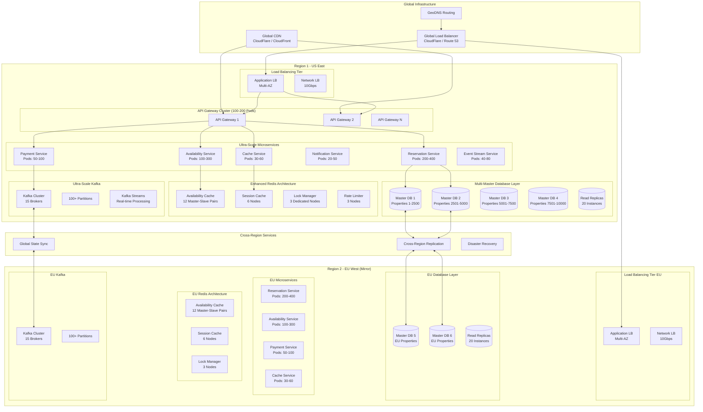

    subgraph "Global Services"
        CDN[CloudFront / CloudFlare CDN]
        MC[Memcached Global]
        ES[Elasticsearch Cluster]
    end

    GLB --> ALB1
    GLB --> ALB2
    ALB1 --> AG1
    ALB1 --> AG2
    ALB1 --> AG3
    AG1 --> RS1
    AG1 --> AS1
    AG1 --> PS1
    RS1 --> PG1
    AS1 --> R1
    PS1 --> K1

    ALB2 --> AG4
    ALB2 --> AG5
    ALB2 --> AG6
    AG4 --> RS2
    AG4 --> AS2
    AG4 --> PS2
    RS2 --> PG2
    AS2 --> R2
    PS2 --> K2

    PG1 <--> PG2
    R1 <--> R2
    K1 <--> K2

    CDN --> AG1
    CDN --> AG4
```

### 5.2.2 Multi-Master Database Architecture for Ultra-Scale

**Advanced Sharding Strategy:**
- **Multi-Master Setup:** 4+ database masters to distribute write load
- **Shard by Property Range:** 2,500 properties per master database
- **Active-Active Replication:** Cross-master synchronization for high availability
- **Massive Read Scaling:** 5+ read replicas per master (20+ total read replicas)
- **Advanced Connection Pooling:** PgBouncer with 5,000+ connections per pool
- **Write Distribution:** Intelligent write routing to prevent hotspots

**Ultra-Scale Database Architecture:**
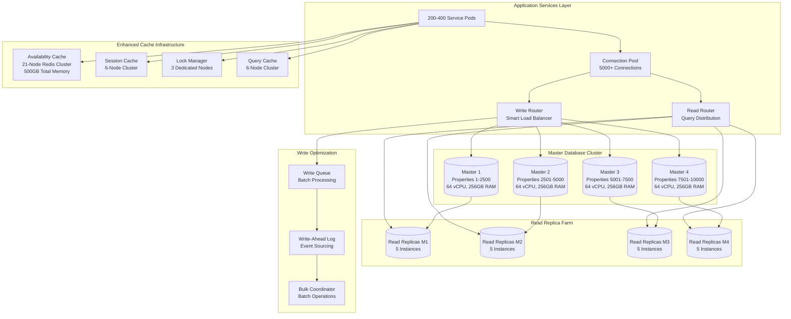

**Database Specifications for 10,000 Reservations/Minute:**
- **Master Databases:** 4 instances, 64 vCPU, 256GB RAM each
- **Read Replicas:** 20 instances, 32 vCPU, 128GB RAM each
- **Connection Pools:** 5,000+ connections per pool
- **Write Capacity:** 1,000+ writes/second per master
- **Read Capacity:** 10,000+ reads/second distributed across replicas
- **Storage:** NVMe SSD with 100,000+ IOPS per master

### 5.2.3 Ultra-Performance Caching Architecture

**Five-Tier Caching Strategy:**
- **L0 - CPU Cache:** Hardware-level caching for ultra-low latency
- **L1 - Application Cache:** In-memory caching within each service pod
- **L2 - Distributed Redis:** Multi-cluster Redis with specialized roles
- **L3 - Regional Cache:** CDN with edge locations for geographic distribution
- **L4 - Database Cache:** Advanced PostgreSQL query and result caching

**Enhanced Redis Architecture:**
```mermaid
graph TB
    subgraph "Redis Infrastructure (21 Nodes Total)"
        subgraph "Availability Cache Cluster"
            AC1[Master 1<br/>32GB RAM]
            AC2[Slave 1<br/>32GB RAM]
            AC3[Master 2<br/>32GB RAM]
            AC4[Slave 2<br/>32GB RAM]
            AC5[Master 3<br/>32GB RAM]
            AC6[Slave 3<br/>32GB RAM]
            AC7[Master 4<br/>32GB RAM]
            AC8[Slave 4<br/>32GB RAM]
            AC9[Master 5<br/>32GB RAM]
            AC10[Slave 5<br/>32GB RAM]
            AC11[Master 6<br/>32GB RAM]
            AC12[Slave 6<br/>32GB RAM]
        end

        subgraph "Session Management Cluster"
            SC1[Session Master 1<br/>16GB RAM]
            SC2[Session Slave 1<br/>16GB RAM]
            SC3[Session Master 2<br/>16GB RAM]
            SC4[Session Slave 2<br/>16GB RAM]
            SC5[Session Master 3<br/>16GB RAM]
            SC6[Session Slave 3<br/>16GB RAM]
        end

        subgraph "Lock Manager Cluster"
            LC1[Lock Manager 1<br/>8GB RAM]
            LC2[Lock Manager 2<br/>8GB RAM]
            LC3[Lock Manager 3<br/>8GB RAM]
        end
    end

    subgraph "Cache Request Flow"
        CR[Cache Request<br/>10,000/minute]
        AR[Availability Router]
        SR[Session Router]
        LR[Lock Router]
    end

    CR --> AR
    CR --> SR
    CR --> LR

    AR --> AC1
    AR --> AC3
    AR --> AC5
    SR --> SC1
    SR --> SC3
    SR --> SC5
    LR --> LC1
    LR --> LC2
    LR --> LC3
```

**Ultra-Fast Cache Performance Specifications:**
- **Total Redis Memory:** 500GB across all clusters
- **Availability Cache Hit Rate:** 99.9% for room availability queries
- **Session Cache Performance:** < 1ms response time
- **Distributed Lock Performance:** < 2ms lock acquisition
- **Cache Throughput:** 100,000+ operations per second
- **Failover Time:** < 100ms automatic failover between master/slave
    APP --> L1
    L1 -->|Cache Miss| L2
    L2 -->|Cache Miss| L3
    L3 -->|Cache Miss| DB

    L1 -->|Cache Hit| APP
    L2 -->|Cache Hit| APP
    L3 -->|Cache Hit| APP
```

### 5.2.4 Ultra-High Volume Transaction Processing (10,000/Minute)

**Critical Performance Target: 167 Reservations per Second Sustained Load**

**1. CQRS + Event Sourcing Pipeline**
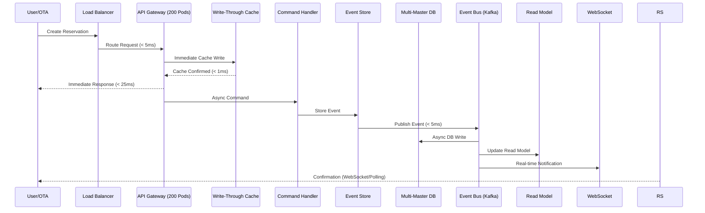

**2. Database Optimization Techniques**
- **Connection Pooling:** 500+ connections per service with PgBouncer
- **Batch Operations:** Process multiple reservations in single transactions
- **Optimized Indexes:** Composite indexes on frequently queried columns
- **Partitioning:** Date-based partitioning for reservations table
- **Read Replicas:** 3-5 read replicas per region for search queries
- **Write Optimization:** Separate write-optimized master databases

**3. Availability Cache Strategy**
- **Pre-computed Availability:** Daily batch jobs to pre-calculate 90-day availability
- **Real-time Updates:** Incremental updates via Kafka events
- **Cache Warming:** Proactive cache population for high-demand properties
- **Distributed Locking:** Redis-based distributed locks to prevent overbooking
- **Cache Hierarchy:** Property → Room Type → Date range caching

**4. Queue Management Architecture**
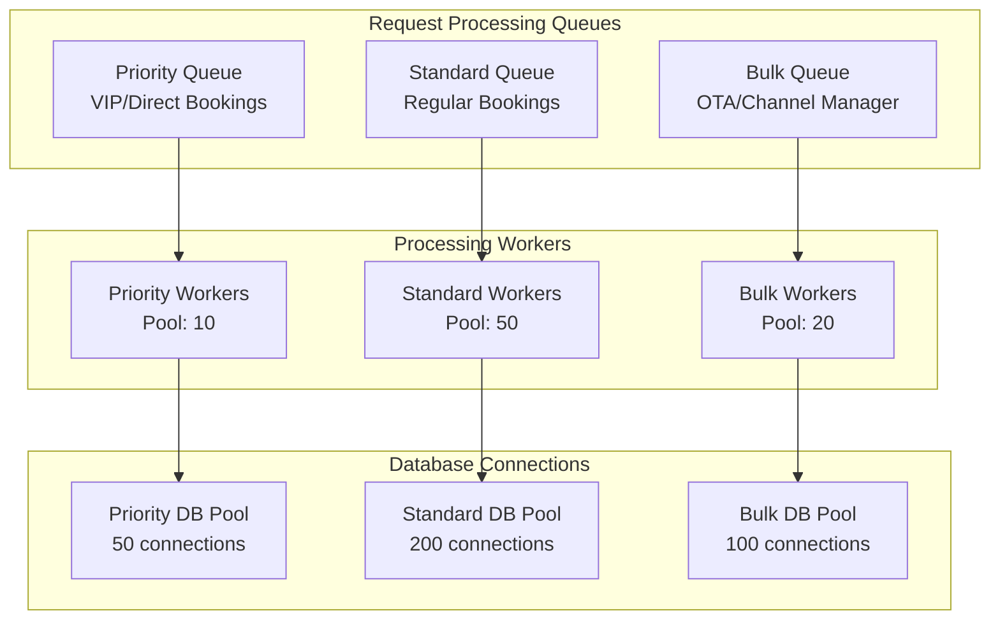

**2. Ultra-Scale Resource Allocation for 10,000 Reservations/Minute**

**Kubernetes Ultra-Scale Resource Planning:**
- **API Gateway:** 100-200 pods, 4 CPU, 8GB RAM each, HPA enabled
- **Reservation Service:** 200-400 pods, 8 CPU, 16GB RAM each, VPA + HPA
- **Availability Service:** 100-300 pods, 4 CPU, 8GB RAM each, Custom Metrics HPA
- **Payment Service:** 50-100 pods, 4 CPU, 8GB RAM each, Queue-based HPA
- **Cache Service:** 30-60 pods, 2 CPU, 4GB RAM each, Memory-based HPA
- **Event Stream Service:** 40-80 pods, 4 CPU, 8GB RAM each, Kafka Lag HPA
- **Notification Service:** 20-50 pods, 2 CPU, 4GB RAM each, Queue Depth HPA

**Ultra-Performance Database Infrastructure:**
- **Master DB Cluster:** 4 masters, 64 vCPU, 256GB RAM each, NVMe SSD (100K IOPS)
- **Read Replica Farm:** 20 replicas, 32 vCPU, 128GB RAM each, distributed globally
- **Redis Ultra Cluster:** 21 nodes total, 500GB combined memory, sub-millisecond latency
- **Connection Pools:** 5,000+ connections per pool with intelligent routing
- **Backup Infrastructure:** Continuous backup with 15-minute RPO

**Network and Load Balancing:**
- **Global Load Balancer:** Multi-region with intelligent geo-routing
- **Regional Load Balancers:** 10Gbps network interfaces, SSL termination
- **Service Mesh:** Istio with advanced traffic management and circuit breakers
- **CDN:** Global edge locations with 99.99% availability

**3. Critical Monitoring and Alerting for Ultra-Scale**
- **Reservation Rate Alert:** < 8,000 reservations/minute during peak (20% safety margin)
- **Ultra-Low Latency Alert:** > 50ms for 95th percentile API response
- **Database Write Alert:** > 800 writes/second per master (safety threshold)
- **Redis Performance Alert:** > 2ms response time or < 99.5% cache hit rate
- **Kafka Lag Alert:** > 100 messages consumer lag
- **Connection Pool Alert:** > 70% utilization (early warning)
- **Memory Alert:** > 75% memory usage across any service
- **CPU Alert:** > 70% CPU usage with scaling lag
- **Network Alert:** > 80% bandwidth utilization
- **Error Cascade Alert:** > 0.01% error rate (ultra-strict for high-value customer)

### 5.2.5 Circuit Breaker and Fault Tolerance Patterns

**Circuit Breaker Implementation:**
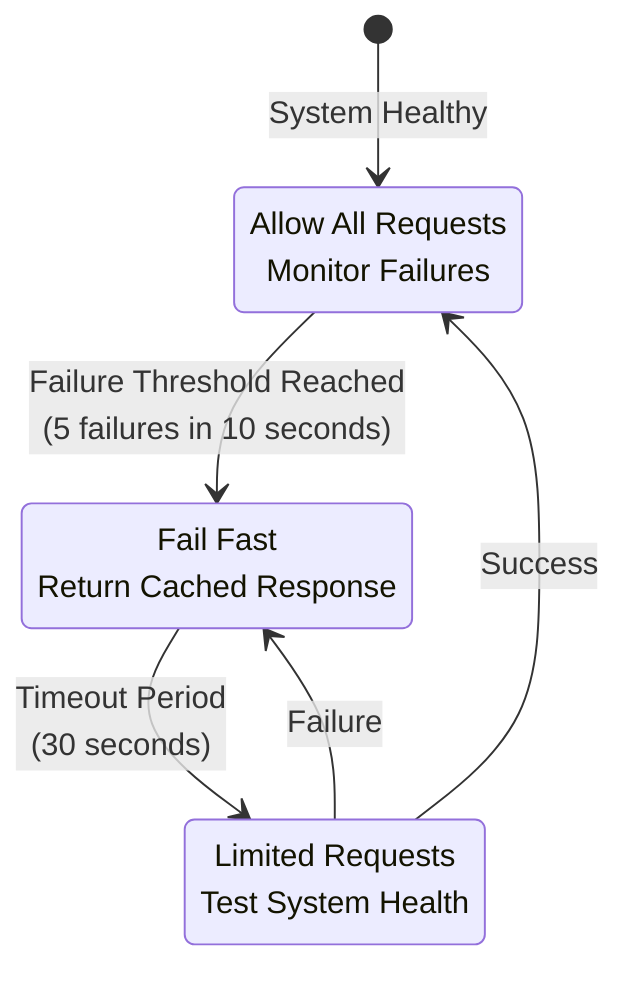

**Fault Tolerance Strategy:**
- **Database Circuit Breakers:** Protect against database overload
- **Redis Circuit Breakers:** Fallback to database when cache fails
- **Kafka Circuit Breakers:** Queue messages locally during Kafka outages
- **API Circuit Breakers:** Rate limiting and graceful degradation
- **Bulkhead Pattern:** Isolate critical resources (reservation processing from reporting)
- **Timeout Management:** Aggressive timeouts (< 100ms for cache, < 1s for DB)

### 5.2.6 CQRS and Event Sourcing Architecture

**Command Query Responsibility Segregation:**
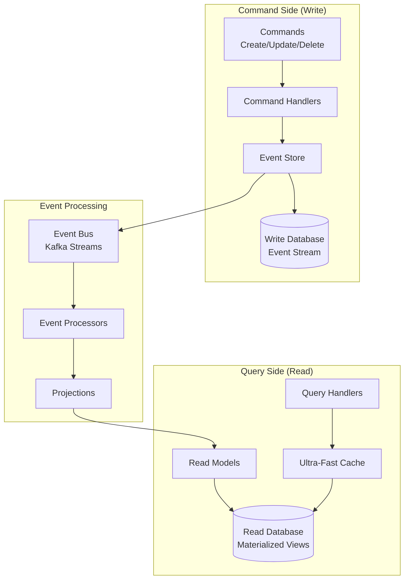

**Event Sourcing Benefits for Ultra-Scale:**
- **Perfect Audit Trail:** Every state change captured as immutable events
- **Temporal Queries:** Query system state at any point in time
- **Replay Capability:** Rebuild read models from events during failures
- **Horizontal Scaling:** Events naturally partition by aggregate ID (property/reservation)
- **Eventually Consistent Reads:** Ultra-fast queries from materialized views
- **Business Intelligence:** Rich event stream for analytics and machine learning

### 5.3 Ultra-High Reliability & Availability
- **Uptime SLA:** 99.99% availability (52 minutes downtime/year maximum)
- **Recovery Time Objective (RTO):** < 100 seconds for full service restoration
- **Recovery Point Objective (RPO):** < 30 seconds maximum data loss
- **Automatic Failover:** < 15 seconds with zero transaction loss
- **Data Durability:** 99.999999999% (11 9's) with cross-region replication
- **Disaster Recovery:** Multi-region active-active with automatic geo-failover
- **Chaos Engineering:** Regular failure testing to ensure resilience
- **Zero-Downtime Deployments:** Blue-green deployments with canary releases

### 5.4 Security Requirements
- **Authentication:** Multi-factor authentication support
- **Authorization:** Fine-grained RBAC
- **Encryption:** TLS 1.3 for transit, AES-256 for storage
- **Compliance:** PCI DSS Level 1, GDPR compliant
- **Security Audits:** Quarterly penetration testing
- **Session Management:** Secure session handling with timeout

#### 5.4.1 Soft Delete Security Framework
- **Access Control:** Role-based permissions for soft delete operations
  - **Staff Level:** Can soft delete their own created records
  - **Supervisor Level:** Can soft delete department records
  - **Manager Level:** Can soft delete all records + bulk operations
  - **Admin Level:** Can restore records + emergency hard delete
- **Audit Security:** Immutable audit trail stored in separate secure database
- **Data Encryption:** All soft-deleted records encrypted with separate keys
- **Recovery Authorization:** Multi-signature approval for sensitive data recovery
- **Compliance Integration:** Automated compliance checks before permanent deletion
- **Forensic Capabilities:** Complete chain of custody for all delete operations

### 5.5 Usability Requirements
- **Theme Support:** Dark and light theme switching
- **Responsive Design:** Mobile, tablet, and desktop support
- **Accessibility:** WCAG 2.1 Level AA compliance
- **Internationalization:** Support for 10+ languages
- **User Training:** < 2 hours for basic operations
- **Help System:** Contextual help and documentation

### 5.6 Observability Requirements
- **Logging:** Structured logging with OpenTelemetry
- **Tracing:** Distributed tracing across services
- **Metrics:** Real-time performance metrics
- **Alerting:** Proactive alert system
- **Dashboards:** Real-time monitoring dashboards
- **Log Retention:** 90 days hot storage, 2 years cold storage

---

## 6. System Architecture

### 6.1 High-Level Architecture

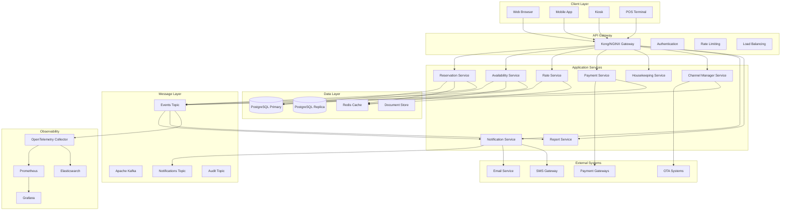

### 6.2 Microservices Communication

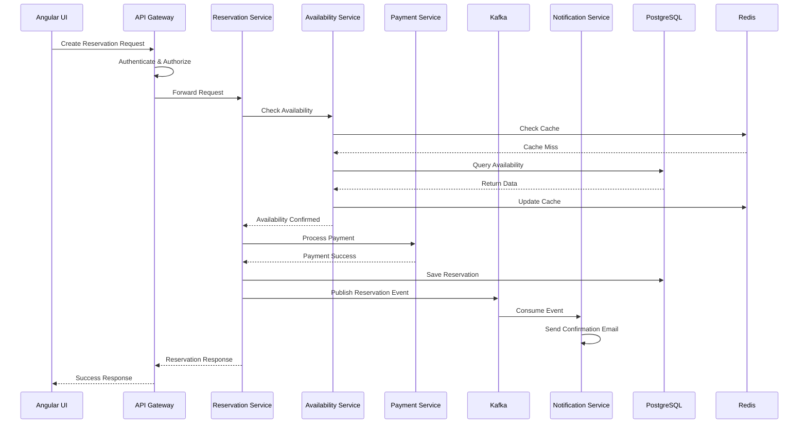

### 6.3 Data Flow Architecture

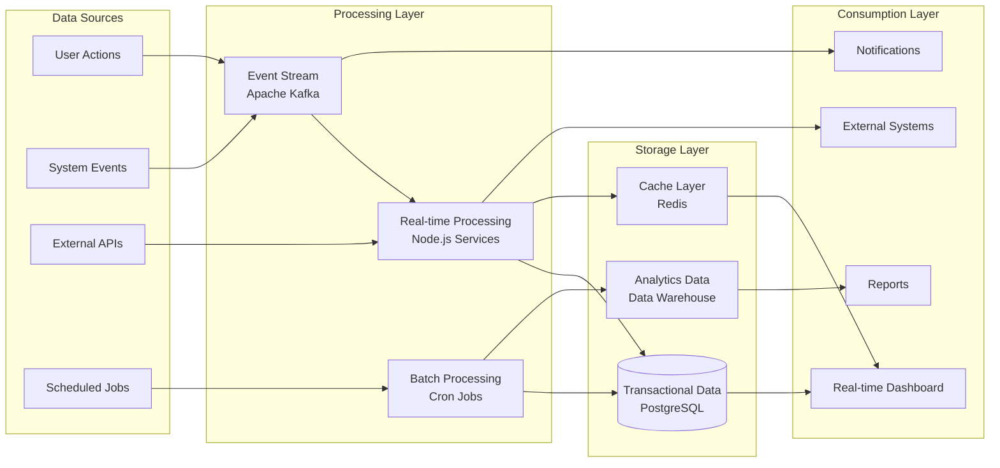

### 6.4 Deployment Architecture

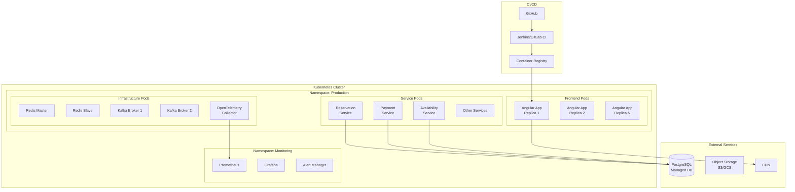

---

## 7. Database-Agnostic Schema Implementation with Zod

### 7.1 Schema-First Architecture
The application implements a database-agnostic approach using Zod for TypeScript-first schema validation, ensuring the system can run with any database or data source that matches our schema definitions.

### 7.2 Zod Schema Benefits
- **Type Safety:** Compile-time and runtime type checking
- **Database Independence:** Schema-driven data layer abstraction
- **Validation:** Input/output validation at API boundaries
- **Documentation:** Self-documenting schemas with TypeScript inference
- **Consistency:** Unified data models across frontend and backend
- **Flexibility:** Easy migration between different databases

### 7.3 Core Data Models

The system will define comprehensive data models for all entities using Zod schema validation:

#### 7.3.1 User Entity (Enhanced with Soft Delete)
- **Unique identifier:** UUID-based user ID
- **Authentication:** Email and password hash
- **Profile:** First name, last name, phone number
- **Role-based access:** Guest, Staff, Manager, Admin roles
- **Preferences:** Theme (light/dark), language, notification settings
- **Soft Delete Fields:** isDeleted, deletedAt, deletedBy, deletionReason
- **Audit fields:** createdAt, createdBy, updatedAt, updatedBy
- **Retention:** hardDeleteAfter, retentionPeriodDays (default: 2555 days)

#### 7.3.2 Reservation Entity (Enhanced with Soft Delete)
- **Identification:** UUID and human-readable confirmation number
- **Guest relationship:** Link to guest user account
- **Room assignment:** Connection to specific room
- **Stay details:** Check-in/out dates, number of guests
- **Status tracking:** Pending, confirmed, checked-in, checked-out, cancelled
- **Requests:** Special guest requirements and notes
- **Financial:** Total amount and payment status
- **Soft Delete Fields:** isDeleted, deletedAt, deletedBy, deletionReason
- **Audit trail:** createdAt, createdBy, updatedAt, updatedBy
- **Retention:** hardDeleteAfter, retentionPeriodDays (default: 2555 days - 7 years for legal compliance)

#### 7.3.3 Room Entity (Enhanced with Soft Delete)
- **Identity:** UUID and room number
- **Classification:** Room type categorization
- **Physical details:** Floor number, maximum occupancy
- **Status management:** Available, occupied, maintenance, cleaning, blocked
- **Features:** Array of room features and amenities
- **Pricing:** Base rate configuration
- **Operations:** Active/inactive status for operations
- **Soft Delete Fields:** isDeleted, deletedAt, deletedBy, deletionReason
- **Tracking:** createdAt, createdBy, updatedAt, updatedBy
- **Retention:** hardDeleteAfter, retentionPeriodDays (default: 1095 days)

#### 7.3.4 Rate Entity (Enhanced with Soft Delete)
- **Identification:** UUID and rate plan name
- **Room association:** Link to specific room type
- **Pricing structure:** Base rate with multipliers
- **Seasonal adjustments:** Peak/off-peak rate modifications
- **Day-of-week pricing:** Different rates for weekdays/weekends
- **Validity periods:** Start and end dates for rate plans
- **Status control:** Active/inactive rate management
- **Soft Delete Fields:** isDeleted, deletedAt, deletedBy, deletionReason
- **Audit trail:** createdAt, createdBy, updatedAt, updatedBy
- **Retention:** hardDeleteAfter, retentionPeriodDays (default: 2555 days)

### 7.4 Database-Agnostic Architecture

#### 7.4.1 Repository Pattern
The system implements a repository pattern to abstract data access:
- **Interface definition:** Standard CRUD operations across all entities
- **Schema validation:** Runtime validation using Zod schemas
- **Database abstraction:** Support for multiple database backends
- **Type safety:** Full TypeScript integration with compile-time checking
- **Error handling:** Consistent error responses across data operations

### 7.5 Supported Data Sources
The schema-based approach allows easy integration with multiple data sources:

- **Relational Databases:** PostgreSQL, MySQL, SQL Server, SQLite
- **Document Databases:** MongoDB, CouchDB
- **In-Memory Stores:** Redis, MemoryDB
- **Cloud Services:** DynamoDB, Firestore, CosmosDB
- **File Systems:** JSON files, CSV, Parquet
- **External APIs:** REST, GraphQL endpoints

### 7.6 Migration Strategy

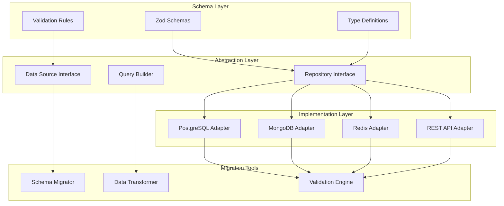

### 7.7 Implementation Benefits
- **Zero Vendor Lock-in:** Easy migration between databases
- **Development Flexibility:** Use different databases for different environments
- **Testing Simplified:** In-memory implementations for unit tests
- **Scalability Options:** Mix multiple data sources as needed
- **Type Safety:** Full TypeScript support with automatic inference
- **Runtime Validation:** Prevent invalid data from entering the system

### 7.8 Soft Delete System Implementation

#### 7.8.1 Soft Delete Architecture
The system implements a fail-safe soft delete mechanism to ensure data integrity, audit compliance, and recovery capabilities while maintaining ultra-high performance.

**Core Principles:**
- **Safety First:** No immediate data loss on delete operations
- **Audit Compliance:** Complete audit trail for all delete operations
- **Performance Maintained:** Soft deletes don't impact query performance
- **Automated Cleanup:** Scheduled hard deletes after retention periods
- **Recovery Capable:** Restore capabilities for accidentally deleted records

#### 7.8.2 Enhanced Zod Schema with Soft Delete Fields

All entities now include standardized soft delete and audit fields:

```typescript
// Base soft delete schema for all entities
const BaseSoftDeleteSchema = z.object({
  // Core identification
  id: z.string().uuid(),

  // Soft delete fields
  isDeleted: z.boolean().default(false),
  deletedAt: z.date().nullable().default(null),
  deletedBy: z.string().uuid().nullable().default(null),
  deletionReason: z.string().nullable().default(null),

  // Audit fields
  createdAt: z.date().default(() => new Date()),
  createdBy: z.string().uuid(),
  updatedAt: z.date().default(() => new Date()),
  updatedBy: z.string().uuid(),

  // Data retention
  hardDeleteAfter: z.date().nullable().default(null),
  retentionPeriodDays: z.number().default(2555), // 7 years default
});

// Extended schema for critical business entities
const ReservationSchema = BaseSoftDeleteSchema.extend({
  confirmationNumber: z.string(),
  guestId: z.string().uuid(),
  roomId: z.string().uuid(),
  checkInDate: z.date(),
  checkOutDate: z.date(),
  status: z.enum(['pending', 'confirmed', 'checked-in', 'checked-out', 'cancelled']),
  totalAmount: z.number().positive(),
  // ... other reservation fields
});
```

#### 7.8.3 Soft Delete Workflow Architecture

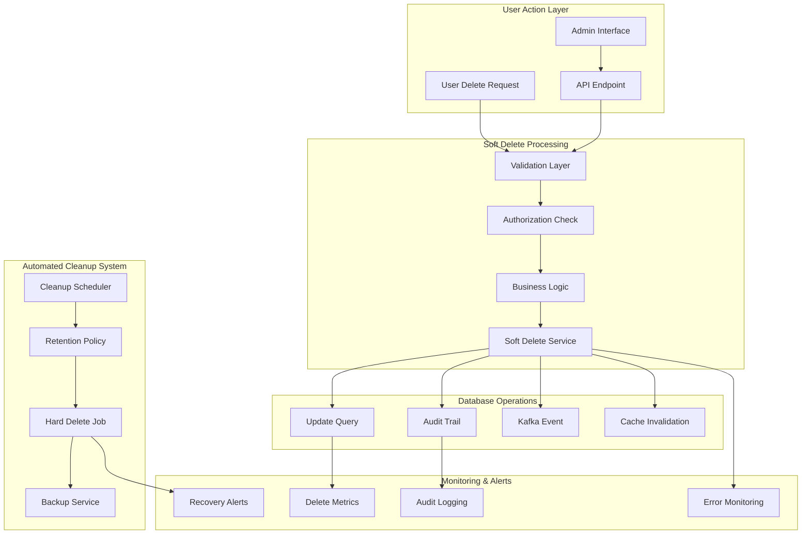

#### 7.8.4 Soft Delete Service Specifications

**High-Performance Soft Delete Operations:**
- **Response Time:** < 10ms for soft delete operations
- **Throughput:** Handle 1,000+ delete operations per second
- **Batch Operations:** Support bulk soft deletes (up to 10,000 records)
- **Atomic Operations:** Ensure consistency across related entities
- **Event Publishing:** Real-time notifications via Kafka

**Query Performance Optimization:**
```sql
-- Optimized indexes for soft delete queries
CREATE INDEX CONCURRENTLY idx_reservations_active
ON reservations (id, updated_at) WHERE is_deleted = false;

CREATE INDEX CONCURRENTLY idx_reservations_deleted
ON reservations (deleted_at, retention_period_days) WHERE is_deleted = true;

CREATE INDEX CONCURRENTLY idx_soft_delete_cleanup
ON reservations (hard_delete_after) WHERE is_deleted = true AND hard_delete_after IS NOT NULL;
```

#### 7.8.5 Automated Cleanup & Retention Policy

**Retention Policy Framework:**
```typescript
interface RetentionPolicy {
  entityType: string;
  defaultRetentionDays: number;
  minimumRetentionDays: number;
  maximumRetentionDays: number;
  legalHoldOverride: boolean;
  complianceRequirements: string[];
}

// Entity-specific retention policies
const retentionPolicies: RetentionPolicy[] = [
  {
    entityType: 'reservations',
    defaultRetentionDays: 2555, // 7 years
    minimumRetentionDays: 1095, // 3 years (legal minimum)
    maximumRetentionDays: 3650, // 10 years
    legalHoldOverride: true,
    complianceRequirements: ['PCI-DSS', 'GDPR', 'SOX']
  },
  {
    entityType: 'payments',
    defaultRetentionDays: 2555, // 7 years (financial records)
    minimumRetentionDays: 2555,
    maximumRetentionDays: 3650,
    legalHoldOverride: true,
    complianceRequirements: ['PCI-DSS', 'SOX', 'IRS']
  },
  {
    entityType: 'guest_data',
    defaultRetentionDays: 1095, // 3 years
    minimumRetentionDays: 365,  // 1 year
    maximumRetentionDays: 2190, // 6 years
    legalHoldOverride: true,
    complianceRequirements: ['GDPR', 'CCPA']
  },
  {
    entityType: 'audit_logs',
    defaultRetentionDays: 3650, // 10 years
    minimumRetentionDays: 2555,
    maximumRetentionDays: 7300, // 20 years
    legalHoldOverride: true,
    complianceRequirements: ['SOX', 'GDPR']
  }
];
```

#### 7.8.6 Automated Cleanup Jobs

**Daily Cleanup Scheduler:**
- **Execution Time:** 2:00 AM UTC (low traffic period)
- **Batch Size:** 10,000 records per batch to prevent database locks
- **Safety Checks:** Pre-cleanup validation and backup verification
- **Rollback Capability:** 24-hour rollback window with automatic snapshots

**Cleanup Process Flow:**
```mermaid
graph TB
    subgraph "Daily Cleanup Job (2:00 AM UTC)"
        ST[Cleanup Start]
        BC[Backup Check]
        RP[Retention Policy Evaluation]
        RR[Records Ready for Hard Delete]
    end

    subgraph "Safety Validation"
        LH[Legal Hold Check]
        CC[Compliance Validation]
        BR[Business Rule Validation]
        AC[Admin Confirmation]
    end

    subgraph "Batch Processing"
        BP[Batch Processing (10K records)]
        BU2[Pre-Delete Backup]
        HD2[Hard Delete Execution]
        KN[Kafka Notification]
    end

    subgraph "Post-Processing"
        AL3[Audit Logging]
        MU[Metrics Update]
        ER[Error Recovery]
        CR[Completion Report]
    end

    ST --> BC
    BC --> RP
    RP --> RR
    RR --> LH
    LH --> CC
    CC --> BR
    BR --> AC
    AC --> BP
    BP --> BU2
    BU2 --> HD2
    HD2 --> KN
    KN --> AL3
    AL3 --> MU
    MU --> CR

    HD2 --> ER
    ER --> CR
```

#### 7.8.7 Recovery & Restore Capabilities

**Data Recovery Service:**
- **Recovery Window:** 30 days for standard entities, 90 days for critical business data
- **Recovery Methods:** Individual record restore, bulk restore, point-in-time recovery
- **Authorization:** Manager+ level required for recovery operations
- **Audit Trail:** Complete audit log of all recovery operations

**Recovery Workflow:**
```typescript
interface RecoveryRequest {
  recordId: string;
  entityType: string;
  requestedBy: string;
  businessJustification: string;
  approvedBy?: string;
  recoveryType: 'individual' | 'bulk' | 'point-in-time';
  targetDate?: Date;
}

interface RecoveryResult {
  success: boolean;
  recoveredRecordId?: string;
  errorMessage?: string;
  auditTrailId: string;
  recoveredAt: Date;
}
```

#### 7.8.8 Performance Monitoring & Metrics

**Key Performance Indicators:**
- **Soft Delete Performance:** Average response time < 10ms
- **Cleanup Efficiency:** 99.9% successful cleanup rate
- **Storage Impact:** < 5% storage overhead from soft-deleted records
- **Recovery Success Rate:** 99.95% successful recovery operations
- **Compliance Score:** 100% retention policy adherence

**Monitoring Dashboard Metrics:**
```typescript
interface SoftDeleteMetrics {
  dailyDeletes: number;
  weeklyDeletes: number;
  monthlyDeletes: number;
  avgDeleteLatency: number;
  cleanupSuccess: number;
  storageOverhead: number;
  pendingRecoveries: number;
  complianceViolations: number;
}
```

---

## 8. Theme Support Implementation

### 7.1 Theme Architecture
- **Theme Service:** Centralized theme management
- **Theme Storage:** User preference in database
- **Theme Variables:** CSS custom properties
- **Dynamic Loading:** Runtime theme switching
- **Accessibility:** High contrast mode support

### 7.2 Theme Components
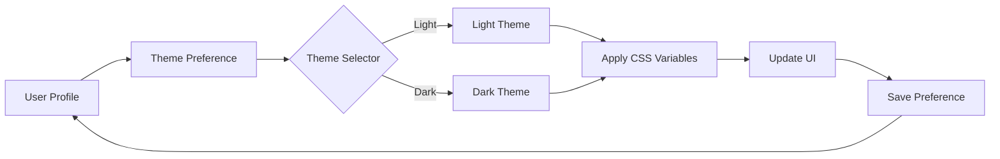

---

## 9. Ultra-Scale Kafka Implementation for Real-time Processing

### 9.1 Enhanced Kafka Cluster Architecture

**Ultra-Performance Kafka Configuration:**
- **Brokers:** 15 high-performance brokers across 3 availability zones
- **Total Partitions:** 500+ partitions for optimal parallel processing
- **Replication Factor:** 3 for high availability with min in-sync replicas = 2
- **Network:** 10Gbps network interfaces for high throughput
- **Storage:** NVMe SSD with 50,000+ IOPS per broker

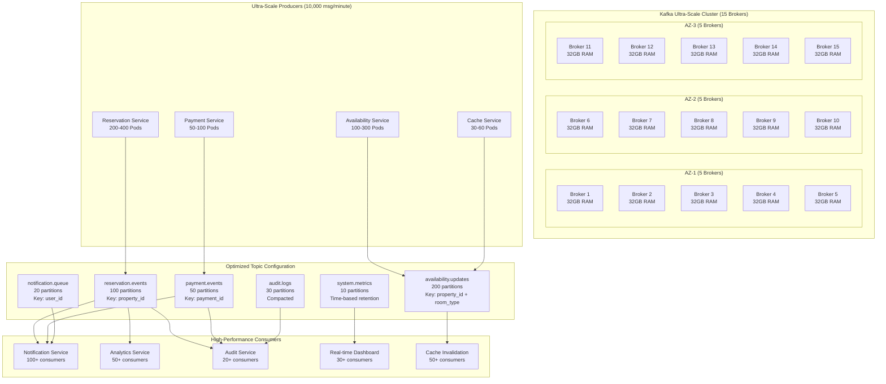

### 9.2 Ultra-Scale Topic Configuration

| Topic | Partitions | Replication Factor | Retention Period | Key Strategy | Compaction |
|-------|------------|-------------------|------------------|--------------|------------|
| reservation.events | 100 | 3 | 30 days | property_id + date | No |
| payment.events | 50 | 3 | 90 days | payment_id | No |
| availability.updates | 200 | 3 | 7 days | property_id + room_type | Yes |
| notification.queue | 20 | 3 | 24 hours | user_id | No |
| audit.logs | 30 | 3 | 365 days | tenant_id | Yes |
| system.metrics | 10 | 3 | 7 days | metric_type | No |
| cache.invalidation | 50 | 3 | 6 hours | cache_key | No |
| analytics.events | 40 | 3 | 180 days | event_type + date | No |

### 9.3 Ultra-Performance Specifications

#### 9.3.1 Throughput Requirements
- **Peak Throughput:** 500,000+ messages per second (10,000 reservations/minute)
- **Sustained Throughput:** 200,000 messages per second
- **Burst Capacity:** 750,000 messages per second for 5-minute windows
- **Message Size:** Optimized for 1-5KB messages
- **Batch Processing:** 10,000 messages per batch for efficiency

#### 9.3.2 Latency & Performance Targets
- **Producer Latency:** < 2ms (99th percentile)
- **End-to-End Latency:** < 5ms for critical events
- **Consumer Lag:** < 100ms under normal load
- **Replication Lag:** < 50ms between brokers
- **Network Utilization:** < 70% of 10Gbps capacity per broker

#### 9.3.3 Availability & Reliability
- **Cluster Availability:** 99.99% uptime (52 minutes/year)
- **Partition Leadership:** Auto-failover within 30 seconds
- **Data Durability:** 3-way replication + min in-sync replicas = 2
- **Disaster Recovery:** Cross-region backup with 1-hour RPO
- **Zero Data Loss:** Acknowledged writes only after successful replication

### 9.4 Notification Flow
1. **Event Generation:** Service publishes event to Kafka
2. **Event Processing:** Notification service consumes event
3. **Template Selection:** Choose notification template based on event type
4. **Channel Selection:** Determine delivery channel (email/SMS/push/in-app)
5. **Delivery:** Send notification through selected channel
6. **Tracking:** Log delivery status and user engagement

---

## 10. OpenTelemetry Integration

### 10.1 Observability Stack
```mermaid
graph TB
    subgraph "Application Layer"
        A1[Node.js Services]
        A2[Angular App]
    end

    subgraph "OpenTelemetry"
        B1[OTel SDK]
        B2[Auto-instrumentation]
        B3[Manual Instrumentation]
        B4[OTel Collector]
    end

    subgraph "Storage & Visualization"
        C1[Prometheus<br/>Metrics]
        C2[Jaeger<br/>Traces]
        C3[Elasticsearch<br/>Logs]
        C4[Grafana<br/>Dashboards]
    end

    A1 --> B1
    A2 --> B1
    B1 --> B2
    B1 --> B3
    B2 --> B4
    B3 --> B4
    B4 --> C1
    B4 --> C2
    B4 --> C3
    C1 --> C4
    C2 --> C4
    C3 --> C4
```

### 10.2 Logging Strategy
- **Structured Logging:** JSON format with correlation IDs
- **Log Levels:** ERROR, WARN, INFO, DEBUG, TRACE
- **Context Propagation:** Trace IDs across services
- **Sensitive Data:** Masking and encryption
- **Retention Policy:** 30 days hot, 1 year cold storage
- **Log Aggregation:** Centralized logging with search capabilities

---

## 11. Docker & Kubernetes Deployment

### 11.1 Container Strategy
- **Base Images:** Node.js Alpine for services, NGINX for Angular
- **Multi-stage Builds:** Optimize image size
- **Security Scanning:** Vulnerability assessment in CI/CD
- **Registry:** Private container registry
- **Versioning:** Semantic versioning for images

### 11.2 Kubernetes Resources
```mermaid
graph TB
    subgraph "Kubernetes Objects"
        A[Deployments]
        B[Services]
        C[ConfigMaps]
        D[Secrets]
        E[Ingress]
        F[HPA]
        G[PVC]
        H[NetworkPolicy]
    end

    subgraph "Resource Configuration"
        A --> A1[Replica Sets]
        A --> A2[Rolling Updates]
        B --> B1[ClusterIP]
        B --> B2[LoadBalancer]
        C --> C1[App Config]
        D --> D1[Credentials]
        E --> E1[TLS Termination]
        F --> F1[Auto-scaling]
        G --> G1[Persistent Storage]
        H --> H1[Security Rules]
    end
```

### 11.3 Deployment Pipeline
1. **Code Commit:** Push to Git repository
2. **Build Trigger:** CI/CD pipeline activation
3. **Test Execution:** Unit, integration, and security tests
4. **Image Build:** Docker image creation
5. **Image Push:** Upload to container registry
6. **Deployment:** Kubernetes rolling update
7. **Health Check:** Readiness and liveness probes
8. **Smoke Test:** Automated validation
9. **Monitoring:** Metrics and log verification

---

## 12. Development Timeline

### Phase 1: Foundation (Weeks 1-6)
- [x] Project setup and architecture design
- [ ] Development environment configuration
- [ ] CI/CD pipeline setup
- [ ] Basic authentication and authorization
- [ ] Database schema design
- [ ] Kafka cluster setup
- [ ] OpenTelemetry integration
- [ ] Angular project scaffolding with Material UI
- [ ] Theme support implementation

### Phase 2: Core Modules (Weeks 7-14)
- [ ] Reservation & Booking module
- [ ] Availability management
- [ ] Rate management system
- [ ] Room configuration
- [ ] Front desk module
- [ ] Basic payment integration
- [ ] Real-time notifications via Kafka

### Phase 3: Advanced Features (Weeks 15-22)
- [ ] Channel Manager integration
- [ ] Housekeeping & Maintenance
- [ ] Point of Sale system
- [ ] Customer feedback module
- [ ] Offers and promotions
- [ ] Add-ons management
- [ ] Advanced reporting

### Phase 4: Operations & Analytics (Weeks 23-28)
- [ ] Night audit implementation
- [ ] Comprehensive audit system
- [ ] Advanced analytics dashboard
- [ ] Back office administration
- [ ] Security hardening
- [ ] Performance optimization

### Phase 5: Testing & Deployment (Weeks 29-32)
- [ ] End-to-end testing
- [ ] Load testing
- [ ] Security audit
- [ ] User acceptance testing
- [ ] Production deployment
- [ ] Documentation completion
- [ ] Staff training

---

## 13. Risk Management

### 13.1 Technical Risks

| Risk | Impact | Probability | Mitigation Strategy |
|------|--------|-------------|-------------------|
| Kafka cluster failure | High | Low | Multi-broker setup, replication factor 3 |
| Database performance issues | High | Medium | Read replicas, query optimization, caching |
| OTA integration complexity | Medium | High | Phased integration, fallback mechanisms |
| Real-time sync delays | Medium | Medium | Redis caching, event-driven updates |
| Security vulnerabilities | High | Medium | Regular audits, OWASP compliance |
| Scalability bottlenecks | High | Low | Microservices architecture, auto-scaling |

### 13.2 Business Risks

| Risk | Impact | Probability | Mitigation Strategy |
|------|--------|-------------|-------------------|
| User adoption resistance | High | Medium | Comprehensive training, intuitive UI |
| Data migration issues | High | Low | Thorough testing, phased migration |
| Regulatory compliance | High | Low | Regular compliance audits |
| Integration partner changes | Medium | Medium | Abstraction layers, multiple vendors |
| Scope creep | Medium | High | Clear requirements, change control |

---

## 14. Success Criteria

### 14.1 Technical Success Metrics
- **System Performance:** Meeting all NFR targets
- **Code Coverage:** > 80% test coverage
- **Security Score:** A+ rating in security audits
- **Deployment Frequency:** Daily deployments capability
- **Mean Time to Recovery:** < 30 minutes

### 14.2 Business Success Metrics
- **ROI:** Positive return within 18 months
- **Operational Efficiency:** 60% reduction in manual tasks
- **Revenue Impact:** 20% increase in RevPAR
- **Customer Satisfaction:** NPS score > 70
- **Market Position:** Top 3 in feature completeness

---

## 15. Dependencies & Assumptions

### 15.1 Dependencies
- **External Systems:** Payment gateways availability
- **Third-party Services:** OTA API stability
- **Infrastructure:** Cloud provider SLAs
- **Licensing:** Software license procurement
- **Resources:** Team availability and expertise

### 15.2 Assumptions
- Stable internet connectivity at properties
- Staff technical competency for basic operations
- Existing data in migratable format
- Regulatory requirements remain stable
- Budget approval for all phases

---

## 16. Appendix

### 16.1 Glossary
- **OTA:** Online Travel Agency
- **GDS:** Global Distribution System
- **RevPAR:** Revenue Per Available Room
- **ADR:** Average Daily Rate
- **PMS:** Property Management System
- **POS:** Point of Sale
- **PCI DSS:** Payment Card Industry Data Security Standard
- **GDPR:** General Data Protection Regulation
- **RBAC:** Role-Based Access Control
- **SLA:** Service Level Agreement
- **NFR:** Non-Functional Requirement

### 16.2 Reference Documents
- OpenTelemetry Documentation
- Kafka Architecture Guide
- Angular Material Design Guidelines
- PostgreSQL Performance Tuning
- Kubernetes Best Practices
- PCI DSS Compliance Requirements
- GDPR Implementation Guide

### 16.3 Technology Stack Versions
- Node.js: v20.x LTS
- Angular: v17.x LTS
- PostgreSQL: 15.x
- Redis: 7.x
- Apache Kafka: 3.x
- Zod: v3.x
- Docker: 24.x
- Kubernetes: 1.28.x
- OpenTelemetry: Latest stable

---

**Document Approval:**

| Role | Name | Signature | Date |
|------|------|-----------|------|
| Product Owner | | | |
| Technical Lead | | | |
| Business Stakeholder | | | |
| Project Manager | | | |

---

**Revision History:**

| Version | Date | Author | Changes |
|---------|------|---------|---------|
| 1.0 | Sept 24, 2025 | Initial | Initial draft |
| 2.0 | Sept 24, 2025 | Team | Comprehensive update with all modules |

---

**Next Steps:**
1. Review and approval from all stakeholders
2. Technical architecture deep dive
3. API specification documentation
4. Database schema finalization
5. Development environment setup
6. Sprint planning for Phase 1
