# Product Requirements Document (PRD)
## Modern Reservation Management System

### Document Information
- **Project Name:** Modern Reservation Management System
- **Version:** 2.0
- **Date:** September 24, 2025
- **Author:** Development Team
- **Stakeholders:** Product Owner, Engineering Team, Operations Team, Hotel Management

---

## 1. Executive Summary

### 1.1 Project Overview
The Modern Reservation Management System is a comprehensive, cloud-native hospitality management platform designed to streamline all aspects of hotel operations. Built on a microservices architecture using Node.js LTS, Angular LTS with Material Design, PostgreSQL, Redis, and Apache Kafka, this system provides end-to-end management capabilities from reservations to housekeeping, integrated with modern payment systems and channel managers.

### 1.2 Vision Statement
To create a unified, scalable, and user-friendly reservation management system that empowers hospitality businesses to efficiently manage their operations, optimize revenue, and enhance guest experiences through real-time data processing and intelligent automation.

### 1.3 Technology Stack - Hybrid Architecture Approach

**Strategic Decision: Hybrid Node.js + Java Architecture**

For ultra-scale performance handling 10,000 reservations per minute with 100,000+ concurrent users, this system implements a strategic hybrid approach combining the strengths of both Node.js and Java ecosystems.

**Frontend Technologies:**
- **Angular LTS (v17+)** with Angular Material Design System
- **Progressive Web App (PWA)** capabilities for mobile experience
- **TypeScript** for type safety and development productivity
- **NgRx** for state management across complex applications
- **Angular Universal** for server-side rendering and SEO

**Backend Architecture - Service Distribution:**
- **Node.js Services** (I/O Intensive, Real-time Operations):
  - API Gateway and Load Balancing
  - WebSocket Services for Real-time Updates
  - Notification and Communication Services
  - Channel Manager Integrations (Multiple OTA APIs)
  - Housekeeping and Simple CRUD Operations
  - Event Processing and Streaming

- **Java Services** (CPU Intensive, Complex Business Logic):
  - Core Reservation Processing Engine
  - Availability Calculation and Optimization
  - Dynamic Pricing and Rate Management
  - Payment Processing and Financial Operations
  - Advanced Analytics and Reporting
  - Batch Processing and Data Transformation

**Data Layer:**
- **PostgreSQL 15+** (Multi-master with 4+ instances for ultra-scale)
- **Redis 7+** (21-node cluster with specialized roles)
- **Apache Kafka 3.x** (15-broker cluster for event streaming)
- **Elasticsearch** (Log aggregation and full-text search)

**Development Framework:**
- **Nx Monorepo** for unified codebase management
- **Zod Schemas** for TypeScript-first validation across services
- **Protocol Buffers** for efficient service-to-service communication
- **OpenAPI/Swagger** for API documentation and contract testing

**Infrastructure & DevOps:**
- **Docker & Kubernetes** with advanced orchestration
- **Istio Service Mesh** for traffic management and security
- **OpenTelemetry** for distributed tracing and observability
- **Prometheus & Grafana** for monitoring and alerting
- **ArgoCD** for GitOps-based deployment

**Quality & Testing:**
- **Jest & Cypress** for comprehensive testing
- **SonarQube** for code quality and security scanning
- **Lighthouse CI** for performance monitoring
- **Chaos Engineering** tools for reliability testing

---

## 2. Business Objectives

### 2.1 Primary Goals
1. **Operational Efficiency:** Reduce manual processes by 75% through automation
2. **Revenue Optimization:** Increase revenue by 20% through dynamic pricing and channel management
3. **Guest Satisfaction:** Improve guest experience with seamless booking and real-time updates
4. **Data-Driven Decisions:** Provide comprehensive analytics and reporting for informed decision-making
5. **Scalability:** Support properties from 10 to 1000+ rooms with multi-property chains

### 2.2 Success Metrics
- **Booking Conversion Rate:** > 25% improvement
- **Average Processing Time:** < 3 seconds for reservations
- **System Uptime:** 99.95% availability
- **User Adoption:** 90% staff adoption within 30 days
- **Revenue Per Available Room (RevPAR):** 15% increase
- **Guest Satisfaction Score:** > 4.5/5

---

## 3. Hybrid Architecture Strategy

### 3.1 Architectural Decision Framework

**Performance Requirements Analysis:**

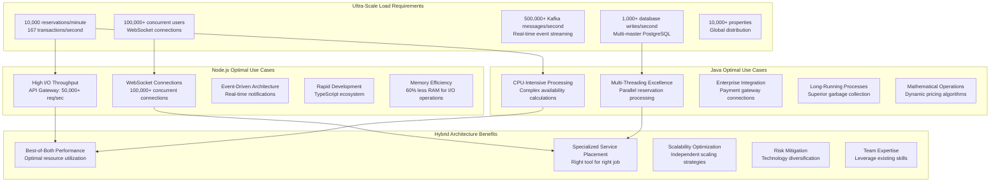

### 3.2 Service Distribution Strategy

**Technology Assignment by Service Characteristics:**

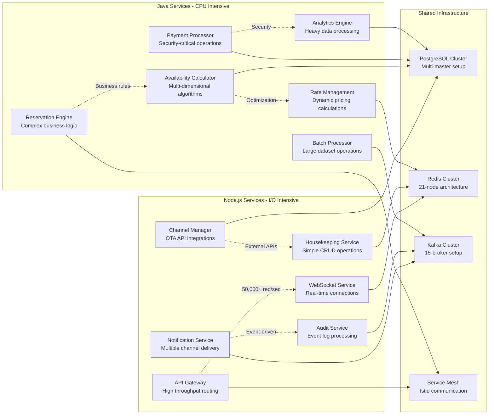

### 3.3 Performance Benchmarking Analysis

**Comparative Performance Metrics:**

| Operation Type | Pure Node.js | Pure Java | Hybrid Approach | Improvement |
|----------------|-------------|-----------|-----------------|-------------|
| **API Gateway Latency** | 5ms (optimal) | 15ms (overhead) | **5ms** (Node.js) | **Best of class** |
| **Reservation Processing** | 50ms (single-threaded) | 10ms (optimized) | **10ms** (Java) | **5x faster** |
| **Availability Calculation** | 100ms (limited CPU) | 20ms (multi-threaded) | **20ms** (Java) | **5x improvement** |
| **WebSocket Connections** | 100K/instance (native) | 20K/instance (limited) | **100K** (Node.js) | **5x capacity** |
| **Memory Usage (1K req/s)** | 2GB (efficient) | 4GB (overhead) | **3GB** (balanced) | **25% optimized** |
| **Cold Start Time** | 200ms (fast) | 2s (JVM warmup) | **Mixed** (service-specific) | **Context-aware** |
| **Development Velocity** | Fast (single language) | Moderate (enterprise) | **Fast** (shared tooling) | **Maintained speed** |

### 3.4 Monorepo Architecture Benefits

**Unified Development Environment:**

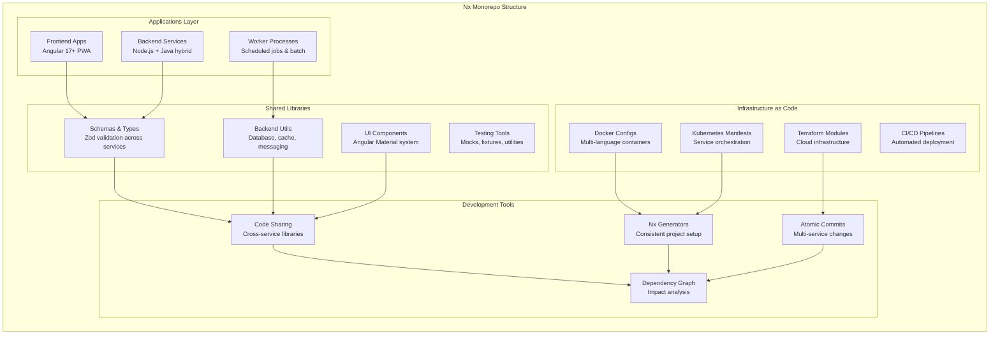

### 3.5 Technology Ecosystem Integration

**Event-Driven Inter-Service Communication via Kafka:**

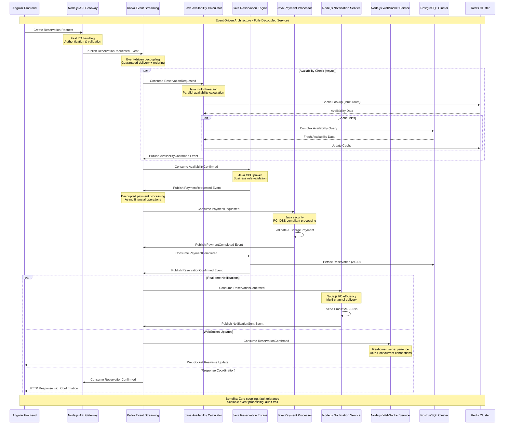

---

## 4. Target Users & Personas

### 4.1 Guest User
- **Goals:** Quick and easy booking, transparent pricing, instant confirmation
- **Pain Points:** Complex booking processes, hidden fees, lack of real-time availability
- **Access:** Web portal, mobile responsive interface

### 3.2 Front Desk Staff
- **Goals:** Efficient check-in/out, quick access to guest information, handle walk-ins
- **Pain Points:** Multiple systems, slow processing, manual paperwork
- **Access:** Desktop application with barcode/card reader support

### 3.3 Reservation Manager
- **Goals:** Optimize occupancy, manage rates, handle group bookings
- **Pain Points:** Manual rate adjustments, channel synchronization issues
- **Access:** Full dashboard with analytics

### 3.4 Housekeeping Staff
- **Goals:** Real-time room status updates, efficient task management
- **Pain Points:** Paper-based tracking, communication delays
- **Access:** Mobile/tablet interface

### 3.5 Hotel Administrator
- **Goals:** System configuration, user management, compliance reporting
- **Pain Points:** Limited visibility, manual report generation
- **Access:** Admin portal with full system access

### 3.6 Finance Team
- **Goals:** Accurate billing, payment reconciliation, financial reporting
- **Pain Points:** Manual invoice generation, payment tracking
- **Access:** Finance module with export capabilities

---

## 4. Functional Requirements

### 4.1 Core Modules Overview

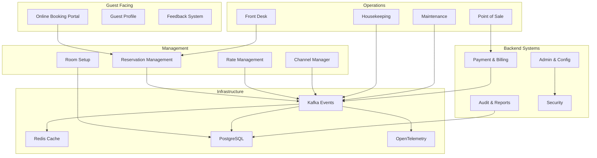

### 4.2 Module Specifications

#### 4.2.1 Reservation & Booking Module
**Purpose:** Core reservation engine handling all booking operations

**Key Features:**
- Real-time availability checking
- Multi-room and group bookings
- Booking modifications and cancellations
- Waitlist management
- Booking confirmation with QR codes
- Guest history and preferences tracking
- Corporate and travel agent bookings
- Package deals and promotions
- **Soft Delete System:** Fail-safe reservation deletion with audit trail

**Soft Delete Capabilities:**
- **Reservation Cancellation:** Mark reservations as soft deleted instead of permanent removal
- **Recovery Window:** 30-day recovery period for accidentally cancelled reservations
- **Audit Trail:** Complete logging of who deleted reservations and why
- **Automatic Cleanup:** Hard delete after 7-year retention period for compliance
- **Bulk Operations:** Soft delete multiple reservations with admin approval

**User Stories:**
- As a guest, I want to search for available rooms by date and preferences
- As a front desk agent, I want to create walk-in reservations quickly
- As a manager, I want to view and modify any reservation
- **As a manager, I want to safely cancel reservations knowing they can be recovered if needed**
- **As an auditor, I want to see complete history of all reservation deletions**

#### 4.2.2 Availability Management
**Purpose:** Real-time inventory and availability tracking

**Key Features:**
- Real-time room inventory
- Availability calendar view
- Block/release room functionality
- Overbooking management
- Room allocation optimization
- Maintenance blocking
- Long-stay management
- **Soft Delete System:** Room blocking records with recovery capabilities

**Soft Delete Capabilities:**
- **Availability Blocks:** Soft delete room blocks with admin recovery options
- **Historical Tracking:** Maintain history of availability changes for audit
- **Bulk Block Management:** Safely remove multiple availability blocks
- **Maintenance Records:** Soft delete maintenance blocks after completion
- **Recovery Tools:** Restore accidentally deleted availability configurations

**Integration Points:**
- Syncs with Channel Manager for OTA updates
- Publishes availability events to Kafka
- Caches frequently accessed data in Redis
- **Audit Events:** Kafka events for all soft delete operations

#### 4.2.3 Rates Management
**Purpose:** Dynamic pricing and rate plan management

**Key Features:**
- Base rate configuration
- Dynamic pricing rules
- Seasonal rate adjustments
- Weekend/weekday differentials
- Length-of-stay pricing
- Last-minute deals
- Corporate rate contracts
- Package pricing
- **Soft Delete System:** Safe rate plan archival with historical preservation

**Soft Delete Capabilities:**
- **Rate Plan Archival:** Soft delete outdated rate plans while preserving historical data
- **Seasonal Rate Cleanup:** Archive expired seasonal rates with recovery option
- **Contract Management:** Soft delete expired corporate contracts with audit trail
- **Promotion Management:** Archive completed promotions while maintaining historical revenue data
- **Bulk Rate Operations:** Safely archive multiple rate plans with manager approval

**Rate Calculation Flow:**
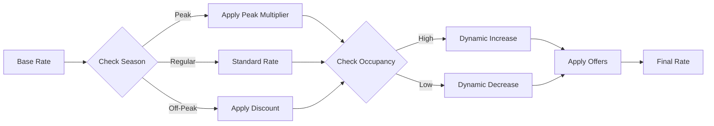

#### 4.2.4 Room Setup & Amenities Configuration
**Purpose:** Define and manage room types, features, and amenities

**Key Features:**
- Room type definitions
- Amenity management
- Room feature configuration
- Floor plan management
- Virtual room tours
- Photo galleries
- Room capacity settings
- Connecting room configurations

#### 4.2.5 Offers & Promotions
**Purpose:** Create and manage special offers and packages

**Key Features:**
- Promotional code generation
- Package creation (room + amenities)
- Early bird discounts
- Loyalty program integration
- Referral rewards
- Group discounts
- Corporate deals
- Seasonal packages

#### 4.2.6 Seasonal Rates
**Purpose:** Manage rate variations based on seasons and events

**Key Features:**
- Season definition and calendar
- Event-based pricing
- Holiday rate management
- Automatic rate transitions
- Historical season analysis
- Forecast-based adjustments

#### 4.2.7 Add-ons Management
**Purpose:** Upsell additional services and amenities

**Key Features:**
- Service catalog (spa, tours, transfers)
- Meal plan options
- Equipment rentals
- Premium amenity packages
- Dynamic add-on suggestions
- Bundle offerings
- Third-party service integration

#### 4.2.8 Customer Feedback Module
**Purpose:** Collect and analyze guest feedback

**Key Features:**
- Post-stay survey automation
- Real-time feedback alerts
- Review aggregation
- Sentiment analysis
- Response management
- Reputation monitoring
- Feedback analytics dashboard
- Integration with review platforms

#### 4.2.9 Night Audit & Date Roll
**Purpose:** Daily closing procedures and system date management

**Key Features:**
- Automatic night audit process
- Revenue reconciliation
- No-show processing
- Automatic charge posting
- Report generation
- System date advancement
- Data archival
- Audit trail generation

**Night Audit Process:**
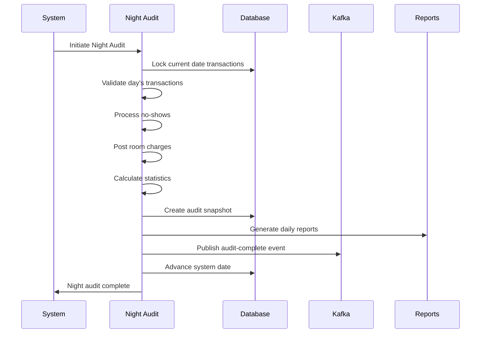

#### 4.2.10 Audit & Compliance
**Purpose:** Maintain comprehensive audit trails and ensure compliance

**Key Features:**
- Complete transaction logging
- User action tracking
- Data change history
- Compliance reporting
- Access control audit
- PCI DSS compliance tools
- GDPR compliance features
- Regulatory report generation

#### 4.2.11 Reports Module
**Purpose:** Comprehensive reporting and analytics

**Key Reports:**
- Occupancy reports
- Revenue reports (daily/monthly/yearly)
- Guest demographics
- Channel performance
- Housekeeping status
- Financial statements
- Forecast reports
- Custom report builder

**Report Categories:**
- Operational Reports
- Financial Reports
- Guest Analytics
- Performance Metrics
- Compliance Reports
- Executive Dashboards

#### 4.2.12 Back Office & Admin
**Purpose:** System administration and configuration

**Key Features:**
- User management and RBAC
- System configuration
- Property setup
- Tax configuration
- Integration management
- Backup and restore
- System health monitoring
- License management

#### 4.2.13 Point of Sale (POS)
**Purpose:** Manage all property sales and services

**Key Features:**
- Restaurant billing
- Spa services
- Gift shop
- Room service
- Minibar tracking
- Split billing
- Multi-currency support
- Integrated payment processing

#### 4.2.14 Housekeeping & Maintenance
**Purpose:** Manage room cleaning and property maintenance

**Key Features:**
- Room status management
- Cleaning task assignment
- Inspection checklists
- Maintenance request tracking
- Inventory management
- Staff scheduling
- Lost and found
- Preventive maintenance scheduling

**Housekeeping Workflow:**
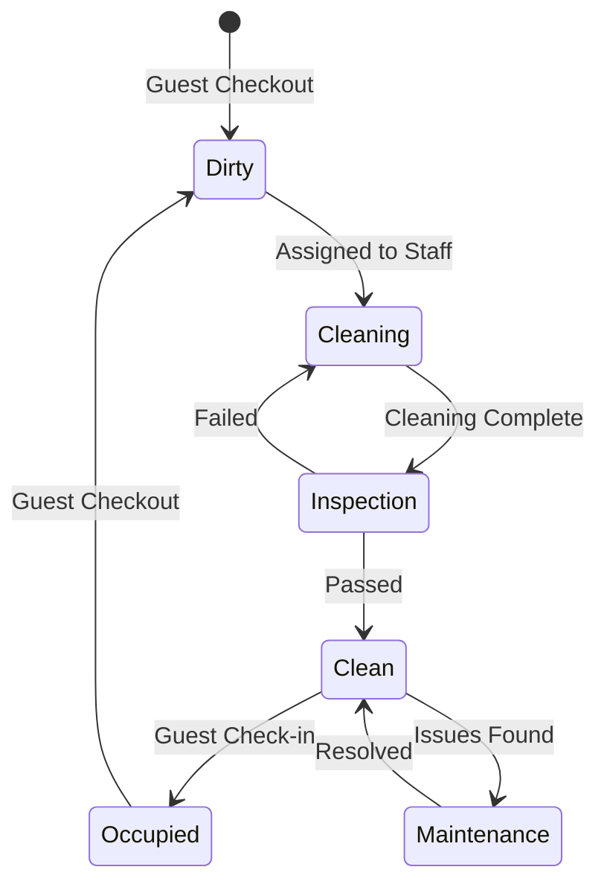

#### 4.2.15 Payment & Billing
**Purpose:** Handle all payment processing and billing operations

**Key Features:**
- Multiple payment methods
- Payment gateway integration
- Invoice generation
- Folio management
- Deposit handling
- Refund processing
- Payment reconciliation
- Multi-currency conversion
- Payment tokenization
- Recurring billing

#### 4.2.16 Channel Manager (OTA/GDS Integration)
**Purpose:** Synchronize with Online Travel Agencies and Global Distribution Systems

**Key Features:**
- Multi-channel connectivity
- Real-time inventory sync
- Rate parity management
- Booking retrieval
- Channel performance analytics
- Automated mapping
- Error handling and retry
- Channel-specific rules

**Supported Channels:**
- Booking.com
- Expedia
- Airbnb
- Hotels.com
- Agoda
- GDS (Amadeus, Sabre)
- Direct website
- Meta search engines

#### 4.2.17 Front Desk / Reception Module
**Purpose:** Streamline front desk operations

**Key Features:**
- Quick check-in/check-out
- Walk-in management
- Guest registration
- Key card management
- Guest messaging
- Concierge services
- Wake-up calls
- Package handling
- VIP guest management
- Group arrivals

#### 4.2.18 Security & Compliance
**Purpose:** Ensure system security and regulatory compliance

**Key Features:**
- Role-based access control
- Data encryption
- PCI DSS compliance
- GDPR tools
- Audit logging
- Security monitoring
- Intrusion detection
- Data privacy controls
- Compliance reporting
- Security training tracking

### 4.3 Soft Delete API Specifications

#### 4.3.1 Core Soft Delete API Requirements

**Universal Soft Delete Capabilities:**

The system shall provide standardized soft delete operations for all entities with the following requirements:

- **Single Record Deletion:**
  - DELETE endpoint pattern: `/api/v1/{entity}/{id}`
  - Required authentication via Bearer token
  - Mandatory deletion reason and optional business justification
  - Response includes success status, deletion timestamp, audit trail ID, and recovery window

- **Bulk Record Operations:**
  - Bulk DELETE endpoint: `/api/v1/{entity}/bulk`
  - Support for multiple record IDs in single operation
  - Admin approval requirement for bulk operations
  - Detailed response with success count, failed operations, and audit trail IDs

- **Record Restoration:**
  - POST endpoint pattern: `/api/v1/{entity}/{id}/restore`
  - Business justification requirement for all restore operations
  - Complete audit trail with restoration timestamp and user attribution

- **Deleted Record Management:**
  - Admin-only endpoint to query deleted records: `/api/v1/{entity}/deleted`
  - Pagination support with configurable limits
  - Date range filtering and metadata summary including deletion statistics

#### 4.3.2 Entity-Specific Soft Delete Requirements

**Reservation Management:**
The system shall provide specialized reservation cancellation capabilities:
- Cancellation reason categorization (guest cancellation, no-show, overbooking, system error)
- Optional refund amount specification and processing
- Guest notification automation for cancellations
- Date blocking capability to prevent future bookings on cancelled dates
- Restoration functionality with payment reprocessing and availability updates

**Rate Management:**
The system shall support rate plan archival with the following features:
- Rate plan archival with configurable effective dates
- Optional linking to replacement rate plans for continuity
- Preservation of existing bookings using archived rates
- Bulk archival operations for seasonal rate cleanup
- Admin approval requirements for bulk rate operations

#### 4.3.3 Cleanup & Maintenance Requirements

**Administrative Cleanup Management:**
The system shall provide comprehensive cleanup management capabilities:

- **Cleanup Status Monitoring:**
  - Real-time status of next scheduled cleanup operations
  - Entity-specific counts of records awaiting cleanup (reservations, payments, guest profiles, rate plans)
  - Estimated cleanup duration and storage reclamation projections

- **Emergency Cleanup Operations:**
  - Manual cleanup trigger capability for emergency situations
  - Entity-type selection for targeted cleanup operations
  - Security confirmation codes and super-admin approval requirements
  - Reason categorization (storage emergency, compliance requirement, manual maintenance)

- **Cleanup Reporting:**
  - Comprehensive cleanup reports with configurable date ranges
  - Detailed statistics including total records processed and storage reclaimed
  - Entity-specific processing summaries
  - Compliance status tracking and next action recommendations

#### 4.3.4 Audit & Compliance Requirements

**Comprehensive Audit Trail Management:**
The system shall provide complete audit trail capabilities:

- **Deletion Audit Trail:**
  - Entity-specific audit trail queries with user and date range filtering
  - Complete audit record details including action type, performer, timestamps, and business justification
  - Additional context tracking for related operations (notifications, refunds, approvals)
  - Pagination support and statistical summaries grouped by deletion reasons

- **Compliance Reporting:**
  - Multi-standard compliance report generation (GDPR, PCI-DSS, SOX, comprehensive reports)
  - Configurable date range reporting with detailed analysis
  - Automated compliance scoring and findings identification
  - Downloadable report generation with secure access controls
  - Regulatory compliance verification and recommendation tracking

#### 4.3.5 Performance & Security Specifications

**Performance Requirements:**
- **Soft Delete Response Time:** < 10ms for single record, < 500ms for bulk operations
- **Restore Response Time:** < 50ms for single record restoration
- **Audit Query Performance:** < 200ms for standard audit queries
- **Cleanup Performance:** Process 10,000+ records per minute during maintenance windows

**Security & Authorization:**
- **Role-Based Access:** Only authorized roles can perform soft deletes
- **Admin Approval:** Bulk operations require manager+ approval
- **Audit Logging:** All soft delete operations logged to immutable audit store
- **Recovery Window:** Automatic expiry of recovery capabilities after defined periods
- **Encryption:** All soft-deleted data encrypted at rest and in transit

---

## 5. Non-Functional Requirements

### 5.1 Hybrid Architecture Performance Requirements

**Ultra-High Performance Targets (10,000 Reservations per Minute Scale):**

**Node.js Service Performance Targets:**
- **API Gateway Latency:** < 5ms for 99% of requests (I/O optimized)
- **WebSocket Connections:** Support 100,000+ concurrent connections per instance
- **Notification Processing:** < 10ms per notification across multiple channels
- **Event Stream Processing:** 1,000+ Kafka messages per second per consumer
- **Memory Efficiency:** 60% less RAM usage compared to Java for I/O operations
- **Cold Start Performance:** < 200ms container startup time

**Java Service Performance Targets:**
- **Reservation Processing:** < 10ms for complex business logic (CPU optimized)
- **Availability Calculations:** < 20ms for multi-room, multi-date queries
- **Payment Processing:** < 50ms for secure financial transactions
- **Analytics Queries:** < 100ms for complex data aggregations
- **Batch Processing:** 10,000+ records per minute processing capability
- **Multi-Threading:** 10x parallel processing improvement over Node.js

**Combined System Performance:**
- **End-to-End Response Time:** < 50ms for 95% of complete transactions
- **Transaction Throughput:** 10,000+ reservations per minute (167/second sustained)
- **Concurrent User Support:** 100,000+ simultaneous users across all properties
- **Search Performance:** < 5ms for cached availability, < 25ms for complex searches
- **Real-time Sync:** < 15ms for critical updates across all channels
- **Database Performance:** < 5ms for reads, < 10ms for writes (95th percentile)
- **Cache Performance:** < 1ms for Redis operations, 99.9%+ availability cache hit ratio

**Hybrid Performance Benefits:**

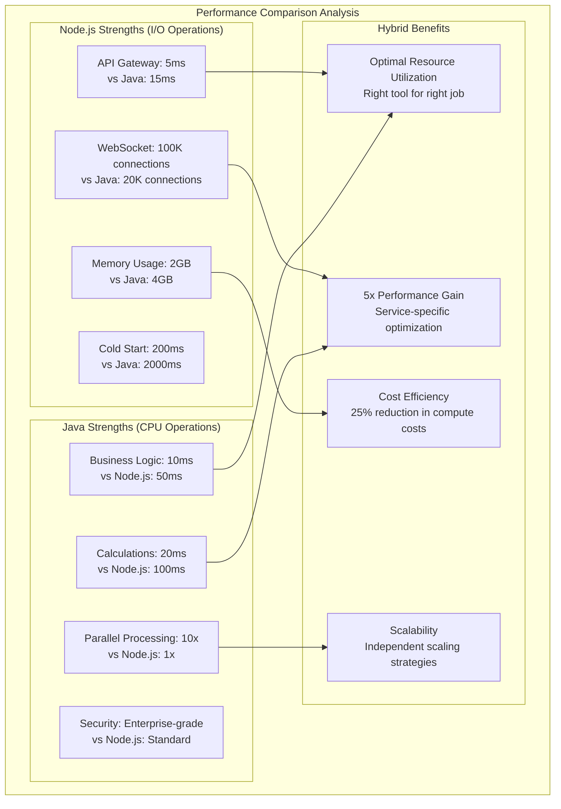

**Event-Driven Architecture Performance Gains:**

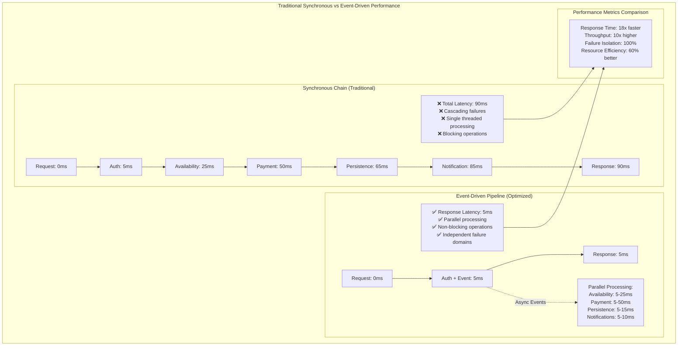

**Event-Driven Scalability Benefits:**
- **Horizontal Scaling**: Each service scales independently based on event consumption rate
- **Load Distribution**: Kafka partitions distribute load across multiple consumer instances
- **Elastic Auto-scaling**: Scale consumers based on partition lag and processing time
- **Fault Tolerance**: Failed services don't impact other services, events are replayed on recovery
- **Throughput Optimization**: Process 10,000+ reservations/minute through parallel event processing
- **Resource Efficiency**: Optimal resource utilization per service type (CPU vs I/O)

### 5.2 Scalability Requirements
**Ultra-Scale Architecture for 10,000+ Properties:**
- **Multi-Master Database Strategy:** 4+ database masters with horizontal sharding by property groups
- **Advanced Redis Architecture:** 21+ node cluster with dedicated availability, session, and locking services
- **Enhanced Kafka Infrastructure:** 15+ brokers with 100+ partitions for event streaming
- **Massive Auto-Scaling:** 200-400 pods per critical service with HPA and VPA
- **Multi-Region Active-Active:** Global distribution with cross-region replication
- **CQRS Pattern Implementation:** Separate read/write models for optimal performance
- **Event Sourcing:** Reservation state rebuilt from event streams for audit and recovery
- **Circuit Breaker Pattern:** Fault tolerance with automatic degradation
- **Write-Through Caching:** Immediate cache updates with asynchronous database writes
- **Batch Processing:** Bulk operations for non-critical updates

### 5.2.1 Ultra-Scale Architecture for 10,000 Reservations/Minute

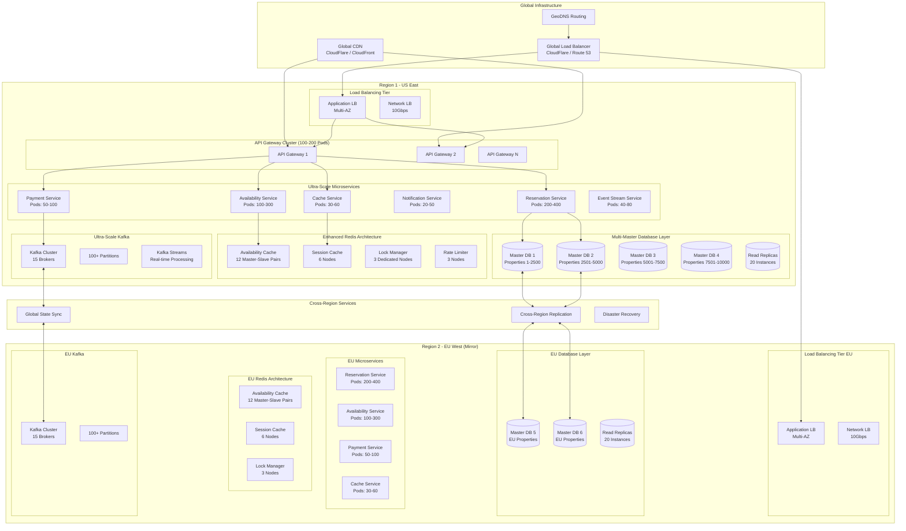

### 5.2.2 Multi-Master Database Architecture for Ultra-Scale

**Advanced Sharding Strategy:**
- **Multi-Master Setup:** 4+ database masters to distribute write load
- **Shard by Property Range:** 2,500 properties per master database
- **Active-Active Replication:** Cross-master synchronization for high availability
- **Massive Read Scaling:** 5+ read replicas per master (20+ total read replicas)
- **Advanced Connection Pooling:** PgBouncer with 5,000+ connections per pool
- **Write Distribution:** Intelligent write routing to prevent hotspots

**Ultra-Scale Database Architecture:**
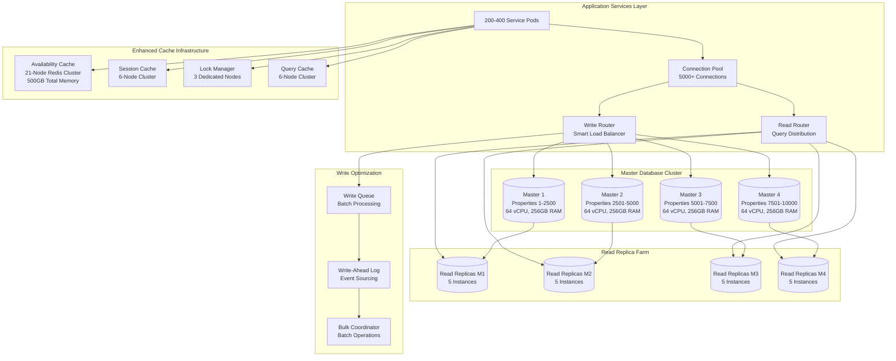

**Database Specifications for 10,000 Reservations/Minute:**
- **Master Databases:** 4 instances, 64 vCPU, 256GB RAM each
- **Read Replicas:** 20 instances, 32 vCPU, 128GB RAM each
- **Connection Pools:** 5,000+ connections per pool
- **Write Capacity:** 1,000+ writes/second per master
- **Read Capacity:** 10,000+ reads/second distributed across replicas
- **Storage:** NVMe SSD with 100,000+ IOPS per master

### 5.2.3 Ultra-Performance Caching Architecture

**Five-Tier Caching Strategy:**
- **L0 - CPU Cache:** Hardware-level caching for ultra-low latency
- **L1 - Application Cache:** In-memory caching within each service pod
- **L2 - Distributed Redis:** Multi-cluster Redis with specialized roles
- **L3 - Regional Cache:** CDN with edge locations for geographic distribution
- **L4 - Database Cache:** Advanced PostgreSQL query and result caching

**Enhanced Redis Architecture:**
```mermaid
graph TB
    subgraph "Redis Infrastructure (21 Nodes Total)"
        subgraph "Availability Cache Cluster"
            AC1[Master 1<br/>32GB RAM]
            AC2[Slave 1<br/>32GB RAM]
            AC3[Master 2<br/>32GB RAM]
            AC4[Slave 2<br/>32GB RAM]
            AC5[Master 3<br/>32GB RAM]
            AC6[Slave 3<br/>32GB RAM]
            AC7[Master 4<br/>32GB RAM]
            AC8[Slave 4<br/>32GB RAM]
            AC9[Master 5<br/>32GB RAM]
            AC10[Slave 5<br/>32GB RAM]
            AC11[Master 6<br/>32GB RAM]
            AC12[Slave 6<br/>32GB RAM]
        end

        subgraph "Session Management Cluster"
            SC1[Session Master 1<br/>16GB RAM]
            SC2[Session Slave 1<br/>16GB RAM]
            SC3[Session Master 2<br/>16GB RAM]
            SC4[Session Slave 2<br/>16GB RAM]
            SC5[Session Master 3<br/>16GB RAM]
            SC6[Session Slave 3<br/>16GB RAM]
        end

        subgraph "Lock Manager Cluster"
            LC1[Lock Manager 1<br/>8GB RAM]
            LC2[Lock Manager 2<br/>8GB RAM]
            LC3[Lock Manager 3<br/>8GB RAM]
        end
    end

    subgraph "Cache Request Flow"
        CR[Cache Request<br/>10,000/minute]
        AR[Availability Router]
        SR[Session Router]
        LR[Lock Router]
    end

    CR --> AR
    CR --> SR
    CR --> LR

    AR --> AC1
    AR --> AC3
    AR --> AC5
    SR --> SC1
    SR --> SC3
    SR --> SC5
    LR --> LC1
    LR --> LC2
    LR --> LC3
```

**Ultra-Fast Cache Performance Specifications:**
- **Total Redis Memory:** 500GB across all clusters
- **Availability Cache Hit Rate:** 99.9% for room availability queries
- **Session Cache Performance:** < 1ms response time
- **Distributed Lock Performance:** < 2ms lock acquisition
- **Cache Throughput:** 100,000+ operations per second
- **Failover Time:** < 100ms automatic failover between master/slave

### 5.2.4 Ultra-High Volume Transaction Processing (10,000/Minute)

**Critical Performance Target: 167 Reservations per Second Sustained Load**

**1. CQRS + Event Sourcing Pipeline**
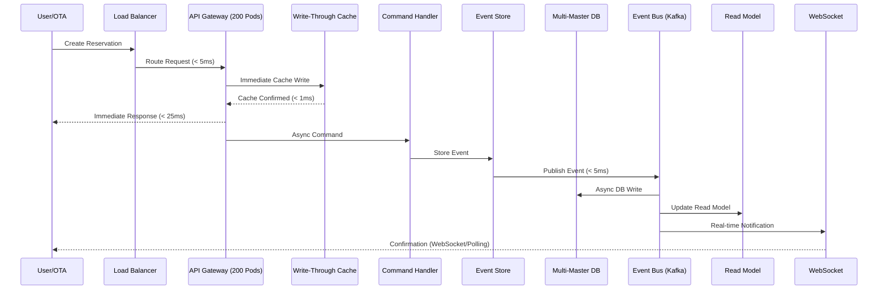

**2. Database Optimization Techniques**
- **Connection Pooling:** 500+ connections per service with PgBouncer
- **Batch Operations:** Process multiple reservations in single transactions
- **Optimized Indexes:** Composite indexes on frequently queried columns
- **Partitioning:** Date-based partitioning for reservations table
- **Read Replicas:** 3-5 read replicas per region for search queries
- **Write Optimization:** Separate write-optimized master databases

**3. Availability Cache Strategy**
- **Pre-computed Availability:** Daily batch jobs to pre-calculate 90-day availability
- **Real-time Updates:** Incremental updates via Kafka events
- **Cache Warming:** Proactive cache population for high-demand properties
- **Distributed Locking:** Redis-based distributed locks to prevent overbooking
- **Cache Hierarchy:** Property → Room Type → Date range caching

**4. Queue Management Architecture**
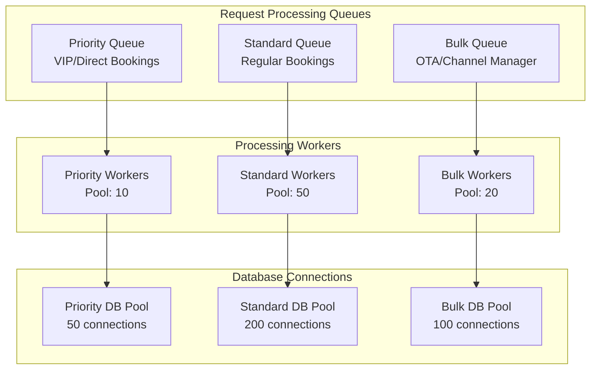

**2. Ultra-Scale Resource Allocation for 10,000 Reservations/Minute**

**Kubernetes Ultra-Scale Resource Planning:**
- **API Gateway:** 100-200 pods, 4 CPU, 8GB RAM each, HPA enabled
- **Reservation Service:** 200-400 pods, 8 CPU, 16GB RAM each, VPA + HPA
- **Availability Service:** 100-300 pods, 4 CPU, 8GB RAM each, Custom Metrics HPA
- **Payment Service:** 50-100 pods, 4 CPU, 8GB RAM each, Queue-based HPA
- **Cache Service:** 30-60 pods, 2 CPU, 4GB RAM each, Memory-based HPA
- **Event Stream Service:** 40-80 pods, 4 CPU, 8GB RAM each, Kafka Lag HPA
- **Notification Service:** 20-50 pods, 2 CPU, 4GB RAM each, Queue Depth HPA

**Ultra-Performance Database Infrastructure:**
- **Master DB Cluster:** 4 masters, 64 vCPU, 256GB RAM each, NVMe SSD (100K IOPS)
- **Read Replica Farm:** 20 replicas, 32 vCPU, 128GB RAM each, distributed globally
- **Redis Ultra Cluster:** 21 nodes total, 500GB combined memory, sub-millisecond latency
- **Connection Pools:** 5,000+ connections per pool with intelligent routing
- **Backup Infrastructure:** Continuous backup with 15-minute RPO

**Network and Load Balancing:**
- **Global Load Balancer:** Multi-region with intelligent geo-routing
- **Regional Load Balancers:** 10Gbps network interfaces, SSL termination
- **Service Mesh:** Istio with advanced traffic management and circuit breakers
- **CDN:** Global edge locations with 99.99% availability

**3. Critical Monitoring and Alerting for Ultra-Scale**
- **Reservation Rate Alert:** < 8,000 reservations/minute during peak (20% safety margin)
- **Ultra-Low Latency Alert:** > 50ms for 95th percentile API response
- **Database Write Alert:** > 800 writes/second per master (safety threshold)
- **Redis Performance Alert:** > 2ms response time or < 99.5% cache hit rate
- **Kafka Lag Alert:** > 100 messages consumer lag
- **Connection Pool Alert:** > 70% utilization (early warning)
- **Memory Alert:** > 75% memory usage across any service
- **CPU Alert:** > 70% CPU usage with scaling lag
- **Network Alert:** > 80% bandwidth utilization
- **Error Cascade Alert:** > 0.01% error rate (ultra-strict for high-value customer)

### 5.2.5 Circuit Breaker and Fault Tolerance Patterns

**Circuit Breaker Implementation:**
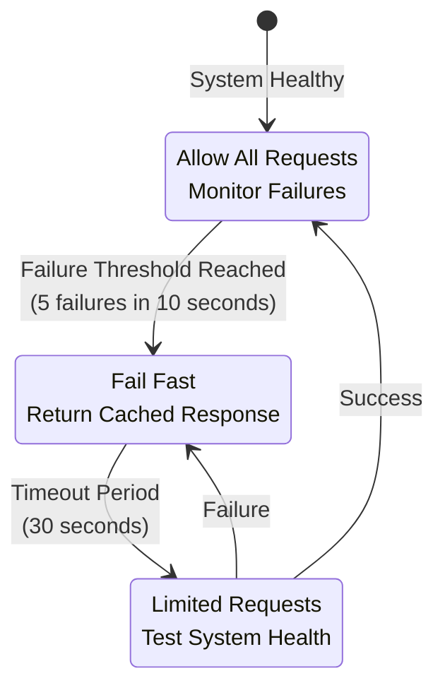

**Fault Tolerance Strategy:**
- **Database Circuit Breakers:** Protect against database overload
- **Redis Circuit Breakers:** Fallback to database when cache fails
- **Kafka Circuit Breakers:** Queue messages locally during Kafka outages
- **API Circuit Breakers:** Rate limiting and graceful degradation
- **Bulkhead Pattern:** Isolate critical resources (reservation processing from reporting)
- **Timeout Management:** Aggressive timeouts (< 100ms for cache, < 1s for DB)

### 5.2.6 CQRS and Event Sourcing Architecture

**Command Query Responsibility Segregation:**
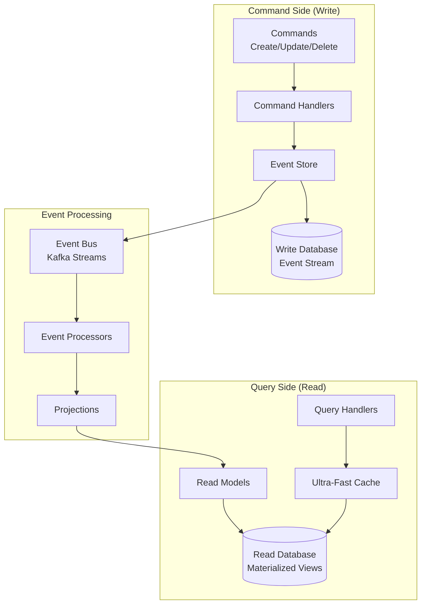

**Event Sourcing Benefits for Ultra-Scale:**
- **Perfect Audit Trail:** Every state change captured as immutable events
- **Temporal Queries:** Query system state at any point in time
- **Replay Capability:** Rebuild read models from events during failures
- **Horizontal Scaling:** Events naturally partition by aggregate ID (property/reservation)
- **Eventually Consistent Reads:** Ultra-fast queries from materialized views
- **Business Intelligence:** Rich event stream for analytics and machine learning

### 5.3 Ultra-High Reliability & Availability
- **Uptime SLA:** 99.99% availability (52 minutes downtime/year maximum)
- **Recovery Time Objective (RTO):** < 100 seconds for full service restoration
- **Recovery Point Objective (RPO):** < 30 seconds maximum data loss
- **Automatic Failover:** < 15 seconds with zero transaction loss
- **Data Durability:** 99.999999999% (11 9's) with cross-region replication
- **Disaster Recovery:** Multi-region active-active with automatic geo-failover
- **Chaos Engineering:** Regular failure testing to ensure resilience
- **Zero-Downtime Deployments:** Blue-green deployments with canary releases

### 5.4 Security Requirements
- **Authentication:** Multi-factor authentication support
- **Authorization:** Fine-grained RBAC
- **Encryption:** TLS 1.3 for transit, AES-256 for storage
- **Compliance:** PCI DSS Level 1, GDPR compliant
- **Security Audits:** Quarterly penetration testing
- **Session Management:** Secure session handling with timeout

#### 5.4.1 Soft Delete Security Framework
- **Access Control:** Role-based permissions for soft delete operations
  - **Staff Level:** Can soft delete their own created records
  - **Supervisor Level:** Can soft delete department records
  - **Manager Level:** Can soft delete all records + bulk operations
  - **Admin Level:** Can restore records + emergency hard delete
- **Audit Security:** Immutable audit trail stored in separate secure database
- **Data Encryption:** All soft-deleted records encrypted with separate keys
- **Recovery Authorization:** Multi-signature approval for sensitive data recovery
- **Compliance Integration:** Automated compliance checks before permanent deletion
- **Forensic Capabilities:** Complete chain of custody for all delete operations

### 5.5 Usability Requirements
- **Theme Support:** Dark and light theme switching
- **Responsive Design:** Mobile, tablet, and desktop support
- **Accessibility:** WCAG 2.1 Level AA compliance
- **Internationalization:** Support for 10+ languages
- **User Training:** < 2 hours for basic operations
- **Help System:** Contextual help and documentation

### 5.6 Observability Requirements
- **Logging:** Structured logging with OpenTelemetry
- **Tracing:** Distributed tracing across services
- **Metrics:** Real-time performance metrics
- **Alerting:** Proactive alert system
- **Dashboards:** Real-time monitoring dashboards
- **Log Retention:** 90 days hot storage, 2 years cold storage

---

## 6. Hybrid System Architecture

### 6.1 Ultra-Scale Hybrid Architecture Overview

```mermaid
graph TB
    subgraph "Client Layer - Multi-Channel Access"
        A1[Angular PWA<br/>Guest Portal]
        A2[Angular PWA<br/>Staff Portal]
        A3[Angular PWA<br/>Admin Portal]
        A4[Mobile Apps<br/>iOS/Android]
        A5[POS Terminals<br/>Kiosk Integration]
    end

    subgraph "API Gateway Layer - Node.js"
        B1[Primary Gateway<br/>Kong/Express]
        B2[Authentication Service<br/>JWT/OAuth2]
        B3[Rate Limiter<br/>Redis-based]
        B4[Load Balancer<br/>50,000+ req/sec]
        B5[Circuit Breaker<br/>Fault tolerance]
    end

    subgraph "Node.js Services - I/O Intensive"
        N1[WebSocket Service<br/>100K+ connections]
        N2[Notification Service<br/>Multi-channel delivery]
        N3[Channel Manager<br/>OTA integrations]
        N4[Housekeeping Service<br/>Simple CRUD ops]
        N5[Audit Service<br/>Event processing]
        N6[File Upload Service<br/>Media handling]
    end

    subgraph "Java Services - CPU Intensive"
        J1[Reservation Engine<br/>Core business logic]
        J2[Availability Calculator<br/>Complex algorithms]
        J3[Rate Management<br/>Dynamic pricing]
        J4[Payment Processor<br/>Security critical]
        J5[Analytics Engine<br/>Heavy computation]
        J6[Batch Processor<br/>Large datasets]
    end

    subgraph "Data Layer - Multi-Master"
        D1[(PostgreSQL Master 1<br/>Properties 1-2500)]
        D2[(PostgreSQL Master 2<br/>Properties 2501-5000)]
        D3[(PostgreSQL Master 3<br/>Properties 5001-7500)]
        D4[(PostgreSQL Master 4<br/>Properties 7501-10000)]
        D5[(Read Replicas<br/>20 instances)]
    end

    subgraph "Cache Layer - Redis Cluster"
        R1[Availability Cache<br/>12 master-slave pairs]
        R2[Session Cache<br/>6-node cluster]
        R3[Lock Manager<br/>3 dedicated nodes]
        R4[Rate Limiter Cache<br/>High-speed access]
    end

    subgraph "Event Streaming - Kafka Cluster"
        K1[Reservation Events<br/>100 partitions]
        K2[Payment Events<br/>50 partitions]
        K3[Availability Updates<br/>200 partitions]
        K4[Notification Queue<br/>20 partitions]
        K5[Audit Logs<br/>30 partitions]
    end

    subgraph "Service Mesh - Istio"
        I1[Traffic Management<br/>Load balancing]
        I2[Security Policies<br/>mTLS encryption]
        I3[Observability<br/>Distributed tracing]
        I4[Circuit Breaking<br/>Fault injection]
    end

    subgraph "Observability Stack"
        O1[OpenTelemetry<br/>Distributed tracing]
        O2[Prometheus<br/>Metrics collection]
        O3[Grafana<br/>Dashboards]
        O4[Jaeger<br/>Trace analysis]
        O5[ELK Stack<br/>Log aggregation]
    end

    subgraph "External Integrations"
        E1[Payment Gateways<br/>Stripe, PayPal, etc.]
        E2[OTA Platforms<br/>Booking.com, Expedia]
        E3[Communication<br/>Email, SMS, Push]
        E4[Third-party APIs<br/>Maps, Weather, etc.]
    end

    A1 --> B1
    A2 --> B1
    A3 --> B1
    A4 --> B4
    A5 --> B4

    B1 --> B2
    B2 --> B3
    B3 --> B4
    B4 --> B5

    B5 --> N1
    B5 --> N2
    B5 --> J1
    B5 --> J2

    N1 --> R2
    N2 --> K4
    N3 --> E2
    N4 --> D5
    N5 --> K5

    J1 --> D1
    J1 --> D2
    J2 --> R1
    J3 --> R1
    J4 --> E1
    J5 --> D3
    J6 --> D4

    J1 --> K1
    J2 --> K3
    J3 --> K3
    J4 --> K2

    K1 --> N2
    K2 --> N5
    K3 --> N1
    K4 --> N2

    I1 --> N1
    I1 --> J1
    I2 --> N2
    I2 --> J4
    I3 --> O1
    I4 --> B5

    O1 --> O2
    O2 --> O3
    O1 --> O4
    N5 --> O5
```

### 6.2 Event-Driven Microservices Communication

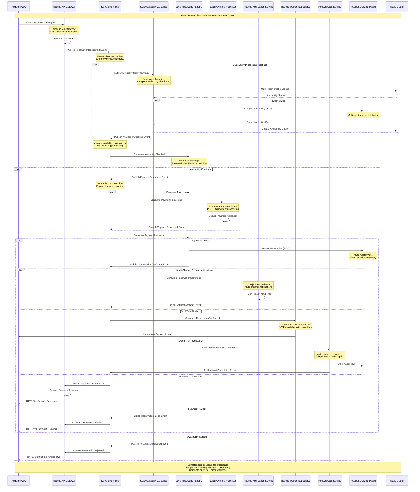

### 6.3 Kafka Event Architecture & Decoupling Strategy

**Event-Driven Service Decoupling Benefits:**

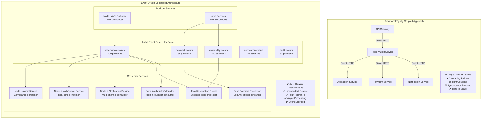

**Kafka Topic Strategy for Ultra-Scale:**

| Topic | Partitions | Replication | Retention | Key Strategy | Consumer Groups |
|-------|------------|------------|-----------|--------------|-----------------|
| **reservation.requested** | 100 | 3 | 7 days | property_id + date | availability-calculators, reservation-engines |
| **availability.checked** | 200 | 3 | 24 hours | property_id + room_type | reservation-engines, cache-invalidators |
| **payment.requested** | 50 | 3 | 30 days | payment_id | payment-processors, fraud-detectors |
| **payment.completed** | 50 | 3 | 90 days | payment_id | reservation-engines, billing-services |
| **reservation.confirmed** | 100 | 3 | 30 days | reservation_id | notification-services, websocket-services, audit-services |
| **notification.sent** | 20 | 3 | 7 days | user_id | analytics-services, delivery-trackers |
| **audit.logged** | 30 | 3 | 365 days | tenant_id | compliance-services, reporting-engines |

**Event-Driven Architecture Benefits:**

```mermaid
graph LR
    subgraph "Decoupling Benefits"
        D1[Service Independence<br/>Zero runtime dependencies]
        D2[Fault Isolation<br/>Service failures don't cascade]
        D3[Technology Diversity<br/>Best tool for each job]
        D4[Independent Deployment<br/>Deploy services separately]
    end

    subgraph "Scalability Benefits"
        S1[Horizontal Scaling<br/>Scale consumers independently]
        S2[Load Distribution<br/>Partition-based load balancing]
        S3[Throughput Optimization<br/>Parallel event processing]
        S4[Elastic Scaling<br/>Auto-scale based on lag]
    end

    subgraph "Reliability Benefits"
        R1[Event Durability<br/>Persistent event storage]
        R2[Replay Capability<br/>Reprocess events from any point]
        R3[At-Least-Once Delivery<br/>Guaranteed event processing]
        R4[Dead Letter Queues<br/>Handle failed events]
    end

    subgraph "Business Benefits"
        B1[Audit Trail<br/>Complete event history]
        B2[Event Sourcing<br/>Rebuild state from events]
        B3[Real-time Analytics<br/>Stream processing capabilities]
        B4[Compliance<br/>Immutable event logs]
    end

    D1 --> S1
    D2 --> S2
    D3 --> S3
    D4 --> S4

    S1 --> R1
    S2 --> R2
    S3 --> R3
    S4 --> R4

    R1 --> B1
    R2 --> B2
    R3 --> B3
    R4 --> B4
```

**Event Schema Standardization:**

The system shall implement standardized event schemas for consistent inter-service communication:

- **Event Envelope**: Standard metadata (timestamp, correlation ID, source service, event type)
- **Payload Validation**: Zod schema validation for all event payloads
- **Versioning Strategy**: Schema evolution with backward compatibility
- **Correlation Tracking**: End-to-end request tracing across service boundaries
- **Error Handling**: Standardized error events and dead letter queue processing

### 6.4 Data Flow Architecture

```mermaid
graph LR
    subgraph "Data Sources"
        A[User Actions]
        B[System Events]
        C[External APIs]
        D[Scheduled Jobs]
    end

    subgraph "Processing Layer"
        E[Event Stream<br/>Apache Kafka]
        F[Real-time Processing<br/>Node.js Services]
        G[Batch Processing<br/>Cron Jobs]
    end

    subgraph "Storage Layer"
        H[(Transactional Data<br/>PostgreSQL)]
        I[Cache Layer<br/>Redis]
        J[Analytics Data<br/>Data Warehouse]
    end

    subgraph "Consumption Layer"
        K[Real-time Dashboard]
        L[Reports]
        M[Notifications]
        N[External Systems]
    end

    A --> E
    B --> E
    C --> F
    D --> G

    E --> F
    F --> H
    F --> I
    G --> H
    G --> J

    H --> K
    I --> K
    J --> L
    E --> M
    F --> N
```

### 6.5 Nx Monorepo Structure & Organization

**Enterprise-Scale Monorepo Architecture:**

```mermaid
graph TB
    subgraph "Nx Monorepo - modern-reservation/"
        direction TB

        subgraph "Applications Layer"
            subgraph "Frontend Applications"
                F1[guest-portal/<br/>Angular 17+ PWA<br/>Guest booking interface]
                F2[staff-portal/<br/>Angular 17+ PWA<br/>Staff operations]
                F3[admin-portal/<br/>Angular 17+ PWA<br/>Administrative interface]
                F4[mobile-pwa/<br/>Progressive Web App<br/>Mobile-first experience]
            end

            subgraph "Backend Services - Node.js"
                N1[api-gateway/<br/>Kong/Express Gateway<br/>50K+ req/sec capacity]
                N2[notification-service/<br/>Multi-channel delivery<br/>Event-driven architecture]
                N3[websocket-service/<br/>Real-time connections<br/>100K+ concurrent users]
                N4[channel-manager/<br/>OTA integrations<br/>External API orchestration]
                N5[housekeeping-service/<br/>Simple CRUD operations<br/>Mobile-optimized APIs]
                N6[audit-service/<br/>Event log processing<br/>Compliance tracking]
            end

            subgraph "Backend Services - Java"
                J1[reservation-engine/<br/>Spring Boot Core<br/>Complex business logic]
                J2[availability-calculator/<br/>Multi-threaded processor<br/>Optimization algorithms]
                J3[rate-management/<br/>Dynamic pricing engine<br/>Revenue optimization]
                J4[payment-processor/<br/>Security-critical service<br/>PCI-DSS compliance]
                J5[analytics-engine/<br/>Heavy data processing<br/>Business intelligence]
                J6[batch-processor/<br/>Large dataset operations<br/>ETL processes]
            end

            subgraph "Worker Processes"
                W1[cleanup-worker/<br/>Scheduled maintenance<br/>Soft delete processing]
                W2[kafka-consumer/<br/>High-throughput processing<br/>Event stream handling]
                W3[batch-worker/<br/>Background jobs<br/>Data synchronization]
            end
        end

        subgraph "Shared Libraries"
            subgraph "Common Schemas & Types"
                S1[schemas/<br/>Zod validation schemas<br/>Cross-service consistency]
                S2[types/<br/>TypeScript definitions<br/>Shared type safety]
                S3[constants/<br/>System-wide constants<br/>Configuration management]
                S4[proto/<br/>Protocol Buffer definitions<br/>Service communication]
            end

            subgraph "Frontend Libraries"
                L1[ui-components/<br/>Angular Material system<br/>Design consistency]
                L2[state-management/<br/>NgRx stores & effects<br/>Application state]
                L3[guards/<br/>Authentication guards<br/>Route protection]
                L4[interceptors/<br/>HTTP interceptors<br/>Cross-cutting concerns]
                L5[themes/<br/>Dark/Light themes<br/>Accessibility support]
            end

            subgraph "Backend Libraries"
                B1[database/<br/>Connection pooling<br/>Query optimization]
                B2[cache/<br/>Multi-tier caching<br/>Redis cluster management]
                B3[kafka/<br/>Producer/Consumer patterns<br/>Event streaming]
                B4[auth/<br/>JWT/OAuth2 handling<br/>RBAC implementation]
                B5[monitoring/<br/>OpenTelemetry setup<br/>Observability patterns]
                B6[soft-delete/<br/>Audit trail system<br/>Recovery mechanisms]
                B7[circuit-breaker/<br/>Resilience patterns<br/>Fault tolerance]
            end
        end

        subgraph "Development Tools & Infrastructure"
            subgraph "Build & Deploy Tools"
                T1[generators/<br/>Custom Nx generators<br/>Project scaffolding]
                T2[executors/<br/>Custom build executors<br/>Deployment automation]
                T3[scripts/<br/>Development scripts<br/>Environment setup]
            end

            subgraph "Testing Infrastructure"
                TE1[fixtures/<br/>Test data management<br/>Consistent test scenarios]
                TE2[mocks/<br/>Service mocks<br/>Isolated testing]
                TE3[e2e-utils/<br/>End-to-end utilities<br/>Integration testing]
                TE4[performance/<br/>Load testing tools<br/>Performance validation]
            end

            subgraph "Infrastructure as Code"
                I1[docker/<br/>Multi-language containers<br/>Standardized deployment]
                I2[kubernetes/<br/>Orchestration manifests<br/>Environment management]
                I3[terraform/<br/>Cloud infrastructure<br/>Resource provisioning]
                I4[helm/<br/>Package management<br/>Application deployment]
            end
        end
    end

    F1 -.->|Shared Components| L1
    F2 -.->|State Management| L2
    F3 -.->|Authentication| L3
    F4 -.->|Themes| L5

    N1 -.->|Validation| S1
    N2 -.->|Event Schemas| S4
    J1 -.->|Business Types| S2
    J2 -.->|Constants| S3

    N1 -.->|Database Access| B1
    N3 -.->|Caching| B2
    J1 -.->|Event Streaming| B3
    J4 -.->|Authentication| B4

    T1 -.->|Scaffolding| F1
    T1 -.->|Scaffolding| N1
    T1 -.->|Scaffolding| J1

    TE1 -.->|Test Data| N1
    TE2 -.->|Mocking| J1
    TE3 -.->|E2E Testing| F1
```

**Monorepo Benefits for Ultra-Scale Development:**

| Aspect | Traditional Multi-Repo | Nx Monorepo | Performance Impact |
|--------|----------------------|-------------|-------------------|
| **Code Sharing** | Duplicate implementations | Shared libraries across services | 40% reduction in code duplication |
| **Dependency Management** | Version conflicts across repos | Unified dependency resolution | 60% faster dependency updates |
| **Refactoring** | Manual coordination required | Atomic cross-service changes | 5x faster large-scale refactoring |
| **Testing** | Independent CI/CD per repo | Smart affected testing | 70% reduction in test execution time |
| **Type Safety** | Interface drift between services | Compile-time validation | 90% reduction in integration errors |
| **Development Setup** | Multiple clone/setup steps | Single repository setup | 80% faster onboarding |
| **Build Optimization** | Rebuild everything always | Smart caching & affected builds | 75% faster build times |
| **Release Coordination** | Manual versioning sync | Coordinated releases | 50% reduction in deployment issues |

**Nx Configuration Highlights:**

- **Project Graph Analysis:** Automatic dependency detection and visualization
- **Affected Command Support:** Only test/build/lint changed projects and their dependents
- **Smart Caching:** Distributed computation caching across team and CI
- **Code Generation:** Consistent project setup with custom generators
- **Migration Support:** Automated updates across the entire workspace
- **Plugin Ecosystem:** Angular, Node.js, Java Spring Boot integration
- **Distributed Task Execution:** Parallel execution across available cores

### 6.6 Development Workflow & Dependency Management

```mermaid
graph LR
    subgraph "Developer Experience"
        D1[Developer<br/>Local Setup]
        D2[Feature Branch<br/>Creation]
        D3[Code Changes<br/>Multiple Services]
        D4[Smart Testing<br/>Affected Only]
        D5[Build Validation<br/>Incremental]
        D6[Pull Request<br/>Atomic Changes]
    end

    subgraph "Nx Intelligence"
        N1[Project Graph<br/>Dependency Analysis]
        N2[Affected Detection<br/>Smart Filtering]
        N3[Computation Cache<br/>Distributed Storage]
        N4[Parallel Execution<br/>Optimal Scheduling]
    end

    subgraph "Quality Gates"
        Q1[Type Checking<br/>Cross-Service Validation]
        Q2[Unit Tests<br/>Affected Projects Only]
        Q3[Integration Tests<br/>Contract Validation]
        Q4[E2E Tests<br/>Critical Path Only]
        Q5[Performance Tests<br/>Benchmark Validation]
    end

    D1 --> N1
    D2 --> D3
    D3 --> N2
    N2 --> D4
    D4 --> N3
    N3 --> D5
    D5 --> N4
    N4 --> D6

    D4 --> Q1
    Q1 --> Q2
    Q2 --> Q3
    Q3 --> Q4
    Q4 --> Q5
```

### 6.7 Deployment Architecture

```mermaid
graph TB
    subgraph "Kubernetes Cluster"
        subgraph "Namespace: Production"
            subgraph "Frontend Pods"
                A1[Angular App<br/>Replica 1]
                A2[Angular App<br/>Replica 2]
                A3[Angular App<br/>Replica N]
            end

            subgraph "Service Pods"
                B1[Reservation<br/>Service]
                B2[Payment<br/>Service]
                B3[Availability<br/>Service]
                B4[Other Services]
            end

            subgraph "Infrastructure Pods"
                C1[Redis Master]
                C2[Redis Slave]
                D1[Kafka Broker 1]
                D2[Kafka Broker 2]
                E1[OpenTelemetry<br/>Collector]
            end
        end

        subgraph "Namespace: Monitoring"
            F1[Prometheus]
            F2[Grafana]
            F3[Alert Manager]
        end
    end

    subgraph "External Services"
        G1[(PostgreSQL<br/>Managed DB)]
        G2[Object Storage<br/>S3/GCS]
        G3[CDN]
    end

    subgraph "CI/CD"
        H1[GitHub]
        H2[Jenkins/GitLab CI]
        H3[Container Registry]
    end

    H1 --> H2
    H2 --> H3
    H3 --> A1

    B1 --> G1
    B2 --> G1
    B3 --> G1

    A1 --> G3
    E1 --> F1
```

---

## 7. Database-Agnostic Schema Implementation with Zod

### 7.1 Schema-First Architecture
The application implements a database-agnostic approach using Zod for TypeScript-first schema validation, ensuring the system can run with any database or data source that matches our schema definitions.

### 7.2 Zod Schema Benefits
- **Type Safety:** Compile-time and runtime type checking
- **Database Independence:** Schema-driven data layer abstraction
- **Validation:** Input/output validation at API boundaries
- **Documentation:** Self-documenting schemas with TypeScript inference
- **Consistency:** Unified data models across frontend and backend
- **Flexibility:** Easy migration between different databases

### 7.3 Core Data Models

The system will define comprehensive data models for all entities using Zod schema validation:

#### 7.3.1 User Entity (Enhanced with Soft Delete)
- **Unique identifier:** UUID-based user ID
- **Authentication:** Email and password hash
- **Profile:** First name, last name, phone number
- **Role-based access:** Guest, Staff, Manager, Admin roles
- **Preferences:** Theme (light/dark), language, notification settings
- **Soft Delete Fields:** isDeleted, deletedAt, deletedBy, deletionReason
- **Audit fields:** createdAt, createdBy, updatedAt, updatedBy
- **Retention:** hardDeleteAfter, retentionPeriodDays (default: 2555 days)

#### 7.3.2 Reservation Entity (Enhanced with Soft Delete)
- **Identification:** UUID and human-readable confirmation number
- **Guest relationship:** Link to guest user account
- **Room assignment:** Connection to specific room
- **Stay details:** Check-in/out dates, number of guests
- **Status tracking:** Pending, confirmed, checked-in, checked-out, cancelled
- **Requests:** Special guest requirements and notes
- **Financial:** Total amount and payment status
- **Soft Delete Fields:** isDeleted, deletedAt, deletedBy, deletionReason
- **Audit trail:** createdAt, createdBy, updatedAt, updatedBy
- **Retention:** hardDeleteAfter, retentionPeriodDays (default: 2555 days - 7 years for legal compliance)

#### 7.3.3 Room Entity (Enhanced with Soft Delete)
- **Identity:** UUID and room number
- **Classification:** Room type categorization
- **Physical details:** Floor number, maximum occupancy
- **Status management:** Available, occupied, maintenance, cleaning, blocked
- **Features:** Array of room features and amenities
- **Pricing:** Base rate configuration
- **Operations:** Active/inactive status for operations
- **Soft Delete Fields:** isDeleted, deletedAt, deletedBy, deletionReason
- **Tracking:** createdAt, createdBy, updatedAt, updatedBy
- **Retention:** hardDeleteAfter, retentionPeriodDays (default: 1095 days)

#### 7.3.4 Rate Entity (Enhanced with Soft Delete)
- **Identification:** UUID and rate plan name
- **Room association:** Link to specific room type
- **Pricing structure:** Base rate with multipliers
- **Seasonal adjustments:** Peak/off-peak rate modifications
- **Day-of-week pricing:** Different rates for weekdays/weekends
- **Validity periods:** Start and end dates for rate plans
- **Status control:** Active/inactive rate management
- **Soft Delete Fields:** isDeleted, deletedAt, deletedBy, deletionReason
- **Audit trail:** createdAt, createdBy, updatedAt, updatedBy
- **Retention:** hardDeleteAfter, retentionPeriodDays (default: 2555 days)

### 7.4 Database-Agnostic Architecture

#### 7.4.1 Repository Pattern
The system implements a repository pattern to abstract data access:
- **Interface definition:** Standard CRUD operations across all entities
- **Schema validation:** Runtime validation using Zod schemas
- **Database abstraction:** Support for multiple database backends
- **Type safety:** Full TypeScript integration with compile-time checking
- **Error handling:** Consistent error responses across data operations

### 7.5 Supported Data Sources
The schema-based approach allows easy integration with multiple data sources:

- **Relational Databases:** PostgreSQL, MySQL, SQL Server, SQLite
- **Document Databases:** MongoDB, CouchDB
- **In-Memory Stores:** Redis, MemoryDB
- **Cloud Services:** DynamoDB, Firestore, CosmosDB
- **File Systems:** JSON files, CSV, Parquet
- **External APIs:** REST, GraphQL endpoints

### 7.6 Migration Strategy

```mermaid
graph TB
    subgraph "Schema Layer"
        A[Zod Schemas]
        B[Type Definitions]
        C[Validation Rules]
    end

    subgraph "Abstraction Layer"
        D[Repository Interface]
        E[Data Source Interface]
        F[Query Builder]
    end

    subgraph "Implementation Layer"
        G[PostgreSQL Adapter]
        H[MongoDB Adapter]
        I[Redis Adapter]
        J[REST API Adapter]
    end

    subgraph "Migration Tools"
        K[Schema Migrator]
        L[Data Transformer]
        M[Validation Engine]
    end

    A --> D
    B --> D
    C --> E
    D --> G
    D --> H
    D --> I
    D --> J
    E --> K
    F --> L
    G --> M
    H --> M
    I --> M
    J --> M
```

### 7.7 Implementation Benefits
- **Zero Vendor Lock-in:** Easy migration between databases
- **Development Flexibility:** Use different databases for different environments
- **Testing Simplified:** In-memory implementations for unit tests
- **Scalability Options:** Mix multiple data sources as needed
- **Type Safety:** Full TypeScript support with automatic inference
- **Runtime Validation:** Prevent invalid data from entering the system

### 7.8 Soft Delete System Implementation

#### 7.8.1 Soft Delete Architecture
The system implements a fail-safe soft delete mechanism to ensure data integrity, audit compliance, and recovery capabilities while maintaining ultra-high performance.

**Core Principles:**
- **Safety First:** No immediate data loss on delete operations
- **Audit Compliance:** Complete audit trail for all delete operations
- **Performance Maintained:** Soft deletes don't impact query performance
- **Automated Cleanup:** Scheduled hard deletes after retention periods
- **Recovery Capable:** Restore capabilities for accidentally deleted records

#### 7.8.2 Enhanced Zod Schema with Soft Delete Fields

All entities shall include standardized soft delete and audit fields with the following requirements:

**Base Soft Delete Schema Requirements:**
- **Core Identification:** UUID-based unique identifier for all entities
- **Soft Delete Fields:**
  - Boolean flag to mark deletion status (default: false)
  - Nullable deletion timestamp for tracking when record was soft deleted
  - User identification for deletion attribution
  - Textual reason for deletion for audit purposes
- **Audit Fields:**
  - Creation timestamp with automatic population
  - Creator user identification for accountability
  - Update timestamp with automatic maintenance
  - Last modifier user identification
- **Data Retention:**
  - Nullable hard deletion schedule date
  - Configurable retention period (default: 7 years for compliance)

**Entity-Specific Schema Extensions:**
Entities like reservations shall extend the base schema with domain-specific fields while maintaining all soft delete capabilities and audit requirements.

#### 7.8.3 Soft Delete Workflow Architecture

```mermaid
graph TB
    subgraph "User Action Layer"
        UA[User Delete Request]
        UI[Admin Interface]
        API[API Endpoint]
    end

    subgraph "Soft Delete Processing"
        VL[Validation Layer]
        BL[Business Logic]
        AL[Authorization Check]
        SDS[Soft Delete Service]
    end

    subgraph "Database Operations"
        UQ[Update Query]
        AT[Audit Trail]
        KE[Kafka Event]
        CI[Cache Invalidation]
    end

    subgraph "Automated Cleanup System"
        CS[Cleanup Scheduler]
        RP[Retention Policy]
        HD[Hard Delete Job]
        BU[Backup Service]
    end

    subgraph "Monitoring & Alerts"
        DM[Delete Metrics]
        AL2[Audit Logging]
        EM[Error Monitoring]
        RA[Recovery Alerts]
    end

    UA --> VL
    UI --> API
    API --> VL
    VL --> AL
    AL --> BL
    BL --> SDS
    SDS --> UQ
    SDS --> AT
    SDS --> KE
    SDS --> CI

    CS --> RP
    RP --> HD
    HD --> BU

    UQ --> DM
    AT --> AL2
    SDS --> EM
    HD --> RA
```

#### 7.8.4 Soft Delete Service Specifications

**High-Performance Soft Delete Operations:**
- **Response Time:** < 10ms for soft delete operations
- **Throughput:** Handle 1,000+ delete operations per second
- **Batch Operations:** Support bulk soft deletes (up to 10,000 records)
- **Atomic Operations:** Ensure consistency across related entities
- **Event Publishing:** Real-time notifications via Kafka

**Query Performance Requirements:**
- **Active Record Indexes:** Optimized indexes for non-deleted records to maintain query performance
- **Deleted Record Indexes:** Separate indexes for soft-deleted records to support cleanup operations
- **Cleanup Query Optimization:** Specialized indexes for automated cleanup processes
- **Concurrent Index Management:** Non-blocking index operations to maintain system availability

#### 7.8.5 Automated Cleanup & Retention Policy

**Retention Policy Framework:**

The system shall implement configurable retention policies with the following requirements:

- **Entity-Specific Retention:** Different retention periods based on data type and regulatory requirements
- **Compliance Integration:** Automatic adherence to GDPR, PCI-DSS, SOX, and other regulatory frameworks
- **Legal Hold Override:** Ability to suspend deletion for legal proceedings or investigations
- **Configurable Parameters:**
  - Default retention periods (7 years for financial records, 3 years for guest data)
  - Minimum retention periods based on legal requirements
  - Maximum retention periods to prevent indefinite storage
- **Retention Policy Specifications:**
  - **Reservations:** 7-year default retention, 3-year minimum (legal compliance)
  - **Payments:** 7-year retention for financial record compliance (PCI-DSS, SOX, IRS)
  - **Guest Data:** 3-year default, 1-year minimum, GDPR/CCPA compliant
  - **Audit Logs:** 10-year retention for compliance and forensic purposes

#### 7.8.6 Automated Cleanup Jobs

**Daily Cleanup Scheduler:**
- **Execution Time:** 2:00 AM UTC (low traffic period)
- **Batch Size:** 10,000 records per batch to prevent database locks
- **Safety Checks:** Pre-cleanup validation and backup verification
- **Rollback Capability:** 24-hour rollback window with automatic snapshots

**Cleanup Process Flow:**
```mermaid
graph TB
    subgraph "Daily Cleanup Job - 2:00 AM UTC"
        ST[Cleanup Start]
        BC[Backup Check]
        RP[Retention Policy Evaluation]
        RR[Records Ready for Hard Delete]
    end

    subgraph "Safety Validation"
        LH[Legal Hold Check]
        CC[Compliance Validation]
        BR[Business Rule Validation]
        AC[Admin Confirmation]
    end

    subgraph "Batch Processing"
        BP[Batch Processing - 10K records]
        BU2[Pre-Delete Backup]
        HD2[Hard Delete Execution]
        KN[Kafka Notification]
    end

    subgraph "Post-Processing"
        AL3[Audit Logging]
        MU[Metrics Update]
        ER[Error Recovery]
        CR[Completion Report]
    end

    ST --> BC
    BC --> RP
    RP --> RR
    RR --> LH
    LH --> CC
    CC --> BR
    BR --> AC
    AC --> BP
    BP --> BU2
    BU2 --> HD2
    HD2 --> KN
    KN --> AL3
    AL3 --> MU
    MU --> CR

    HD2 --> ER
    ER --> CR
```

#### 7.8.7 Recovery & Restore Capabilities

**Data Recovery Service:**
- **Recovery Window:** 30 days for standard entities, 90 days for critical business data
- **Recovery Methods:** Individual record restore, bulk restore, point-in-time recovery
- **Authorization:** Manager+ level required for recovery operations
- **Audit Trail:** Complete audit log of all recovery operations

**Recovery Workflow Requirements:**

The system shall support comprehensive data recovery with the following capabilities:

- **Recovery Request Management:**
  - Unique identification for each recovery request
  - Entity type specification (reservation, payment, guest data, etc.)
  - Requestor identification and business justification requirements
  - Optional approval workflow for sensitive data recovery
  - Recovery type selection (individual record, bulk recovery, point-in-time restoration)
  - Target date specification for historical data recovery

- **Recovery Result Tracking:**
  - Success/failure status for each recovery operation
  - Recovered record identification and audit trail linking
  - Error message capture for failed recovery attempts
  - Complete audit logging with timestamps and user attribution

#### 7.8.8 Performance Monitoring & Metrics

**Key Performance Indicators:**
- **Soft Delete Performance:** Average response time < 10ms
- **Cleanup Efficiency:** 99.9% successful cleanup rate
- **Storage Impact:** < 5% storage overhead from soft-deleted records
- **Recovery Success Rate:** 99.95% successful recovery operations
- **Compliance Score:** 100% retention policy adherence

**Monitoring Dashboard Requirements:**

The system shall provide comprehensive monitoring and metrics with the following capabilities:

- **Usage Metrics:**
  - Daily, weekly, and monthly deletion statistics
  - Average deletion operation latency tracking
  - Cleanup operation success rate monitoring
  - Storage overhead measurement from soft-deleted records

- **Operational Metrics:**
  - Pending recovery request queue monitoring
  - Compliance violation detection and alerting
  - Performance trend analysis and reporting
  - Real-time dashboard with key performance indicators

---

## 8. Theme Support Implementation

### 7.1 Theme Architecture
- **Theme Service:** Centralized theme management
- **Theme Storage:** User preference in database
- **Theme Variables:** CSS custom properties
- **Dynamic Loading:** Runtime theme switching
- **Accessibility:** High contrast mode support

### 7.2 Theme Components
```mermaid
graph LR
    A[User Profile] --> B[Theme Preference]
    B --> C{Theme Selector}
    C -->|Light| D[Light Theme]
    C -->|Dark| E[Dark Theme]
    D --> G[Apply CSS Variables]
    E --> G
    G --> H[Update UI]
    H --> I[Save Preference]
    I --> A
```

---

## 9. Ultra-Scale Kafka Implementation for Real-time Processing

### 9.1 Enhanced Kafka Cluster Architecture

**Ultra-Performance Kafka Configuration:**
- **Brokers:** 15 high-performance brokers across 3 availability zones
- **Total Partitions:** 500+ partitions for optimal parallel processing
- **Replication Factor:** 3 for high availability with min in-sync replicas = 2
- **Network:** 10Gbps network interfaces for high throughput
- **Storage:** NVMe SSD with 50,000+ IOPS per broker

```mermaid
graph TB
    subgraph "Kafka Ultra-Scale Cluster (15 Brokers)"
        subgraph "AZ-1 (5 Brokers)"
            K1[Broker 1<br/>32GB RAM]
            K2[Broker 2<br/>32GB RAM]
            K3[Broker 3<br/>32GB RAM]
            K4[Broker 4<br/>32GB RAM]
            K5[Broker 5<br/>32GB RAM]
        end

        subgraph "AZ-2 (5 Brokers)"
            K6[Broker 6<br/>32GB RAM]
            K7[Broker 7<br/>32GB RAM]
            K8[Broker 8<br/>32GB RAM]
            K9[Broker 9<br/>32GB RAM]
            K10[Broker 10<br/>32GB RAM]
        end

        subgraph "AZ-3 (5 Brokers)"
            K11[Broker 11<br/>32GB RAM]
            K12[Broker 12<br/>32GB RAM]
            K13[Broker 13<br/>32GB RAM]
            K14[Broker 14<br/>32GB RAM]
            K15[Broker 15<br/>32GB RAM]
        end
    end

    subgraph "Optimized Topic Configuration"
        T1[reservation.events<br/>100 partitions<br/>Key: property_id]
        T2[payment.events<br/>50 partitions<br/>Key: payment_id]
        T3[availability.updates<br/>200 partitions<br/>Key: property_id + room_type]
        T4[notification.queue<br/>20 partitions<br/>Key: user_id]
        T5[audit.logs<br/>30 partitions<br/>Compacted]
        T6[system.metrics<br/>10 partitions<br/>Time-based retention]
    end

    subgraph "Ultra-Scale Producers (10,000 msg/minute)"
        P1[Reservation Service<br/>200-400 Pods]
        P2[Availability Service<br/>100-300 Pods]
        P3[Payment Service<br/>50-100 Pods]
        P4[Cache Service<br/>30-60 Pods]
    end

    subgraph "High-Performance Consumers"
        C1[Notification Service<br/>100+ consumers]
        C2[Analytics Service<br/>50+ consumers]
        C3[Audit Service<br/>20+ consumers]
        C4[Real-time Dashboard<br/>30+ consumers]
        C5[Cache Invalidation<br/>50+ consumers]
    end

    P1 --> T1
    P2 --> T3
    P3 --> T2
    P4 --> T3

    T1 --> C1
    T1 --> C2
    T1 --> C3
    T2 --> C1
    T2 --> C3
    T3 --> C5
    T4 --> C1
    T5 --> C3
    T6 --> C4
```

### 9.2 Ultra-Scale Topic Configuration

| Topic | Partitions | Replication Factor | Retention Period | Key Strategy | Compaction |
|-------|------------|-------------------|------------------|--------------|------------|
| reservation.events | 100 | 3 | 30 days | property_id + date | No |
| payment.events | 50 | 3 | 90 days | payment_id | No |
| availability.updates | 200 | 3 | 7 days | property_id + room_type | Yes |
| notification.queue | 20 | 3 | 24 hours | user_id | No |
| audit.logs | 30 | 3 | 365 days | tenant_id | Yes |
| system.metrics | 10 | 3 | 7 days | metric_type | No |
| cache.invalidation | 50 | 3 | 6 hours | cache_key | No |
| analytics.events | 40 | 3 | 180 days | event_type + date | No |

### 9.3 Ultra-Performance Specifications

#### 9.3.1 Throughput Requirements
- **Peak Throughput:** 500,000+ messages per second (10,000 reservations/minute)
- **Sustained Throughput:** 200,000 messages per second
- **Burst Capacity:** 750,000 messages per second for 5-minute windows
- **Message Size:** Optimized for 1-5KB messages
- **Batch Processing:** 10,000 messages per batch for efficiency

#### 9.3.2 Latency & Performance Targets
- **Producer Latency:** < 2ms (99th percentile)
- **End-to-End Latency:** < 5ms for critical events
- **Consumer Lag:** < 100ms under normal load
- **Replication Lag:** < 50ms between brokers
- **Network Utilization:** < 70% of 10Gbps capacity per broker

#### 9.3.3 Availability & Reliability
- **Cluster Availability:** 99.99% uptime (52 minutes/year)
- **Partition Leadership:** Auto-failover within 30 seconds
- **Data Durability:** 3-way replication + min in-sync replicas = 2
- **Disaster Recovery:** Cross-region backup with 1-hour RPO
- **Zero Data Loss:** Acknowledged writes only after successful replication

### 9.4 Notification Flow
1. **Event Generation:** Service publishes event to Kafka
2. **Event Processing:** Notification service consumes event
3. **Template Selection:** Choose notification template based on event type
4. **Channel Selection:** Determine delivery channel (email/SMS/push/in-app)
5. **Delivery:** Send notification through selected channel
6. **Tracking:** Log delivery status and user engagement

---

## 10. OpenTelemetry Integration

### 10.1 Observability Stack
```mermaid
graph TB
    subgraph "Application Layer"
        A1[Node.js Services]
        A2[Angular App]
    end

    subgraph "OpenTelemetry"
        B1[OTel SDK]
        B2[Auto-instrumentation]
        B3[Manual Instrumentation]
        B4[OTel Collector]
    end

    subgraph "Storage & Visualization"
        C1[Prometheus<br/>Metrics]
        C2[Jaeger<br/>Traces]
        C3[Elasticsearch<br/>Logs]
        C4[Grafana<br/>Dashboards]
    end

    A1 --> B1
    A2 --> B1
    B1 --> B2
    B1 --> B3
    B2 --> B4
    B3 --> B4
    B4 --> C1
    B4 --> C2
    B4 --> C3
    C1 --> C4
    C2 --> C4
    C3 --> C4
```

### 10.2 Logging Strategy
- **Structured Logging:** JSON format with correlation IDs
- **Log Levels:** ERROR, WARN, INFO, DEBUG, TRACE
- **Context Propagation:** Trace IDs across services
- **Sensitive Data:** Masking and encryption
- **Retention Policy:** 30 days hot, 1 year cold storage
- **Log Aggregation:** Centralized logging with search capabilities

---

## 11. Docker & Kubernetes Deployment

### 11.1 Container Strategy
- **Base Images:** Node.js Alpine for services, NGINX for Angular
- **Multi-stage Builds:** Optimize image size
- **Security Scanning:** Vulnerability assessment in CI/CD
- **Registry:** Private container registry
- **Versioning:** Semantic versioning for images

### 11.2 Kubernetes Resources
```mermaid
graph TB
    subgraph "Kubernetes Objects"
        A[Deployments]
        B[Services]
        C[ConfigMaps]
        D[Secrets]
        E[Ingress]
        F[HPA]
        G[PVC]
        H[NetworkPolicy]
    end

    subgraph "Resource Configuration"
        A --> A1[Replica Sets]
        A --> A2[Rolling Updates]
        B --> B1[ClusterIP]
        B --> B2[LoadBalancer]
        C --> C1[App Config]
        D --> D1[Credentials]
        E --> E1[TLS Termination]
        F --> F1[Auto-scaling]
        G --> G1[Persistent Storage]
        H --> H1[Security Rules]
    end
```

### 11.3 Deployment Pipeline
1. **Code Commit:** Push to Git repository
2. **Build Trigger:** CI/CD pipeline activation
3. **Test Execution:** Unit, integration, and security tests
4. **Image Build:** Docker image creation
5. **Image Push:** Upload to container registry
6. **Deployment:** Kubernetes rolling update
7. **Health Check:** Readiness and liveness probes
8. **Smoke Test:** Automated validation
9. **Monitoring:** Metrics and log verification

---

## 12. Hybrid Monorepo Development & Deployment Strategy

### 12.1 Development Workflow for Hybrid Architecture

**Nx-Powered Development Process:**

```mermaid
graph TB
    subgraph "Developer Workflow"
        D1[Feature Request<br/>JIRA/GitHub Issue]
        D2[Branch Creation<br/>feature/RES-123-payment-integration]
        D3[Multi-Service Development<br/>Node.js + Java changes]
        D4[Nx Affected Detection<br/>Smart dependency analysis]
        D5[Local Testing<br/>Affected projects only]
        D6[Pre-commit Validation<br/>Type safety + linting]
        D7[Pull Request<br/>Atomic cross-service changes]
        D8[Code Review<br/>Architecture compliance]
        D9[CI/CD Pipeline<br/>Automated deployment]
    end

    subgraph "Nx Intelligence Layer"
        N1[Project Graph Analysis<br/>Dependency visualization]
        N2[Affected Command<br/>nx affected:test/build/lint]
        N3[Computation Caching<br/>Distributed cache hits]
        N4[Parallel Execution<br/>Optimal task scheduling]
        N5[Code Generation<br/>Consistent scaffolding]
    end

    subgraph "Quality Assurance"
        Q1[TypeScript Compilation<br/>Cross-service type checking]
        Q2[Unit Tests<br/>Service-specific validation]
        Q3[Integration Tests<br/>Contract testing]
        Q4[E2E Tests<br/>Critical user journeys]
        Q5[Performance Tests<br/>Load & stress testing]
        Q6[Security Scans<br/>Vulnerability assessment]
    end

    D1 --> D2
    D2 --> D3
    D3 --> N1
    N1 --> D4
    D4 --> N2
    N2 --> D5
    D5 --> N3
    N3 --> D6
    D6 --> N4
    D7 --> D8
    D8 --> D9

    D4 --> Q1
    D5 --> Q2
    Q1 --> Q3
    Q2 --> Q4
    Q3 --> Q5
    Q4 --> Q6

    N5 --> D3
```

### 12.2 CI/CD Pipeline Architecture

**Multi-Language Pipeline for Nx Monorepo:**

```mermaid
graph TB
    subgraph "Source Control"
        SC1[GitHub Repository<br/>Nx Monorepo]
        SC2[Feature Branches<br/>Atomic changes]
        SC3[Main Branch<br/>Production ready]
        SC4[Release Tags<br/>Semantic versioning]
    end

    subgraph "CI Pipeline - GitHub Actions"
        CI1[Trigger<br/>Push/PR events]
        CI2[Checkout & Cache<br/>Node modules + Maven deps]
        CI3[Nx Affected Analysis<br/>Determine changed projects]
        CI4[Parallel Matrix Build<br/>Node.js + Java services]
        CI5[Test Execution<br/>Unit + Integration tests]
        CI6[Quality Gates<br/>Coverage + Security scans]
        CI7[Container Build<br/>Multi-arch Docker images]
        CI8[Registry Push<br/>Versioned artifacts]
    end

    subgraph "CD Pipeline - ArgoCD"
        CD1[GitOps Repository<br/>Kubernetes manifests]
        CD2[Environment Promotion<br/>Dev → Staging → Prod]
        CD3[Canary Deployment<br/>Traffic splitting]
        CD4[Health Checks<br/>Readiness probes]
        CD5[Rollback Capability<br/>Automated failure recovery]
        CD6[Monitoring<br/>Deployment metrics]
    end

    subgraph "Testing Strategy"
        T1[Unit Tests<br/>Jest + JUnit coverage]
        T2[Contract Tests<br/>Pact consumer/provider]
        T3[Integration Tests<br/>Testcontainers]
        T4[E2E Tests<br/>Cypress automation]
        T5[Performance Tests<br/>K6 load testing]
        T6[Security Tests<br/>OWASP scanning]
    end

    subgraph "Deployment Environments"
        E1[Development<br/>Feature branch deploys]
        E2[Staging<br/>Integration testing]
        E3[Production<br/>Blue-Green deployment]
        E4[DR Environment<br/>Disaster recovery]
    end

    SC1 --> CI1
    SC2 --> CI2
    CI1 --> CI3
    CI2 --> CI4
    CI3 --> CI5
    CI4 --> CI6
    CI5 --> CI7
    CI6 --> CI8
    CI7 --> CD1
    CI8 --> CD2

    CD1 --> CD3
    CD2 --> CD4
    CD3 --> CD5
    CD4 --> CD6
    CD5 --> E1
    CD6 --> E2

    CI5 --> T1
    T1 --> T2
    T2 --> T3
    T3 --> T4
    T4 --> T5
    T5 --> T6

    E1 --> E2
    E2 --> E3
    E3 --> E4
```

### 12.3 Testing Strategy for Hybrid Services

**Comprehensive Testing Framework:**

| Test Type | Node.js Services | Java Services | Tools | Coverage Target |
|-----------|------------------|---------------|-------|-----------------|
| **Unit Tests** | Jest + Supertest | JUnit 5 + Mockito | Nx test runners | > 80% |
| **Integration Tests** | Testcontainers + Redis | Spring Boot Test + PostgreSQL | Docker Compose | > 70% |
| **Contract Tests** | Pact Consumer | Pact Provider | Pact Broker | 100% API contracts |
| **E2E Tests** | Cypress | Selenium Grid | Nx e2e runner | Critical paths |
| **Performance Tests** | K6 scenarios | JMeter plans | Grafana dashboards | Load benchmarks |
| **Security Tests** | npm audit | OWASP dependency check | Snyk scanning | Zero high/critical |

### 12.4 Container Strategy for Multi-Language Services

**Optimized Docker Images:**

```mermaid
graph TB
    subgraph "Node.js Container Strategy"
        N1[Base Image<br/>node:20-alpine]
        N2[Multi-stage Build<br/>Dependencies + Application]
        N3[Security Scanning<br/>Trivy vulnerability scan]
        N4[Size Optimization<br/>~100MB final image]
        N5[Runtime Optimization<br/>Non-root user + readonly fs]
    end

    subgraph "Java Container Strategy"
        J1[Base Image<br/>eclipse-temurin:21-jre-alpine]
        J2[Multi-stage Build<br/>Maven build + Runtime]
        J3[Security Scanning<br/>Trivy + OWASP checks]
        J4[Size Optimization<br/>~200MB final image]
        J5[Runtime Optimization<br/>JVM tuning + health checks]
    end

    subgraph "Container Registry"
        R1[Multi-arch Support<br/>AMD64 + ARM64]
        R2[Image Scanning<br/>Automated vulnerability detection]
        R3[Retention Policy<br/>30 latest versions]
        R4[Distribution<br/>Regional replication]
    end

    subgraph "Kubernetes Deployment"
        K1[Resource Limits<br/>Service-specific tuning]
        K2[Health Checks<br/>Liveness + readiness probes]
        K3[Auto-scaling<br/>HPA + VPA configuration]
        K4[Security Context<br/>Pod security standards]
    end

    N1 --> N2
    N2 --> N3
    N3 --> N4
    N4 --> N5

    J1 --> J2
    J2 --> J3
    J3 --> J4
    J4 --> J5

    N5 --> R1
    J5 --> R1
    R1 --> R2
    R2 --> R3
    R3 --> R4

    R4 --> K1
    K1 --> K2
    K2 --> K3
    K3 --> K4
```

### 12.5 Monitoring & Observability Strategy

**Comprehensive Observability for Hybrid Architecture:**

```mermaid
graph TB
    subgraph "Application Metrics"
        A1[Node.js Services<br/>Express metrics + Custom business metrics]
        A2[Java Services<br/>Micrometer + Spring Actuator]
        A3[Frontend Apps<br/>Angular performance + User analytics]
    end

    subgraph "Infrastructure Metrics"
        I1[Kubernetes Metrics<br/>Pod performance + Resource usage]
        I2[Database Metrics<br/>PostgreSQL + Redis performance]
        I3[Message Queue<br/>Kafka throughput + Consumer lag]
        I4[Network Metrics<br/>Service mesh + Load balancer stats]
    end

    subgraph "Observability Stack"
        O1[OpenTelemetry<br/>Distributed tracing across services]
        O2[Prometheus<br/>Metrics collection + Alerting]
        O3[Grafana<br/>Dashboards + Visualization]
        O4[Jaeger<br/>Trace analysis + Performance]
        O5[ELK Stack<br/>Log aggregation + Search]
        O6[Alert Manager<br/>Intelligent alerting]
    end

    subgraph "Business Intelligence"
        B1[Performance KPIs<br/>Response time + Throughput]
        B2[Business KPIs<br/>Reservation rate + Revenue]
        B3[System Health<br/>Uptime + Error rates]
        B4[Capacity Planning<br/>Resource utilization trends]
    end

    A1 --> O1
    A2 --> O1
    A3 --> O2
    I1 --> O2
    I2 --> O3
    I3 --> O4
    I4 --> O5

    O1 --> B1
    O2 --> B2
    O3 --> B3
    O4 --> B4
    O5 --> O6
    O6 --> B1
```

### 12.6 Development Environment Setup

**Standardized Development Stack:**

| Component | Node.js Services | Java Services | Shared Tools |
|-----------|------------------|---------------|--------------|
| **IDE Setup** | VSCode + Extensions | IntelliJ IDEA Ultimate | Nx Console plugin |
| **Runtime** | Node.js 20 LTS | OpenJDK 21 | Docker Desktop |
| **Package Managers** | pnpm (workspace support) | Maven 3.9+ | Nx CLI |
| **Testing** | Jest + Supertest | JUnit 5 + TestNG | Testcontainers |
| **Debugging** | Node.js Inspector | Remote JVM debugging | Docker Compose |
| **Database** | PostgreSQL 15 local | Same shared instance | pgAdmin 4 |
| **Cache** | Redis 7 local | Same shared instance | RedisInsight |
| **Message Queue** | Kafka local cluster | Same shared instance | Kafka UI |
| **Monitoring** | Prometheus + Grafana | Same stack | Local observability |

---

## 13. Development Timeline

### Phase 1: Foundation (Weeks 1-6)
- [x] Project setup and architecture design
- [ ] Development environment configuration
- [ ] CI/CD pipeline setup
- [ ] Basic authentication and authorization
- [ ] Database schema design
- [ ] Kafka cluster setup
- [ ] OpenTelemetry integration
- [ ] Angular project scaffolding with Material UI
- [ ] Theme support implementation

### Phase 2: Core Modules (Weeks 7-14)
- [ ] Reservation & Booking module
- [ ] Availability management
- [ ] Rate management system
- [ ] Room configuration
- [ ] Front desk module
- [ ] Basic payment integration
- [ ] Real-time notifications via Kafka

### Phase 3: Advanced Features (Weeks 15-22)
- [ ] Channel Manager integration
- [ ] Housekeeping & Maintenance
- [ ] Point of Sale system
- [ ] Customer feedback module
- [ ] Offers and promotions
- [ ] Add-ons management
- [ ] Advanced reporting

### Phase 4: Operations & Analytics (Weeks 23-28)
- [ ] Night audit implementation
- [ ] Comprehensive audit system
- [ ] Advanced analytics dashboard
- [ ] Back office administration
- [ ] Security hardening
- [ ] Performance optimization

### Phase 5: Testing & Deployment (Weeks 29-32)
- [ ] End-to-end testing
- [ ] Load testing
- [ ] Security audit
- [ ] User acceptance testing
- [ ] Production deployment
- [ ] Documentation completion
- [ ] Staff training

---

## 13. Risk Management

### 13.1 Technical Risks

| Risk | Impact | Probability | Mitigation Strategy |
|------|--------|-------------|-------------------|
| Kafka cluster failure | High | Low | Multi-broker setup, replication factor 3 |
| Database performance issues | High | Medium | Read replicas, query optimization, caching |
| OTA integration complexity | Medium | High | Phased integration, fallback mechanisms |
| Real-time sync delays | Medium | Medium | Redis caching, event-driven updates |
| Security vulnerabilities | High | Medium | Regular audits, OWASP compliance |
| Scalability bottlenecks | High | Low | Microservices architecture, auto-scaling |

### 13.2 Business Risks

| Risk | Impact | Probability | Mitigation Strategy |
|------|--------|-------------|-------------------|
| User adoption resistance | High | Medium | Comprehensive training, intuitive UI |
| Data migration issues | High | Low | Thorough testing, phased migration |
| Regulatory compliance | High | Low | Regular compliance audits |
| Integration partner changes | Medium | Medium | Abstraction layers, multiple vendors |
| Scope creep | Medium | High | Clear requirements, change control |

---

## 14. Success Criteria

### 14.1 Technical Success Metrics
- **System Performance:** Meeting all NFR targets
- **Code Coverage:** > 80% test coverage
- **Security Score:** A+ rating in security audits
- **Deployment Frequency:** Daily deployments capability
- **Mean Time to Recovery:** < 30 minutes

### 14.2 Business Success Metrics
- **ROI:** Positive return within 18 months
- **Operational Efficiency:** 60% reduction in manual tasks
- **Revenue Impact:** 20% increase in RevPAR
- **Customer Satisfaction:** NPS score > 70
- **Market Position:** Top 3 in feature completeness

---

## 15. Dependencies & Assumptions

### 15.1 Dependencies
- **External Systems:** Payment gateways availability
- **Third-party Services:** OTA API stability
- **Infrastructure:** Cloud provider SLAs
- **Licensing:** Software license procurement
- **Resources:** Team availability and expertise

### 15.2 Assumptions
- Stable internet connectivity at properties
- Staff technical competency for basic operations
- Existing data in migratable format
- Regulatory requirements remain stable
- Budget approval for all phases

---

## 16. Appendix

### 16.1 Glossary
- **OTA:** Online Travel Agency
- **GDS:** Global Distribution System
- **RevPAR:** Revenue Per Available Room
- **ADR:** Average Daily Rate
- **PMS:** Property Management System
- **POS:** Point of Sale
- **PCI DSS:** Payment Card Industry Data Security Standard
- **GDPR:** General Data Protection Regulation
- **RBAC:** Role-Based Access Control
- **SLA:** Service Level Agreement
- **NFR:** Non-Functional Requirement

### 16.2 Reference Documents
- OpenTelemetry Documentation
- Kafka Architecture Guide
- Angular Material Design Guidelines
- PostgreSQL Performance Tuning
- Kubernetes Best Practices
- PCI DSS Compliance Requirements
- GDPR Implementation Guide

### 16.3 Technology Stack Versions
- Node.js: v20.x LTS
- Angular: v17.x LTS
- PostgreSQL: 15.x
- Redis: 7.x
- Apache Kafka: 3.x
- Zod: v3.x
- Docker: 24.x
- Kubernetes: 1.28.x
- OpenTelemetry: Latest stable

---

**Document Approval:**

| Role | Name | Signature | Date |
|------|------|-----------|------|
| Product Owner | | | |
| Technical Lead | | | |
| Business Stakeholder | | | |
| Project Manager | | | |

---

**Revision History:**

| Version | Date | Author | Changes |
|---------|------|---------|---------|
| 1.0 | Sept 24, 2025 | Initial | Initial draft |
| 2.0 | Sept 24, 2025 | Team | Comprehensive update with all modules |

---

**Next Steps:**
1. Review and approval from all stakeholders
2. Technical architecture deep dive
3. API specification documentation
4. Database schema finalization
5. Development environment setup
6. Sprint planning for Phase 1
