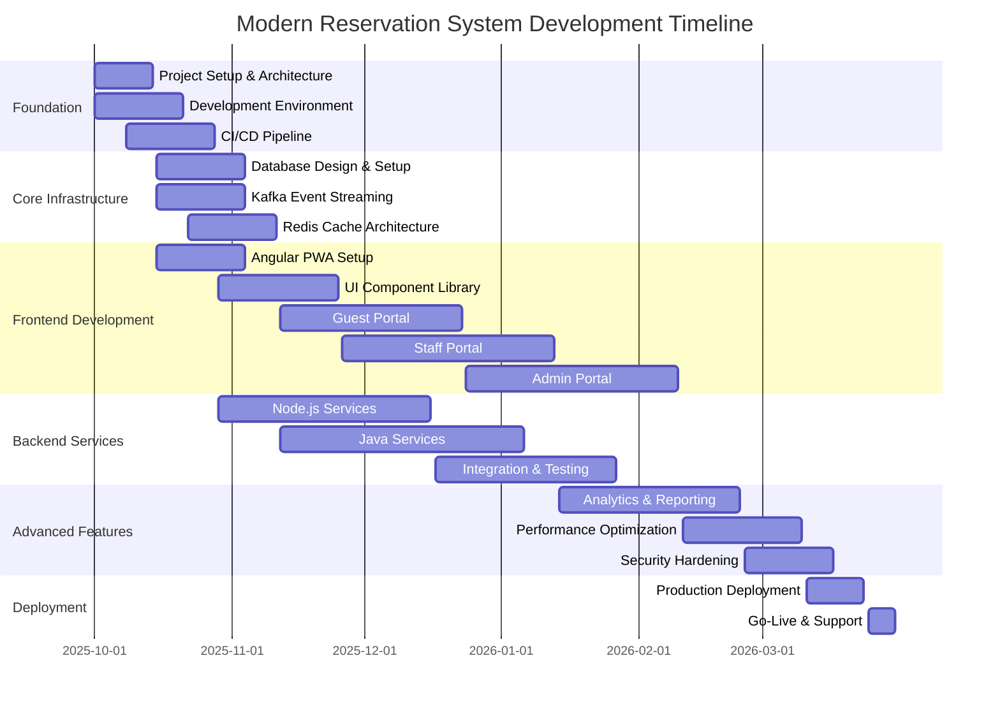
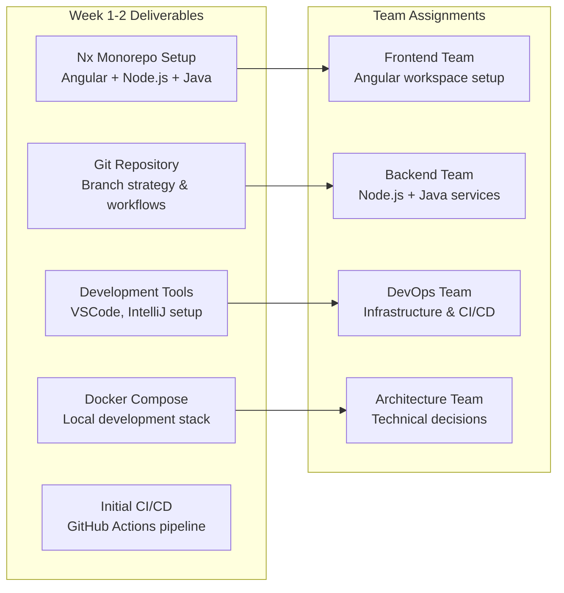
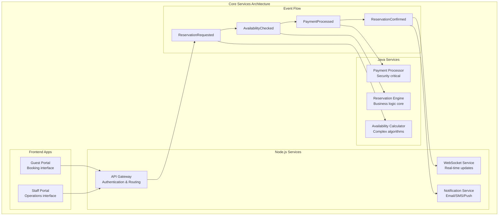
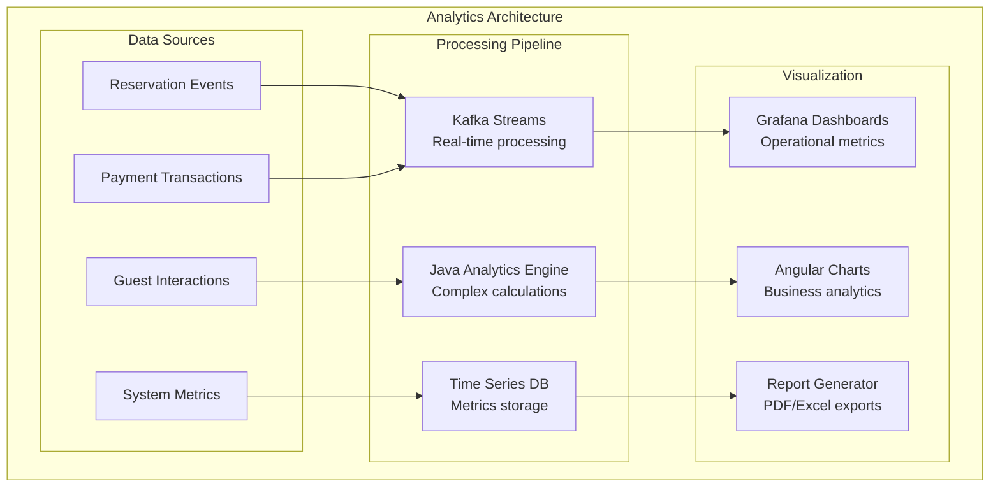
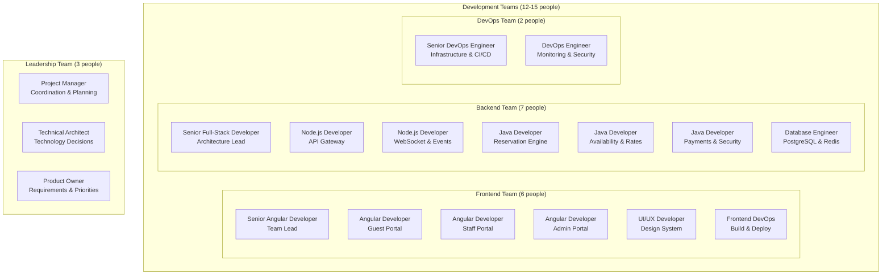
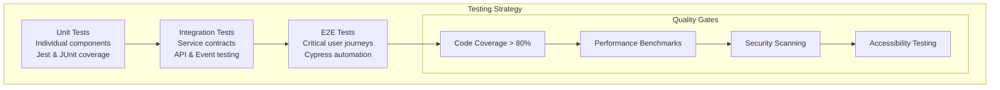

# Project Development Plan
## Modern Reservation Management System

### Document Information
- **Project Name:** Modern Reservation Management System
- **Version:** 1.0
- **Date:** September 24, 2025
- **Planning Period:** October 2025 - March 2026 (6 Months)
- **Team Size:** 12-15 Developers (6 Frontend, 4 Backend Node.js, 3 Backend Java, 2 DevOps)
- **Project Manager:** TBD
- **Technical Lead:** TBD

---

## Executive Summary

This document outlines the comprehensive development plan for building the Modern Reservation Management System using a hybrid Node.js + Java architecture with Nx monorepo. The project is estimated to take 24 weeks (6 months) with a team of 12-15 developers working in parallel across multiple workstreams.

### **Key Success Factors:**
- **Parallel Development:** Frontend, Backend, and Infrastructure teams working simultaneously
- **Iterative Delivery:** Working software delivered every 2 weeks
- **Event-Driven Architecture:** Kafka-based decoupled microservices
- **Hybrid Technology Stack:** Node.js + Java optimized for performance
- **DevOps First:** CI/CD and monitoring setup from day one

---

## Project Phases Overview

---

## Phase 1: Foundation & Setup (Weeks 1-4)

### **Week 1-2: Project Initialization**

#### **Sprint 1.1 Goals:**
- Project kickoff and team onboarding
- Development environment setup
- Initial architecture decisions validation

#### **Detailed Tasks:**

**DevOps & Infrastructure (Week 1-2):**
- [ ] **Day 1-3:** Set up Nx monorepo with Angular, Node.js, and Java project structure
- [ ] **Day 4-7:** Configure Docker development environment with PostgreSQL, Redis, Kafka
- [ ] **Day 8-10:** Set up GitHub Actions CI/CD pipeline for multi-language builds
- [ ] **Day 11-14:** Create Kubernetes development cluster and ArgoCD setup

**Frontend Team (Week 1-2):**
- [ ] **Day 1-5:** Angular 17 workspace configuration with Material Design
- [ ] **Day 6-10:** Set up shared UI component library structure
- [ ] **Day 11-14:** Create responsive layout framework and theme system

**Backend Team (Week 1-2):**
- [ ] **Day 1-7:** Node.js services scaffolding (API Gateway, WebSocket, Notification)
- [ ] **Day 8-14:** Java services setup (Spring Boot projects for Reservation, Availability, Payment)

### **Week 3-4: Core Infrastructure**

#### **Sprint 1.2 Goals:**
- Database schema implementation
- Event streaming setup
- Basic authentication system

#### **Detailed Tasks:**

**Database Team (Week 3-4):**
- [ ] **Day 15-18:** PostgreSQL multi-master setup with Docker
- [ ] **Day 19-22:** Core entity schemas (User, Reservation, Room, Rate) with soft delete
- [ ] **Day 23-26:** Database migration scripts and seeding data
- [ ] **Day 27-28:** Performance tuning and index optimization

**Event Streaming Team (Week 3-4):**
- [ ] **Day 15-19:** Kafka cluster setup with Zookeeper
- [ ] **Day 20-24:** Topic configuration and partitioning strategy
- [ ] **Day 25-28:** Event schema definitions using Zod

**Security Team (Week 3-4):**
- [ ] **Day 15-21:** JWT authentication service implementation
- [ ] **Day 22-28:** RBAC (Role-Based Access Control) system design

---

## Phase 2: Core Development (Weeks 5-12)

### **Week 5-8: Core Services Development**

#### **Sprint 2.1-2.2 Goals:**
- Implement core reservation engine
- Build availability calculation system
- Create user management interfaces

#### **Detailed Development Tasks:**

**Java Backend Team (Week 5-8):**

**Week 5-6: Reservation Engine**
- [ ] **Day 29-33:** Core reservation entity and business logic
- [ ] **Day 34-38:** Kafka event consumers for reservation processing
- [ ] **Day 39-42:** Reservation validation rules and constraints

**Week 7-8: Availability Calculator**
- [ ] **Day 43-47:** Multi-room availability algorithms
- [ ] **Day 48-52:** Cache integration with Redis
- [ ] **Day 53-56:** Performance optimization and parallel processing

**Node.js Backend Team (Week 5-8):**

**Week 5-6: API Gateway**
- [ ] **Day 29-35:** Express.js gateway with authentication middleware
- [ ] **Day 36-42:** Rate limiting and request validation

**Week 7-8: Notification & WebSocket Services**
- [ ] **Day 43-49:** Multi-channel notification system (email, SMS, push)
- [ ] **Day 50-56:** WebSocket service for real-time updates

**Frontend Team (Week 5-8):**

**Week 5-6: Guest Portal Foundation**
- [ ] **Day 29-35:** Angular PWA setup with service worker
- [ ] **Day 36-42:** Responsive layout and navigation system

**Week 7-8: Booking Interface**
- [ ] **Day 43-49:** Room search and availability display
- [ ] **Day 50-56:** Booking form with validation and payment integration

### **Week 9-12: Advanced Features & Integration**

#### **Sprint 2.3-2.4 Goals:**
- Complete payment processing
- Implement housekeeping module
- Add real-time dashboard

#### **Detailed Tasks:**

**Payment Processing (Week 9-10):**
- [ ] **Day 57-63:** Java Spring Boot payment service with Stripe integration
- [ ] **Day 64-70:** PCI-DSS compliance and security hardening

**Housekeeping Module (Week 11-12):**
- [ ] **Day 71-77:** Room status management and cleaning workflows
- [ ] **Day 78-84:** Mobile-first interface for housekeeping staff

---

## Phase 3: Frontend Portals (Weeks 13-16)

### **Week 13-14: Staff Portal Development**

#### **Sprint 3.1 Goals:**
- Complete staff operations interface
- Implement check-in/check-out workflows
- Add guest management features

#### **Detailed Tasks:**

**Frontend Team - Staff Portal:**
- [ ] **Day 85-91:** Front desk operations interface
- [ ] **Day 92-98:** Guest profile management and history

**Integration Team:**
- [ ] **Day 85-98:** API integration testing and error handling

### **Week 15-16: Admin Portal Development**

#### **Sprint 3.2 Goals:**
- Build administrative interface
- Implement reporting dashboard
- Add system configuration tools

#### **Detailed Tasks:**

**Frontend Team - Admin Portal:**
- [ ] **Day 99-105:** System administration interface
- [ ] **Day 106-112:** Real-time analytics dashboard with charts

---

## Phase 4: Analytics & Optimization (Weeks 17-20)

### **Week 17-18: Analytics Engine**

#### **Sprint 4.1 Goals:**
- Implement business intelligence features
- Create revenue management tools
- Add performance monitoring

#### **Detailed Tasks:**

**Analytics Team (Week 17-18):**
- [ ] **Day 113-119:** Java-based analytics engine for revenue calculations
- [ ] **Day 120-126:** Real-time dashboard with occupancy and revenue metrics

**DevOps Team (Week 17-18):**
- [ ] **Day 113-126:** Prometheus, Grafana, and ELK stack deployment

### **Week 19-20: Performance Optimization**

#### **Sprint 4.2 Goals:**
- Achieve 10,000 reservations/minute target
- Optimize database queries
- Implement advanced caching strategies

#### **Detailed Tasks:**

**Performance Team (Week 19-20):**
- [ ] **Day 127-133:** Database query optimization and indexing
- [ ] **Day 134-140:** Redis cache warming and invalidation strategies

---

## Phase 5: Production Readiness (Weeks 21-24)

### **Week 21-22: Security & Compliance**

#### **Sprint 5.1 Goals:**
- Complete security audit
- Implement compliance features
- Add comprehensive monitoring

#### **Detailed Tasks:**

**Security Team (Week 21-22):**
- [ ] **Day 141-147:** Security penetration testing and vulnerability fixes
- [ ] **Day 148-154:** GDPR compliance features and audit trails

### **Week 23-24: Deployment & Go-Live**

#### **Sprint 5.2 Goals:**
- Production deployment
- Load testing validation
- User training and support

#### **Detailed Tasks:**

**DevOps Team (Week 23-24):**
- [ ] **Day 155-161:** Production Kubernetes cluster setup
- [ ] **Day 162-168:** Load testing with 10,000 reservations/minute simulation

**Support Team (Week 23-24):**
- [ ] **Day 155-168:** User training materials and documentation
- [ ] **Day 162-168:** Go-live support and monitoring

---

## Resource Allocation

### **Team Structure & Responsibilities:**

### **Weekly Sprint Planning:**

| Week | Sprint | Focus Area | Key Deliverables |
|------|--------|------------|------------------|
| **1-2** | 1.1 | Foundation | Nx monorepo, Docker setup, CI/CD pipeline |
| **3-4** | 1.2 | Infrastructure | Database schema, Kafka topics, Authentication |
| **5-6** | 2.1 | Core Services | Reservation engine, API gateway, Guest portal foundation |
| **7-8** | 2.2 | Integration | Event-driven communication, WebSocket service |
| **9-10** | 2.3 | Payment & Security | Payment processing, PCI compliance |
| **11-12** | 2.4 | Operations | Housekeeping module, Staff portal |
| **13-14** | 3.1 | Staff Features | Front desk operations, Guest management |
| **15-16** | 3.2 | Administration | Admin portal, System configuration |
| **17-18** | 4.1 | Analytics | Business intelligence, Revenue management |
| **19-20** | 4.2 | Performance | Optimization, Load testing |
| **21-22** | 5.1 | Security | Security audit, GDPR compliance |
| **23-24** | 5.2 | Go-Live | Production deployment, User training |

---

## Risk Management & Mitigation

### **Technical Risks:**

| Risk | Impact | Probability | Mitigation Strategy |
|------|--------|-------------|-------------------|
| **Kafka Learning Curve** | High | Medium | Dedicated training, Senior architect guidance |
| **Java-Node.js Integration** | Medium | Low | Proof of concept, Event-driven architecture |
| **Performance Targets** | High | Low | Early load testing, Performance monitoring |
| **Database Scaling** | Medium | Medium | Multi-master setup, Read replicas |
| **Team Coordination** | Medium | High | Daily standups, Cross-team integration testing |

### **Project Risks:**

| Risk | Impact | Probability | Mitigation Strategy |
|------|--------|-------------|-------------------|
| **Scope Creep** | High | High | Clear requirements, Change control process |
| **Resource Availability** | Medium | Medium | Cross-training, Backup resources |
| **Integration Delays** | Medium | Medium | Parallel development, Early integration |
| **Third-party Dependencies** | Low | Low | Multiple vendor options, Fallback plans |

---

## Quality Assurance Strategy

### **Testing Pyramid:**

### **Definition of Done:**

**For Backend Services:**
- [ ] Unit tests with >80% coverage
- [ ] Integration tests for all API endpoints
- [ ] Event schema validation
- [ ] Performance benchmarks met
- [ ] Security scanning passed
- [ ] Documentation updated

**For Frontend Components:**
- [ ] Unit tests for all components
- [ ] E2E tests for user workflows
- [ ] Accessibility compliance (WCAG 2.1 AA)
- [ ] Mobile responsiveness tested
- [ ] Cross-browser compatibility
- [ ] Performance metrics (Lighthouse score >90)

---

## Success Metrics & KPIs

### **Technical KPIs:**

| Metric | Target | Measurement |
|--------|--------|-------------|
| **System Response Time** | <50ms (95th percentile) | APM monitoring |
| **Throughput** | 10,000 reservations/minute | Load testing |
| **Uptime** | 99.95% availability | Uptime monitoring |
| **Code Coverage** | >80% across all services | Test reports |
| **Bug Escape Rate** | <2% to production | Defect tracking |
| **Deployment Frequency** | Daily deployments | CI/CD metrics |

### **Business KPIs:**

| Metric | Target | Measurement |
|--------|--------|-------------|
| **Time to Market** | 24 weeks delivery | Project timeline |
| **Team Productivity** | 80% story completion rate | Sprint metrics |
| **User Adoption** | 90% staff adoption in 30 days | Usage analytics |
| **Performance Improvement** | 75% reduction in manual processes | Business metrics |

---

## Budget Estimation

### **Development Costs (6 Months):**

| Resource | Count | Monthly Rate | Total Cost |
|----------|-------|-------------|------------|
| **Senior Developers (Lead)** | 3 | $12,000 | $216,000 |
| **Mid-level Developers** | 8 | $8,000 | $384,000 |
| **Junior Developers** | 4 | $5,000 | $120,000 |
| **DevOps Engineers** | 2 | $10,000 | $120,000 |
| **Project Manager** | 1 | $9,000 | $54,000 |
| **Product Owner** | 1 | $8,000 | $48,000 |

**Total Development Cost: $942,000**

### **Infrastructure Costs (6 Months):**

| Service | Monthly Cost | Total Cost |
|---------|-------------|------------|
| **Cloud Infrastructure (AWS/GCP)** | $3,000 | $18,000 |
| **Development Tools & Licenses** | $1,500 | $9,000 |
| **Third-party Services** | $1,000 | $6,000 |
| **Monitoring & Security Tools** | $800 | $4,800 |

**Total Infrastructure Cost: $37,800**

### **Grand Total Project Cost: $979,800**

---

## Conclusion

This comprehensive development plan provides a roadmap for successfully delivering the Modern Reservation Management System within 24 weeks using a hybrid Node.js + Java architecture with event-driven microservices.

### **Key Success Factors:**
1. **Parallel Development Streams** - Frontend, Backend, and Infrastructure teams work simultaneously
2. **Event-Driven Architecture** - Kafka provides decoupling and scalability
3. **Iterative Delivery** - Working software every 2 weeks with continuous feedback
4. **Quality First** - Comprehensive testing and monitoring from day one
5. **Performance Focus** - Early optimization to meet ultra-scale requirements

### **Next Steps:**
1. **Team Assembly** - Recruit and onboard development team
2. **Environment Setup** - Prepare development infrastructure
3. **Sprint 1.1 Kickoff** - Begin with Nx monorepo setup and CI/CD pipeline
4. **Stakeholder Alignment** - Weekly progress reviews and course corrections

This plan positions the project for successful delivery of a production-ready, ultra-scale reservation management system that can handle 10,000 reservations per minute while maintaining high availability and developer productivity.
